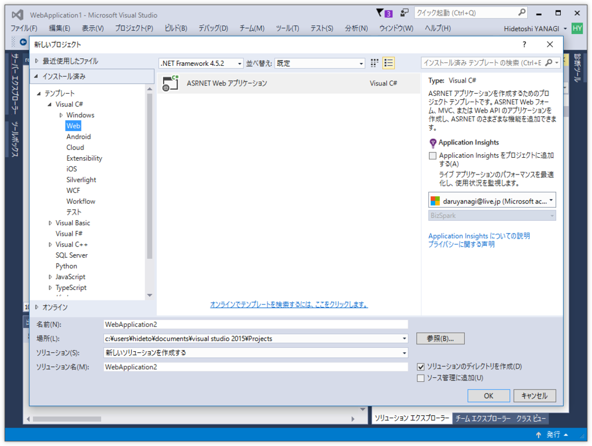

長年愛用してきた「WebMatrix」ですが、昨年10月に2017年11月1日 でのサポート終了がアナウンスされました。

<blockquote cite="https://forums.iis.net/t/1234128.aspx?WebMatrix+formal+support+ends+November+1st+2017">

Hi everyone

After a long and successful run, Microsoft has decided to end formal support of WebMatrix.  Formal support will end on November 1st, 2017.  Community support will continue on the WebMatrix forums 

Please take a look at Visual Studio Code, our new, free, open source, multi-platform editor!  VS Code support git integration, extensions and a whole bunch of other great features!

Thanks!

The WebMatrix team

<cite><a href="https://forums.iis.net/t/1234128.aspx?WebMatrix+formal+support+ends+November+1st+2017">WebMatrix formal support ends November 1st, 2017 : The Official Microsoft IIS Forums</a></cite>
</blockquote>

すでにテンプレートをダウンロードする際に 404 が発生することが多くなったほか、拡張機能のダウンロード提供が終了しており、第一線で使うにはつらい状況になっています。そろそろ乗り換えを検討すべきでしょう。

Microsoft は後継ソフトとして「Visual Studio Code」を推奨していますが、これは統合ターミナルでバリバリとコマンドを打つ感じなので、GUI に甘やかされた僕にはしんどい感じ（最近「Express」を少し触っているのですが、そっちの文化にあわせるなら割と使いやすいですけどねー）。いずれ慣れないといけないなーとは思うんですが、APS.NET Web Pages を使うならば、当面の間は「Visual Studio 2015」が一番楽かなーって感じです。

<h3>1. 「Visual Studio 2015」で ASP.NET プロジェクトを作成</h3>

まず「Visual Studio 2015」で ASP.NET プロジェクトを作成します。

プロジェクトタイプは“Empty”でよいです。というか、「WebMatrix」でいうところのスターターテンプレートの類は「Visual Studio」に用意されていないので、“Empty”が無難な気がします。

<h3>2. プロジェクトに Razor ページを追加</h3>

このテンプレートは本当にほぼ空なので、プロジェクトのコンテキストメニューなどから Web ページ（Razor）を追加する必要があります。

“Razor”などのキーワードで探すと簡単。いろいろあるけど、わかんなかった“Web ページ（Razor v3）”でいいと思います。

最初のページを追加すると、ASP.NET Web Pages に必要な参照が勝手に追加されます。すごーい！

<h3>3. ［F5］キーを押して実行</h3>

とりあえずなんか書いて実行してみましょう。

<pre class="code lang-cs" data-lang="cs" data-unlink>&lt;!DOCTYPE html&gt;
@{
var message = &quot;Hello! World&quot;;
}
&lt;html&gt;
&lt;head&gt;
&lt;title&gt;&lt;/title&gt;
&lt;/head&gt;
&lt;body&gt;
&lt;p&gt;@message&lt;/p&gt;
&lt;/body&gt;
&lt;/html&gt;
</pre>
［F5］キーを押すとサーバー＆ブラウザーが立ち上がります。

message を変えてブラウザーをリロードすると、即座に反映されまっする。なんとなく気軽で「WebMatrix」を使い続けてきましたが、機能面では「Visual Studio」のほうがずっと強力（ブレークポイントとかもしかけられるやで。入力補完はちょっと緩いところあるけど）です。……で、「Visual Studio Code」ではこの手順をどうやるんだ？　

最後に「WebMatrix」さん、長いことありがとうございました。

