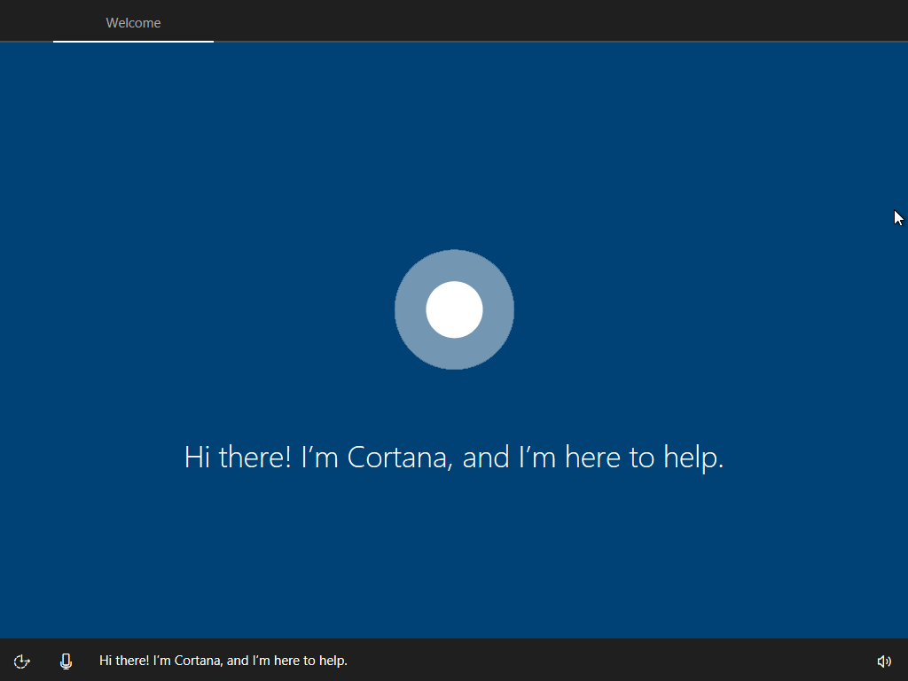
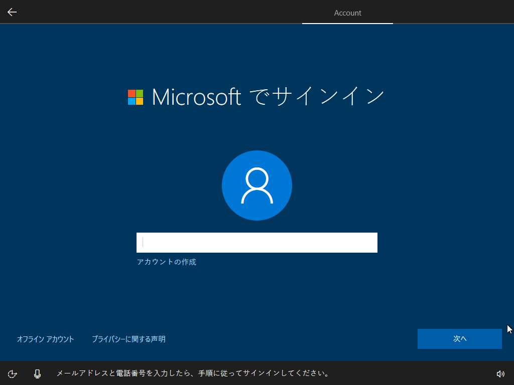
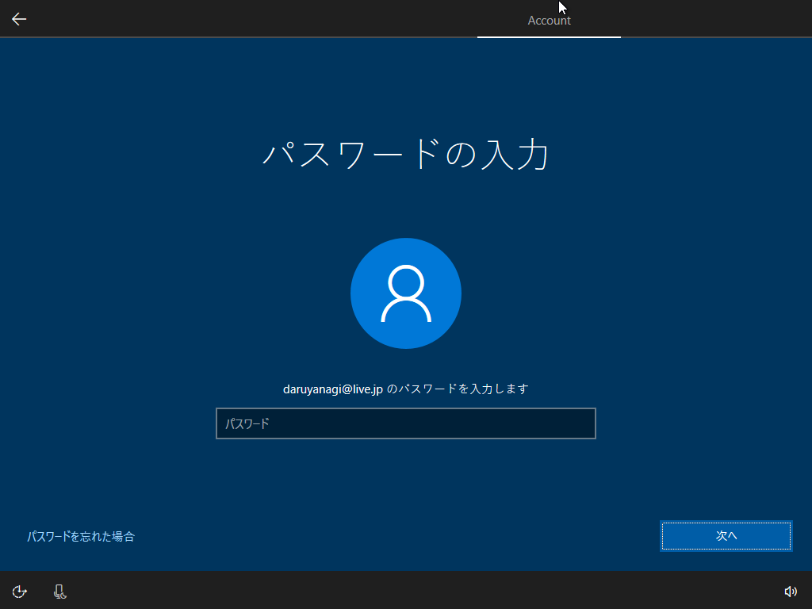

Windows 10 Creators Update のリリースが迫っていますが、なんかセットアップのアクセシビリティが改善されているらしいです。

<iframe src="//hatenablog-parts.com/embed?url=https%3A%2F%2Fblogs.windows.com%2Fwindowsexperience%2F2017%2F01%2F10%2Fcontinuing-commitment-privacy-windows-10%2F%23Cu336hmeoam3T8pB.97" title="Our continuing commitment to your privacy with Windows 10" class="embed-card embed-webcard" scrolling="no" frameborder="0" style="display: block; width: 100%; height: 155px; max-width: 500px; margin: 10px 0px;"></iframe><cite class="hatena-citation"><a href="https://blogs.windows.com/windowsexperience/2017/01/10/continuing-commitment-privacy-windows-10/#Cu336hmeoam3T8pB.97">blogs.windows.com</a></cite>

実機でスクリーンショットを撮るのがアレだったので仮想マシンですが、ちょっと追ってみました。なお、これはプレビュー版での仕様であり、製品版では変更や改善があるはずです。変なところがあっても笑わない。

<h3>1. いつものやつ</h3>

だいぶ変わったといっても、最初の方はこれまでと同じです。

おなじみだと思うのですっ飛ばします。この処理が終わって OS を再起動させると、ニューワールドの始まりです。

<h3>2. こ、こいつ……しゃべるぞ？</h3>

再起動しました。

するとコルタナさんが現れ、カタカナ発音で英語のメッセージを読み上げてくれます（製品版では日本語化されるものと思われます）。下のバーにはアクセシビリティ関連機能へのアクセスが提供されています。んー、音声でナビゲートされるのは割と新しい感じだなぁ。

たいへん親切な案内だと思います。

ちょっと進めてみましょう。ここからはメッセージが日本語化されています。このあたりで気づいたんですが、上のバーは現在なんの処理をしているのかを示しているのですね。［Welcome］→［（うちの環境ではスキップ？）］→［Network］→［Account］→［Services］と進むようです。今回は有線 LAN だったのでネットワークの設定をしなくて済んだようですが、Wi-Fi 経由でセットアップする場合はもうちょっと手順が多くなりそう。

<h3>3. アカウントのセットアップ</h3>

次はアカウントのセットアップです。アカウントを“個人”で所有しているか、“職場または学校”で管理しているかで分岐するようですね。今回は“個人”を選択しました。

お次は Microsoft アカウントのセットアップ。自分はいつもローカルアカウントを作成してから Microsoft アカウントに紐づけるようにしているのですが、今回は面倒なので案内に従っておきます。

パスワードを入力。

新しいセットアップではここで PIN の作成を求められます。最近はパスワードでのログインよりも PIN の利用が推奨されているので、従っておくといいでしょう（理由はググってみてください）。

今回は適当に4桁の数字を設定しておきました。

<h3>サービスの設定</h3>

最後はサービスの設定です。コルタナを有効にするかとか、プライバシーの保護設定とかをするセクションですね。

新しいセットアップでは、とくにプライバシー設定がわかりやすくなっているのが売りのようです（個人的にはあんまりそういうことは気にしていないのですが、まぁ、自分でコントロールできるのはよいことです）。これだけではプライバシー潔癖マンには不足でしょうけど、なにもわからないまま［簡単設定］でスキップできてしまうよりはいいのかもしれません。

このセクションは英語ですが、たぶん製品版では日本語化されるはず。

セットアップはこれで完了！

あとはお馴染みのなんか色がぶわーっと変わるなんか変な画面を鑑賞すれば、デスクトップが現れます。

お疲れさまでした！

