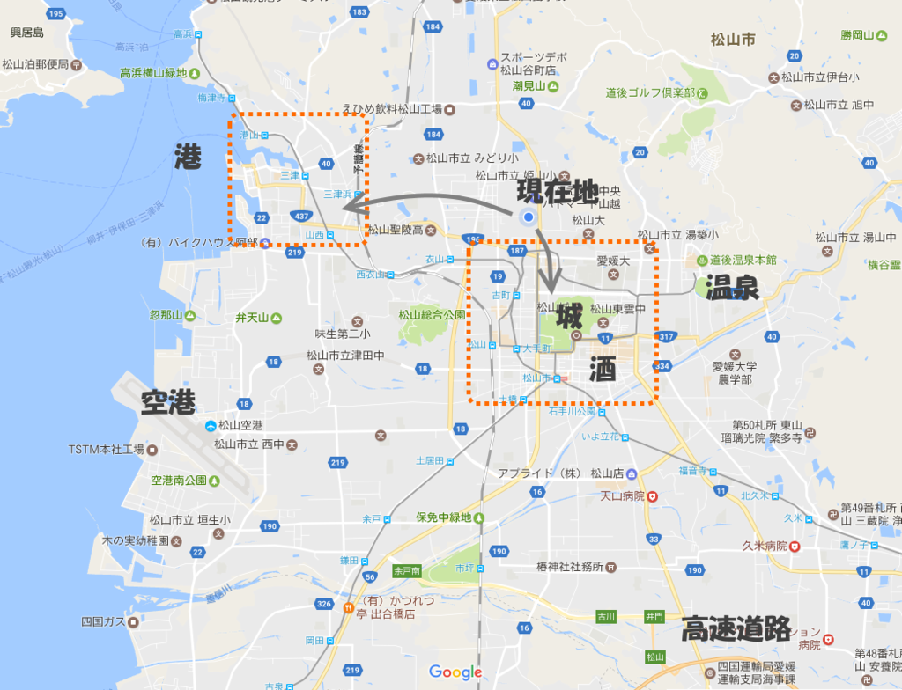

松山にくるときにもらった ANA マイルが今月で期限切れです。もう3年か……時間が経つのは早え！

<iframe src="https://hatenablog-parts.com/embed?url=https%3A%2F%2Fblog.daruyanagi.jp%2Fentry%2F2016%2F02%2F29%2F190700" title="愛媛・松山に移住して2年経ちました。 - だるろぐ" class="embed-card embed-blogcard" scrolling="no" frameborder="0" style="display: block; width: 100%; height: 190px; max-width: 500px; margin: 10px 0px;"></iframe><cite class="hatena-citation"><a href="https://blog.daruyanagi.jp/entry/2016/02/29/190700">blog.daruyanagi.jp</a></cite>

3年目ともなると、とくに何か書かなきゃーってことはないです。近所に飲みに行くお店ができたのと、散髪屋さんが何も言わなくてもいい感じに髪を切ってくれるようになっただけで十分。ちょっとだけ知り合いも増えましたしね。確定申告の方はちょっとだけ減収減益って感じですが、まぁまぁ、楽しくのんびり暮らせています。

最近ちょっと考えているのは、いい物件があったら（市内で）引越ししたいかなーってことぐらいですかね。今のマンションでも不満はないのだけど（なんか契約更新料もかかんなかったし、ベランダから松山城見えるし、別にずっといてもいい）、もっといいところがあれば狙いたい感じ。

もうちょっと街中か、船と飛行機のアクセスがよさそうな（街にも出やすい）三津エリアがいいかなー。味のある・手ごろな値段の古民家があればいいのだけど。

そういう話とも関係するのですが、そろそろ婚活でもしてみようかなみたいなみたいなことも考えています。結婚するなら街中に住むのがいいだろうけれど、独りならもう少し田舎の方で田んぼと山でも買って暮らすのもあり（きっと大変なんだろうけど、楽しそうでもある）。とにかく、結婚するのかしないのか確定しないことには、いろいろあとのことも決まらない感じがする。

ぶっちゃけそんなに結婚願望があるかというと、実のところそんなこともないので、そんなに熱心にはしないかもですが、もしこっちのヒトと結婚できたら、もう少しこの土地にも根付けるかなーという期待はあるし、子どもはやっぱりほしい（真顔）。でも、まぁ、婚活市場に出す商品としてはレモンもいいところという自覚はあるし、無理してまですることもないかなって感じですかね。あまりうまく自分の気持ちを表現できないのですが、無理のない程度にやってみるのは損でもなかろう、と。ちょろっと顔出してみて、ダメだったらあっさり引き上げる方向で、とりあえずトライしてみようかなーって感じですね。

――これが今年の努力目標ｗ そのほかにも、

<ul>
<li>船で松山の島巡り</li>
<li>愛媛 FC 観に行く（去年はなんかいろいろ問題あって興が削がれた！）</li>
<li>今治城観に行って、なんか B 級グルメ食べてくる</li>
</ul>
という、去年のやり残しも片付けたいかも。確定申告おえて、バイクの車検を通したら、あちこち回ってみたい。

あと、今年もプログラミング生放送 in 愛媛・松山は是非やりたいと思います。今のところ例年通り6月に開催される予定。

<iframe src="https://hatenablog-parts.com/embed?url=https%3A%2F%2Fblog.daruyanagi.jp%2Fentry%2F2016%2F06%2F24%2F173130" title="プログラミング生放送勉強会 第41回＠サイボウズ株式会社 松山オフィス 参加ありがとー #pronama - だるろぐ" class="embed-card embed-blogcard" scrolling="no" frameborder="0" style="display: block; width: 100%; height: 190px; max-width: 500px; margin: 10px 0px;"></iframe><cite class="hatena-citation"><a href="https://blog.daruyanagi.jp/entry/2016/06/24/173130">blog.daruyanagi.jp</a></cite>

そういえば、去年はみつばたんも Hololens 抱えて松山まで遊びに来てくれて、楽しかったですねー。

<iframe src="https://hatenablog-parts.com/embed?url=https%3A%2F%2Fblog.daruyanagi.jp%2Fentry%2F2016%2F06%2F28%2F163058" title="HoloLens おさわり会 in 愛媛・松山 マツヤマンスペース 参加ありがとうございました！ - だるろぐ" class="embed-card embed-blogcard" scrolling="no" frameborder="0" style="display: block; width: 100%; height: 190px; max-width: 500px; margin: 10px 0px;"></iframe><cite class="hatena-citation"><a href="https://blog.daruyanagi.jp/entry/2016/06/28/163058">blog.daruyanagi.jp</a></cite>

今年もなんかそういうプラスアルファがあればいいなって思っています。いいこと思いついた人がいたら、ぜひ声をかけてください！

