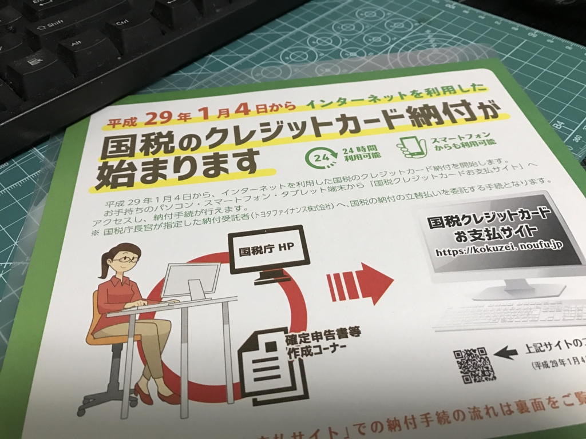

今年も freee でお手軽に確定申告を済ましました。プリントアウトして、税務署にもっていくだけ。

<iframe src="https://hatenablog-parts.com/embed?url=http%3A%2F%2Ffreee.co.jp%2F" title="会計ソフト freee (フリー) | 無料から使えるクラウド会計ソフト" class="embed-card embed-webcard" scrolling="no" frameborder="0" style="display: block; width: 100%; height: 155px; max-width: 500px; margin: 10px 0px;"></iframe><cite class="hatena-citation"><a href="http://freee.co.jp/">freee.co.jp</a></cite>

とはいえ、いくつかハマったポイント＆今回初めて体験したことが少しありました。

<h3>開庁時間</h3>

<blockquote cite="https://www.nta.go.jp/tetsuzuki/shinkoku/shotoku/qa/04.htm">

税務署の開庁時間は、月曜日から金曜日（祝日等を除きます。）の午前8時30分から午後5時までです。

　なお、一部の税務署では、平成28年分の確定申告期間中、2月19日と2月26日に限り、日曜日も確定申告の相談及び申告書の受付を行います（詳しくは「税務署の閉庁日における確定申告の相談等の実施について」をご覧ください。）。

<cite><a href="https://www.nta.go.jp/tetsuzuki/shinkoku/shotoku/qa/04.htm">&#x56FD;&#x7A0E;&#x5E81;&#x30DB;&#x30FC;&#x30E0;&#x30DA;&#x30FC;&#x30B8;&#x30EA;&#x30CB;&#x30E5;&#x30FC;&#x30A2;&#x30EB;&#x306E;&#x304A;&#x77E5;&#x3089;&#x305B;&#xFF5C;&#x56FD;&#x7A0E;&#x5E81;</a></cite>
</blockquote>

なぜかこの時期は土日もやっているとばかり思っていた。世の中が便利になりすぎて、それに甘えていたんやな。

<blockquote class="twitter-tweet" data-lang="ja">
なぜ空いてると思ったし…… (@ 松山税務署 in 松山市, 愛媛県) <a href="https://t.co/HUq0c4WTvB">https://t.co/HUq0c4WTvB</a>
&mdash; だるやなぎ に天使が舞い降りた！ (@daruyanagi) <a href="https://twitter.com/daruyanagi/status/832793489003814912?ref_src=twsrc%5Etfw">2017年2月18日</a></blockquote> 

<h3>書類が足りなかった</h3>

<blockquote class="twitter-tweet" data-lang="ja">
ふぁー 書類足らんかったー まぁ、他はオッケーだからあとで郵送しよう（震え声 (@ 松山税務署 in 松山市, 愛媛県) <a href="https://t.co/yRFJzrhlSg">https://t.co/yRFJzrhlSg</a>
&mdash; だるやなぎ に天使が舞い降りた！ (@daruyanagi) <a href="https://twitter.com/daruyanagi/status/833850017400119298?ref_src=twsrc%5Etfw">2017年2月21日</a></blockquote>

freee で「確定申告書B （2016 年度） （提出用 ･ 控用）」に加え、「青色申告決算書 （2016 年度） （一般用） （提出用 ･ 控用）」が出力されているのに気づいてなくて、決算書を同封するの忘れてた（ﾌｧｯｷｭｰ

結局、税務署で封筒もらって、家に帰って決算書をプリントアウトして突っ込み、近所の郵便局から送った。税務署まで散歩した＆職員さんに書類のチェックをしてもらったと思えば、無駄足ではない（震え声

<h3>マイナンバー</h3>

今年からマイナンバーを書いて、書類を同封しなければならないみたい。自分はマイナンバーカードをまだ発行してもらってないので、通知カードのコピー＋免許書のコピーで済ませました。

確定申告書にある個人番号の欄を埋め忘れた気がするけど……まぁ、どうにかしてくれるやろう（ごめんなさいごめんなさい

<h3>クレジットカード納税</h3>

自分で調べるのが面倒で、税務署のヒトにやり方を聞いたら、パンフレットくれた。おかげで簡単にできたやで。手数料がかかるけど、代わりにポイントが付くので、ポイント還元率が手数料を上回るカードであればちょっとお得……なはず。

<h3>iD と株</h3>

今年は株を買ったけど、途中で面倒になり、とくに申告はしなかった。まぁ、配当は源泉徴収されてるしねー。真面目に申告すればちょっと還付されたかもだけど、大した金額じゃないので放置。あと、買っただけで売らなかったから、売却益とかもない。これは本格的に株をやることがあれば課題になる部分やな。

あと、Apple Pay がきたのでプライベートで iD を使いまくっていたのだけど――

<iframe src="https://hatenablog-parts.com/embed?url=https%3A%2F%2Fblog.daruyanagi.jp%2Fentry%2F2016%2F10%2F26%2F005631" title="あっぽーぺーにさっそくカードを登録してみた - だるろぐ" class="embed-card embed-blogcard" scrolling="no" frameborder="0" style="display: block; width: 100%; height: 190px; max-width: 500px; margin: 10px 0px;"></iframe><cite class="hatena-citation"><a href="https://blog.daruyanagi.jp/entry/2016/10/26/005631">blog.daruyanagi.jp</a></cite>

その履歴が freee に取り込まれていないみたいで、余計な作業が増えた（ﾌｧｯｷｭｰ

幸いプライベート支出ばっかりなので、テキトーに事業主貸で処理して済ませた。

そんなわけで、面倒な iD は辞めて、代わりにモバイル SUICA を使うことにしようと思う。こっちならば、freee でも履歴の取り込みができるみたい。

<iframe src="https://hatenablog-parts.com/embed?url=https%3A%2F%2Fsupport.freee.co.jp%2Fhc%2Fja%2Farticles%2F202847560-%25E3%2583%25A2%25E3%2583%2590%25E3%2582%25A4%25E3%2583%25ABSuica-%25E5%2588%25A9%25E7%2594%25A8%25E5%25B1%25A5%25E6%25AD%25B4%25E3%2582%2592%25E5%258F%2596%25E3%2582%258A%25E8%25BE%25BC%25E3%2582%2580" title="モバイルSuica - 利用履歴を取り込む" class="embed-card embed-webcard" scrolling="no" frameborder="0" style="display: block; width: 100%; height: 155px; max-width: 500px; margin: 10px 0px;"></iframe><cite class="hatena-citation"><a href="https://support.freee.co.jp/hc/ja/articles/202847560-%E3%83%A2%E3%83%90%E3%82%A4%E3%83%ABSuica-%E5%88%A9%E7%94%A8%E5%B1%A5%E6%AD%B4%E3%82%92%E5%8F%96%E3%82%8A%E8%BE%BC%E3%82%80">support.freee.co.jp</a></cite>

Apple Pay から iD のクレジットカードは削除し、iPhone で決済したい場合はクレジットカードから SUICA へチャージして利用するようにした。

これで現金取引は交際費ぐらいになったので、銀行口座とクレジットカードの明細取り込みでほぼ対応できる（仕訳けもフィルターを作ってほぼ自動化）。領収書の整理なんかは、一年分溜めても半日かからない。タクシーで電子マネーかクレカが使えると助かるんだけど、運転手があんまりいい顔しないのがネックやねぇ。

あと、freee にオンラインバンクのパスワード預けるのはあまりよいことではないので、いろいろ業界内で話し合って、早めに解決していただきたく。

