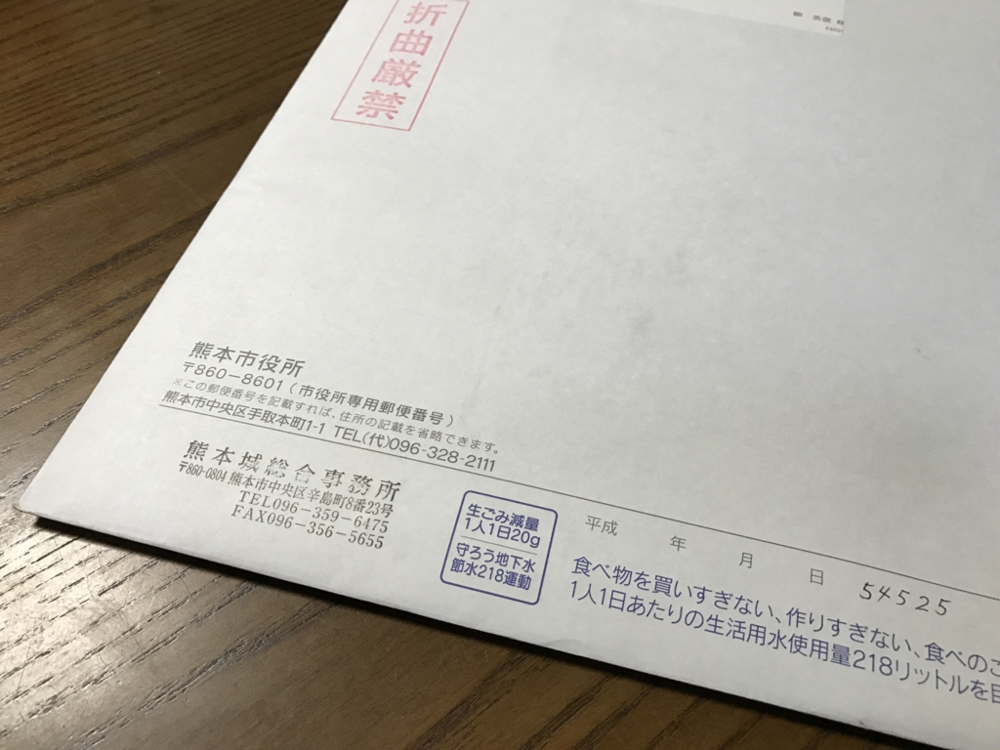
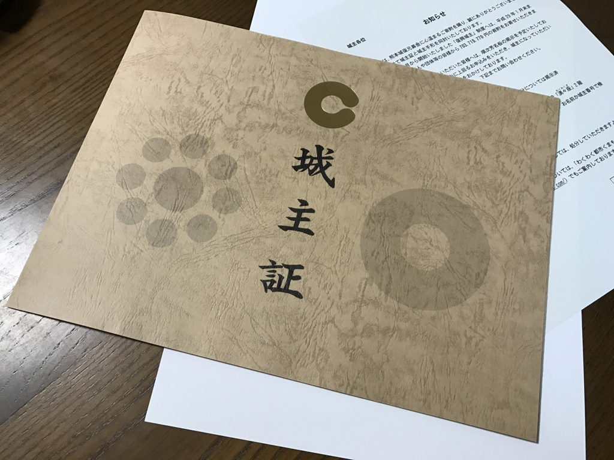
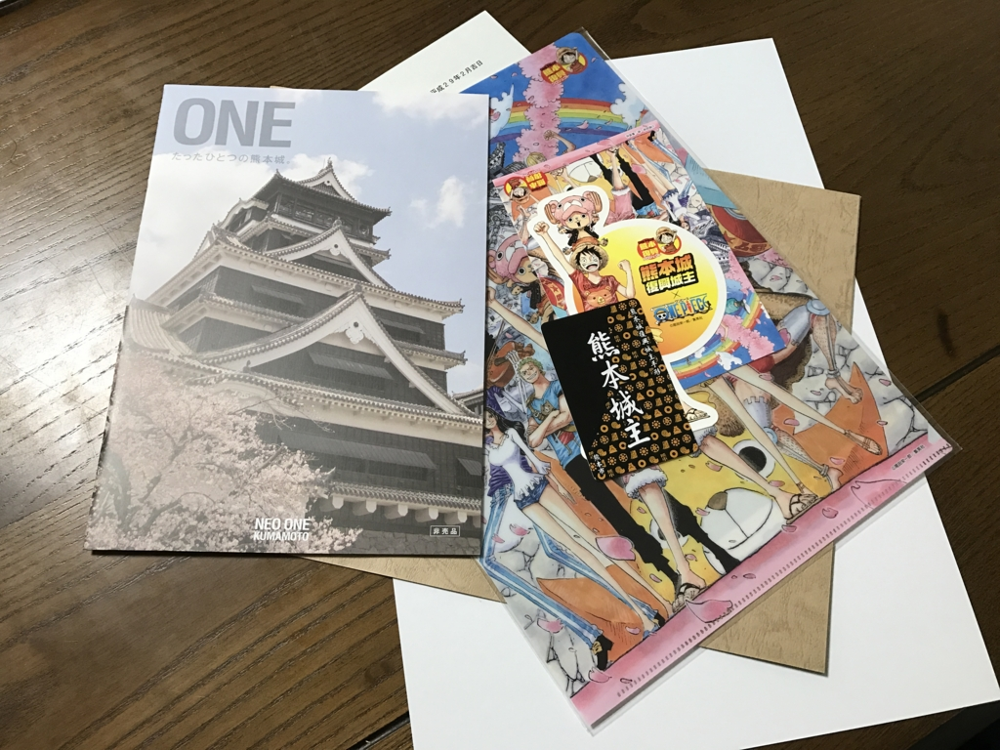

なんか熊本市から謎の書状が送られてきた。折り曲げ厳禁とのことで、玄関の郵便受けではなく、わざわざ郵便屋さんが7階の我が家までもってきてくれたんだけど……なんじゃ。

中身は熊本城の城主証でした。去年、募金してきたやつですね。

<iframe src="https://hatenablog-parts.com/embed?url=https%3A%2F%2Fblog.daruyanagi.jp%2Fentry%2F2016%2F11%2F15%2F203854" title="熊本城主になってきたった！ - だるろぐ" class="embed-card embed-blogcard" scrolling="no" frameborder="0" style="display: block; width: 100%; height: 190px; max-width: 500px; margin: 10px 0px;"></iframe><cite class="hatena-citation"><a href="http://blog.daruyanagi.jp/entry/2016/11/15/203854">blog.daruyanagi.jp</a></cite>

地震の後処理がまだまだ忙しいだろうに、大変申し訳なく。ありがとうございます。

よぅ、おまいら！　これからは俺を熊本城主と呼べ！

そのほかにもワンピースのグッズなんかが入っていました（個人的にはくまモングッズの方がよかっただなんて言えない）。

最近は寄付の“お返し”が手厚く、うれしいことではあるのですが、寄付は1円でも多く本来の目的に使われるのが正しい在り方だと思うので、できるだけ簡素にしていただければと。まぁ、こういう“お返し”作りで地元が潤っているみたいなところが多少はあるんでしょうけどね。

<h3>追伸</h3>

<blockquote cite="https://www.city.kumamoto.jp/hpkiji/pub/detail.aspx?c_id=5&id=12552">

<h4>税法上の優遇措置について</h4>

  平成28年熊本地震に対する義援金・寄附金・支援金については、所得税法の規定に基づく寄附金控除及び法人税法上の損金として扱われます。

<cite><a href="https://www.city.kumamoto.jp/hpkiji/pub/detail.aspx?c_id=5&id=12552">&#x718A;&#x672C;&#x5730;&#x9707;&#x95A2;&#x9023;&#x5BC4;&#x9644;&#x91D1;&#x306B;&#x3064;&#x3044;&#x3066; / &#x718A;&#x672C;&#x5E02;&#x30DB;&#x30FC;&#x30E0;&#x30DA;&#x30FC;&#x30B8;</a></cite>
</blockquote>

確定申告で熊本城の寄付を算入するの忘れてた気がする……地震の方は銀行振り込みだったから気付いたけど、現金で寄付するとこういうことになるのだな。まぁ、悪いことをしたわけじゃないので全然かまわないけれど（笑

これから申告する人は忘れないように！

