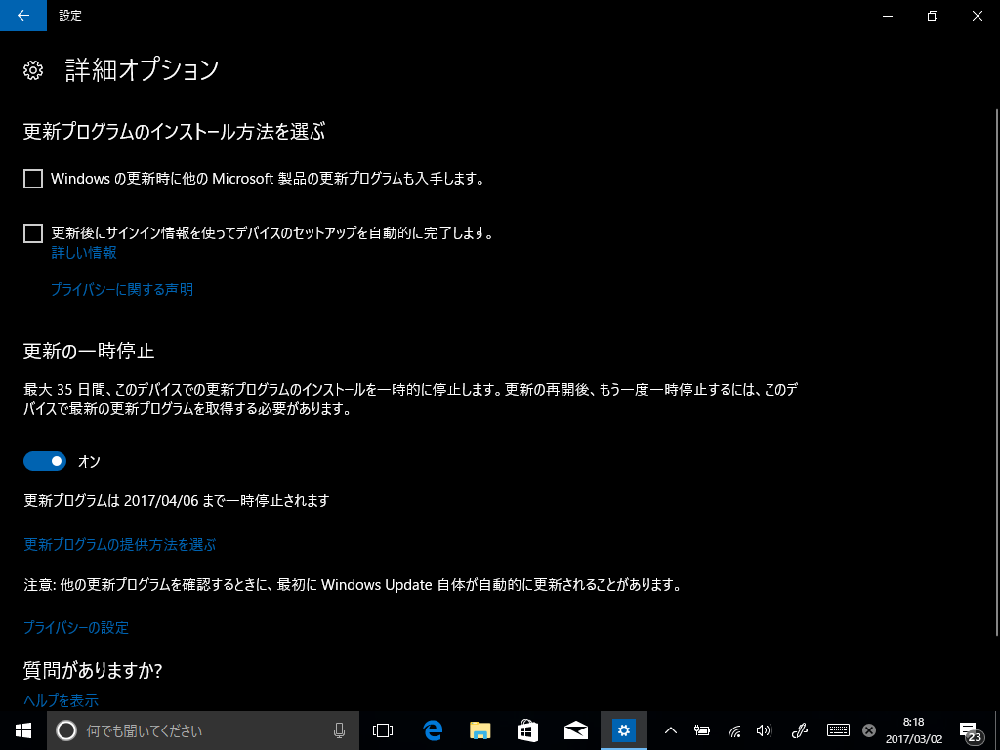

Windows 10 Insider Preview Build 15046 の一部で、Windows Update の詳細オプションが拡充（？）されているらしい。

<blockquote cite="https://betanews.com/2017/03/01/hidden-update-settings-windows-10-creators-update/">

The Creators Update will let you pause updates for up to 35 days, but there’s an option that gives you much greater control over what -- and when -- updates get installed. The intriguing thing is, this isn't visible to everyone, and even if you manage to get to see it, it may suddenly vanish the moment you look away. Here's what it does, and how to enable it.

<cite><a href="https://betanews.com/2017/03/01/hidden-update-settings-windows-10-creators-update/">Latest Windows 10 Creators Update build has secret settings for pausing and deferring updates</a></cite>
</blockquote>

まず、更新の一時停止を有効化。

再び無効化。

すると一瞬だけブランチを切り替える画面がでました。CB（Current Branch）と CBB（Current Branch for Bussiness）を切り替えたりすることができるみたい。

たぶんこの機能は Pro 異常じゃないと使えません。なぜなら Home では CBB が選択できないからです。

（Windows 10 は CB ユーザー（一般ユーザー）を4カ月生け贄にして成熟させたプロダクトを CBB ユーザー（おもにビジネスユーザー）に展開する……という仕組みになっています。Pro ユーザーはこの“生け贄”を避けられますが Home ユーザーは……ゲフンゲフン）

モタモタしているとこうなっちゃいました。うちの環境がおかしいのか、そもそもこのオプションの出方が想定された仕様ではない（バグ）なのか、ちょっと判断付きかねますね。ちゃんとローカライズされているので、すでに存在した機能かもしれないし。

