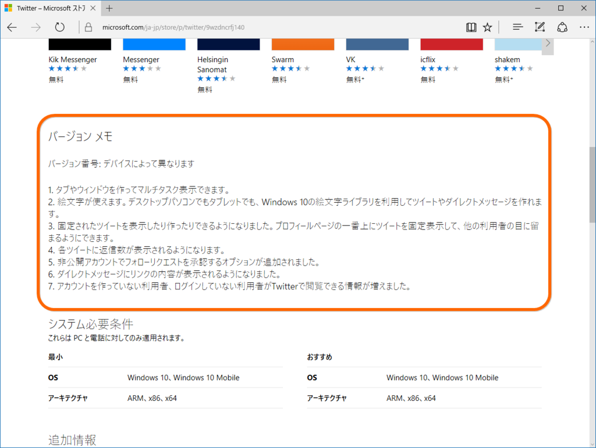

これをチェックするツールがほしかったんだけど、WPF や ASP.NET Web Pages ではストアに「おまえ BOT だろ」と怒られてうまくいかなかった。けれど、似たようなコードを PowerShell で試すと、なぜかうまくいく……。原因はわかんないけど（調べる気が起きない）、PowerShell でできるんなら、PowerShell でやるか―って感じで頑張ってみた。

基本方針は

<ul>
<li>ストアから #version-notes をスクレイピングして保存</li>
<li>新旧 #version-notes を比較してステータス（!?*+-）をつける</li>
<li>結果を PSCustomｍObject の配列で返す</li>
</ul>
って感じ。

<pre class="code" data-lang="" data-unlink>function Check-WindowsStore
{
$urls =@(
&#34;https://www.microsoft.com/ja-jp/store/p/swarm/9wzdncrdrsq1&#34;,
:（途中省略）
)

# 重複は無駄なので削る
$urls = $urls | Get-Unique

foreach ($url in $urls)
{
try
{
# ストアからテキストをダウンロード
$request = Invoke-WebRequest -Uri $url

# アプリの表示名を記憶
$title = $request.AllElements
.FindById(&#34;page-title&#34;).innerText

# 新しいバージョンノートを記憶
$new = $request.AllElements
.FindById(&#34;version-notes&#34;).innerText

if ($new)
{
# 最初だけ：更新履歴を保存する .temp フォルダーを掘る
$path = $env:USERPROFILE
| Join-Path -ChildPath  &#34;.temp&#34;
if (Test-Path $path) { }
else { New-Item $path -ItemType Directory }

# バージョンノートを保存するファイル名を記憶
# （パスに使えない文字は排除しておく）
$path = $path | Join-Path -ChildPath
($title -replace &#34;/&#34;, &#34; &#34; -replace &#34;:&#34;, &#34; &#34;)
$old_path = $path + &#34;.old.txt&#34; # 質素な差分管理
$new_path = $path + &#34;.txt&#34;

# 前の更新履歴が保存されていたら……
if (Test-Path $new_path)
{
# 名前を変えて保存
$old = [System.IO.File]::ReadAllText($new_path)

if ($old -eq $new)
{
$status = &#34;-&#34; # 変化なし

}
else
{
[System.IO.File]::
WriteAllText($old_path, $old)
[System.IO.File]::
WriteAllText($new_path, $new)
$status = &#34;*&#34; # 変化あり
}
}
else # 新しい更新履歴
{
[System.IO.File]::WriteAllText($new_path, $new)
$status = &#34;+&#34; # 新規作成
}
}
else # $new が nil
{
$status = &#34;?&#34; # そもそもリリースノートがない
}

[PSCustomObject] @{
Status = $status; Title = $title; Url=$url
}
}
catch [Exception]
{
$status = &#34;!&#34; # エラー

[PSCustomObject] @{
Status = $status; Title = $title; Url=$url
}
}
finally
{
Write-Host &#34;$status $url&#34;
$request = $null
}
}

Write-Host &#34;Complete&#34;
}</pre>
この前は Slack のバージョン履歴が更新されたので、

<pre class="code" data-lang="" data-unlink>Check-WindowsStore
| where { $_.Status -ne &#34;?&#34; }
| where { $_.Status -ne &#34;-&#34; }
| Format-Table</pre>
を実行すると、

<pre class="code" data-lang="" data-unlink>Status Title Url
------ ----- ---
*      Slack https://www.microsoft.com/ja-jp/store/p/……</pre>
が出力される。

<h3>個人的お勉強ポイント</h3>

PowerShell はいろいろ省略記法とかあって、カッコよく書くのはまだまだ難しいなって思った。ぼちぼちうまくなりたい。

<h4>エスケープは ` で（今回は結局使わなかったけど）</h4>

タブは `t で入力できる。改行は `n だけど、CRLF にしたかったら `r`n にする。

<h4>ループでオブジェクトをポイポイすれば yield return みたいになる</h4>
<pre class="code" data-lang="" data-unlink>$result = @()</pre>
に結果をストアしていかなくてもいいみたい。なーんだ！

<h4>JoinPath は | で繋ぐとネストが避けられて美しい</h4>

<iframe src="//hatenablog-parts.com/embed?url=http%3A%2F%2Fsevenb.jp%2Fwordpress%2Fura%2F2015%2F08%2F10%2Fpowershelljoin-path%25E3%2581%25AF%25E3%2583%2591%25E3%2582%25A4%25E3%2583%2597%25E3%2581%25A7%25E4%25BD%25BF%25E3%2581%2586%25E3%2581%25A8%25E3%2582%25AD%25E3%2583%25AC%25E3%2582%25A4%2F" title="[powershell]Join-Pathはパイプで使うとキレイ" class="embed-card embed-webcard" scrolling="no" frameborder="0" style="display: block; width: 100%; height: 155px; max-width: 500px; margin: 10px 0px;"></iframe><cite class="hatena-citation"><a href="http://sevenb.jp/wordpress/ura/2015/08/10/powershelljoin-path%E3%81%AF%E3%83%91%E3%82%A4%E3%83%97%E3%81%A7%E4%BD%BF%E3%81%86%E3%81%A8%E3%82%AD%E3%83%AC%E3%82%A4/">sevenb.jp</a></cite> 

<h4>Invoke-WebRequest はすっげえ便利</h4>

特定の id の中身がほしい場合はこれだけ。

<pre class="code" data-lang="" data-unlink>$request = Invoke-WebRequest $url
$request.AllElements.FindById(&#34;page-title&#34;).innerText</pre>
リンクや画像だけをストアしてるメンバーもある！

XPath 使えたらもっと便利なのになぁ（涎

