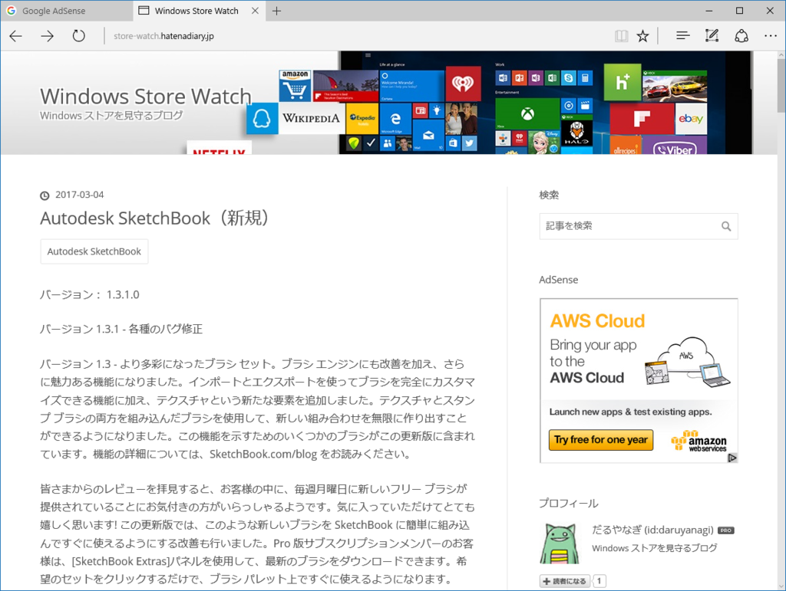
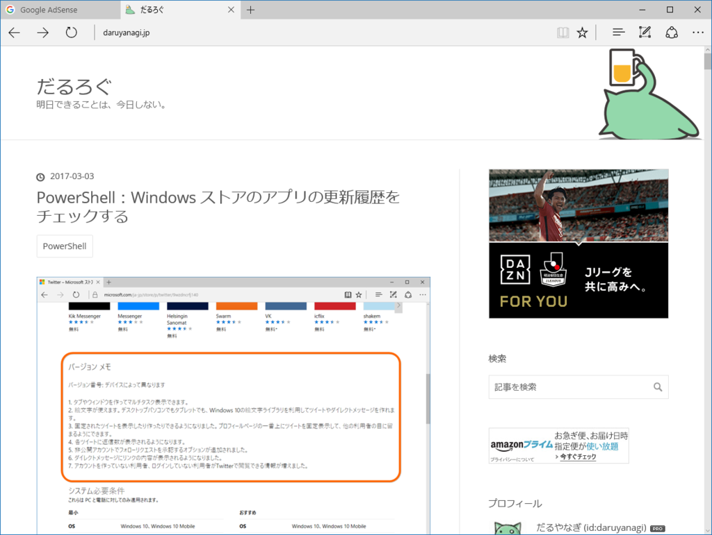

<iframe src="https://hatenablog-parts.com/embed?url=http%3A%2F%2Fstore-watch.hatenadiary.jp%2F" title="Windows Store Watch" class="embed-card embed-webcard" scrolling="no" frameborder="0" style="display: block; width: 100%; height: 155px; max-width: 500px; margin: 10px 0px;"></iframe>

この前の PowerShell を進化させて、はてなブログへメール送信＆ブログをアップデートするところまで完成。プライベート公開にしているのも何なので、一般公開してみました。更新履歴ばっかりのっけてるのも何なので、たまには負担にならない程度に独自記事も加えられるといいなーと思います。

ついでに、うちのブログもリニューアルしてみました（トップの画像がしっくりこないけど、また今度でいいや）。

<ul>
<li><a href="http://blog.hatena.ne.jp/-/store/theme/8454420450091363061">Blank - &#x30C6;&#x30FC;&#x30DE; &#x30B9;&#x30C8;&#x30A2;</a></li>
</ul>
使いやすくていいテーマですね、これ。

<iframe src="https://hatenablog-parts.com/embed?url=https%3A%2F%2Fblog.daruyanagi.jp%2Fentry%2F2017%2F03%2F03%2F145454" title="PowerShell：Windows ストアのアプリの更新履歴をチェックする - だるろぐ" class="embed-card embed-blogcard" scrolling="no" frameborder="0" style="display: block; width: 100%; height: 190px; max-width: 500px; margin: 10px 0px;"></iframe><cite class="hatena-citation"><a href="https://blog.daruyanagi.jp/entry/2017/03/03/145454">blog.daruyanagi.jp</a></cite> 

<h3>追伸</h3>

<iframe src="https://hatenablog-parts.com/embed?url=http%3A%2F%2Ftweetpvservice.nkd.jp%2F" title="PVをツイートするサービス（PVTS）" class="embed-card embed-webcard" scrolling="no" frameborder="0" style="display: block; width: 100%; height: 155px; max-width: 500px; margin: 10px 0px;"></iframe><cite class="hatena-citation"><a href="http://tweetpvservice.nkd.jp/">tweetpvservice.nkd.jp</a></cite>

@YanagiHidetoshi で PV もつぶやくようにしてみました。さんきゅう、<a href="http://blog.hatena.ne.jp/nakaji999/">id:nakaji999</a>！

