
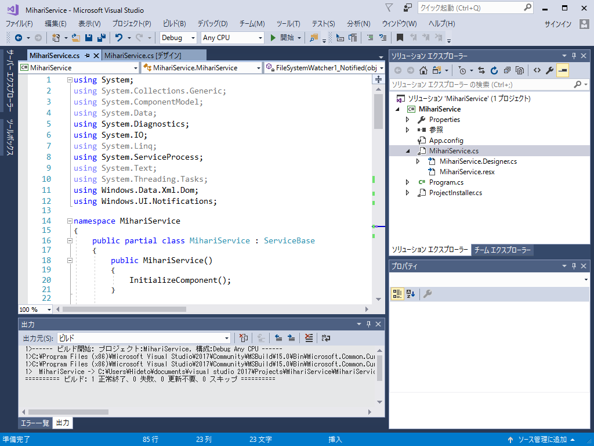

まぁ、この程度のことであれば、今までとあんまり変わらんと思うけどね。ちょこちょこ便利になってる感じはある。

<h3>今回の目標</h3>

実行ファイルが書き換わったら、トーストで通知してほしい。

<h3>プロジェクトを作成する</h3>

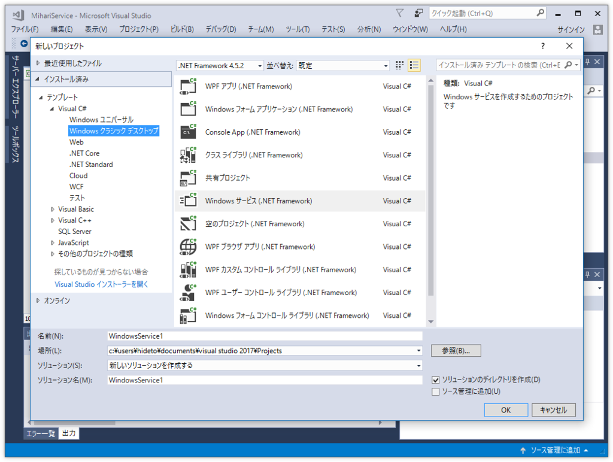

［テンプレート］－［Visual C#］－［Windows クラシック デスクトップ］を開いて、“Windows サービス（.NET Framework）”を選択。すると、Windows サービス プロジェクトのスケルトンがブリブリっと吐かれる。

Service1.cs では味気ないので、今回は MihariService.cs という名前にした。“見張り”やね（以前にもそういう名前のアプリを作って放置してたっけ）。

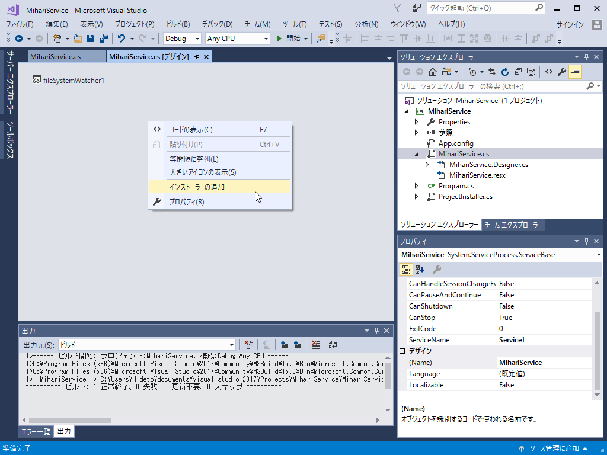

次に MihariService.cs のデザイナー画面を開き、コンテキストメニューの［インストーラーの追加］コマンドを実行。

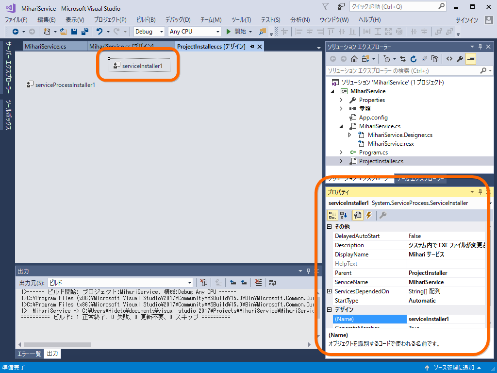

すると ServiceInstaller.cs というのが作成されます。このデザイン画面で ServiceInstaller1 を探し、プロパティ画面からいい感じにプロパティを設定。今回はこんな感じにした。

<ul>
<li>ServiceName：MihariService（アプリ ID のノリでどこでも使っていくやで）</li>
<li>DisplayName：Mihari サービス（WIndowsの「サービス」からはこれが見えるらしい。日本語にした）</li>
<li>Description：システム内で EXE ファイルが変更されるのを監視します</li>
<li>StartType：Automatic（これでたぶん自動実行されるはず）</li>
</ul>
最低限の準備はこれでいいみたい。まだ中身はないけれど、ソリューションをビルドする。

<h3>サービスの登録とデバッグ</h3>

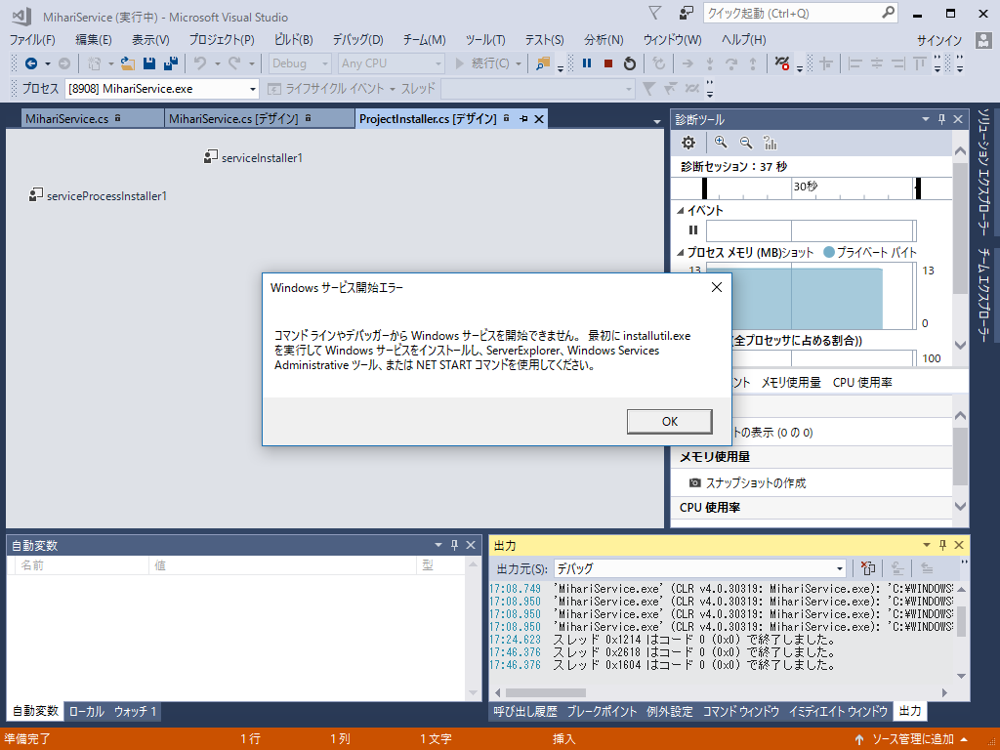

このままデバッグ実行をしても、エラーが出る。ビルドした Windows サービスをシステムに登録しなきゃいけない。

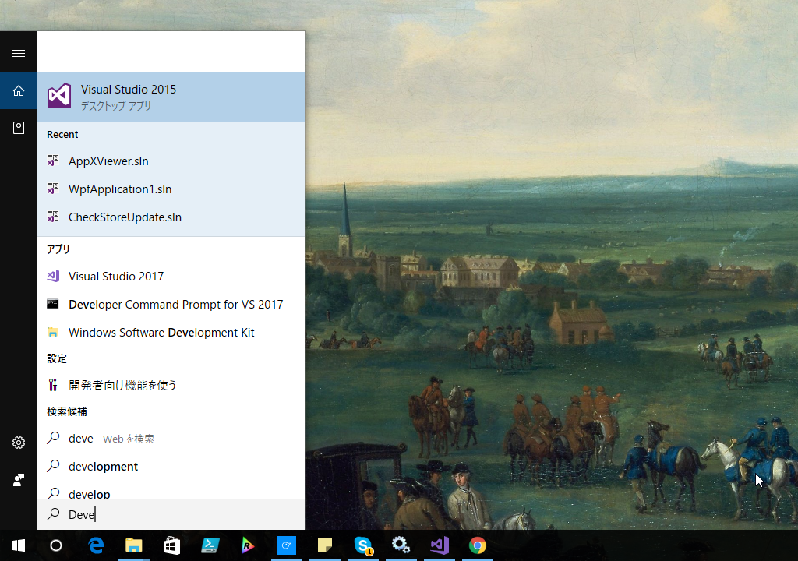

まず、ツールの類にパスの通ったコマンドプロンプトを起動（よくわかんないけど Developer Command Prompt for VS 2017 というのでいいみたい）。

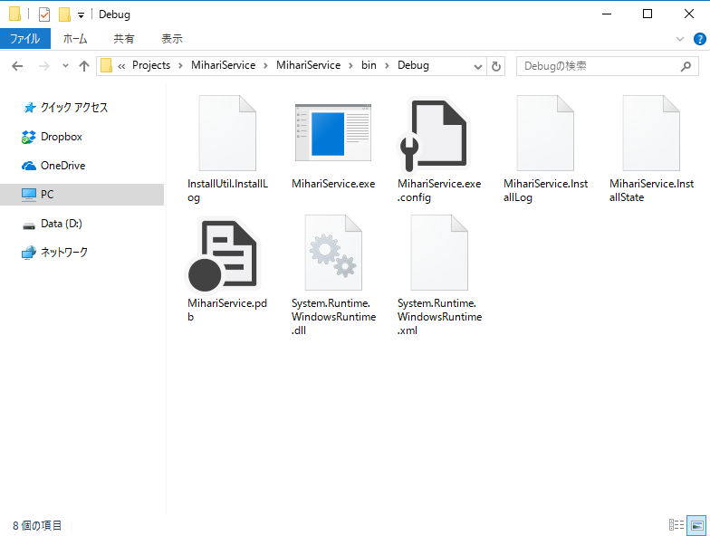

Debug フォルダーに移動してパスをコピーしておき、コマンドプロンプトで移動。installutil で MihariService.exe をシステムに登録する。

<pre class="code" data-lang="" data-unlink>**********************************************************************
** Visual Studio 2017 Developer Command Prompt v15.0.26228.4
** Copyright (c) 2017 Microsoft Corporation
**********************************************************************
&gt; cd （Debug フォルダー）

&gt; installutil MihariService.exe</pre>
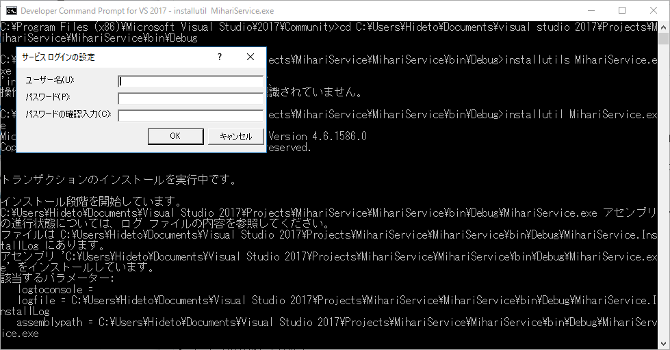

ログインを求められたら、ユーザー名とパスワードを入力。ユーザー名はコンピュータ名から始まる完全な奴じゃないとダメみたい。

<pre class="code" data-lang="" data-unlink>&gt; whoami</pre>
で取得したのをコピーして使うといい。

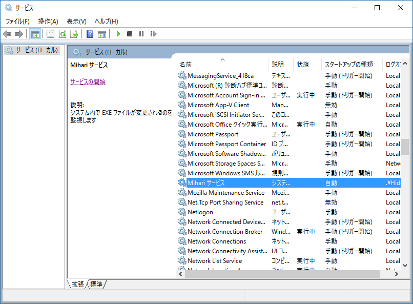

あとは「サービス」に移動して、登録したサービスを開始する。

<h3>デバッグ</h3>

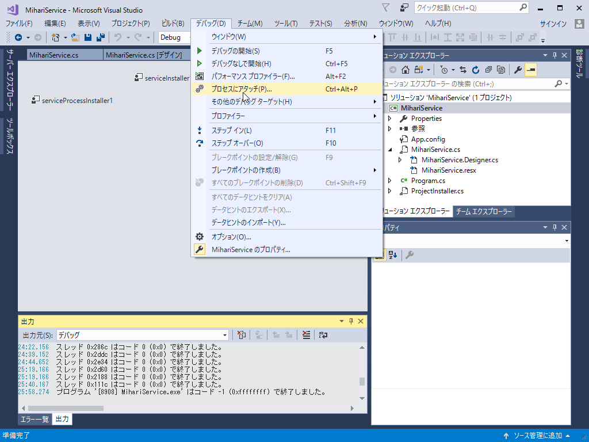

デバッグを行うには Windows サービスのプロセスにアタッチすればよい。

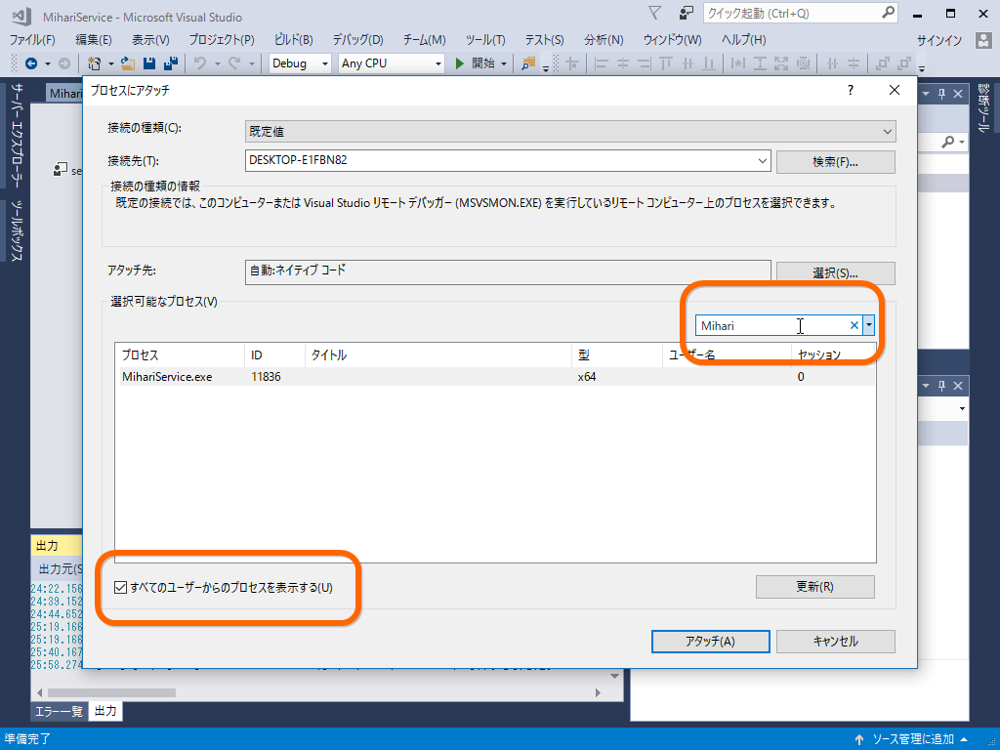

［すべてのユーザーからのプロセスを表示する］オプションを有効化し、フィルターで Mihari を探すと早い。あとはブレークポイントを仕掛けるなりなんなりご自由に。

リビルドのときは サービスを止める → ビルド → サービスを開始する（→再びアタッチする）みたいな作業フローで。ちょっと面倒くさいけど仕方ない（もしかしたら自動化できるのかもだけど、そこまではいいや）。

<h3>ファイルを監視する</h3>

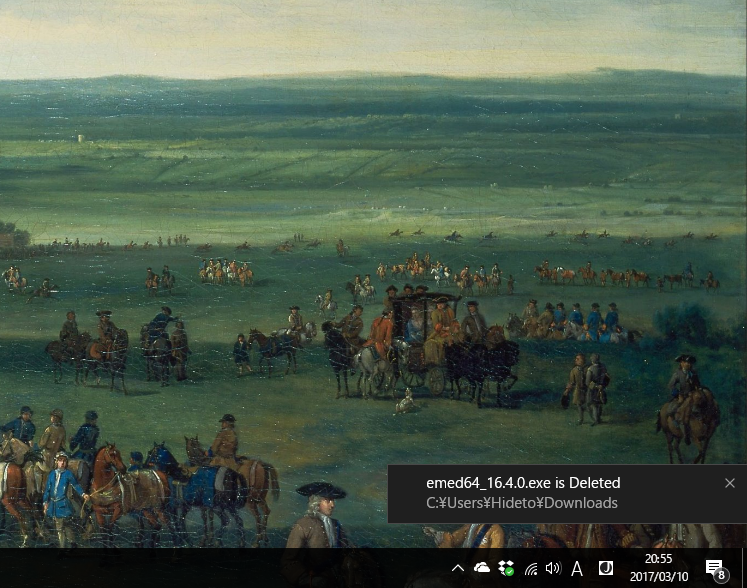

めんどくさくなった。MihariService.cs に FileSystemWatcher を追加して、いろいろコードを書けばおっけ。 

完成してから気づいたんだけど、サービスから通知トーストを出しても、クリックに反応してくれないんだな（フォルダーを開いたりしてほしい）。単にログだけ出力し、そのログを監視してトーストを出すクライアントを別途作った方がよかった。

<iframe src="http://rinta.hatenablog.com/embed/20110102/p2" title="Windowsサービスの作り方講座　その１ - おろかな日々" class="embed-card embed-blogcard" scrolling="no" frameborder="0" style="display: block; width: 100%; height: 190px; max-width: 500px; margin: 10px 0px;"></iframe><cite class="hatena-citation"><a href="http://rinta.hatenablog.com/entry/20110102/p2">rinta.hatenablog.com</a></cite>

<iframe src="http://iseebi.hatenablog.com/embed/20080603/p1" title="WindowsサービスをC#で書く - backyard of 伊勢的新常識" class="embed-card embed-blogcard" scrolling="no" frameborder="0" style="display: block; width: 100%; height: 190px; max-width: 500px; margin: 10px 0px;"></iframe><cite class="hatena-citation"><a href="http://iseebi.hatenablog.com/entry/20080603/p1">iseebi.hatenablog.com</a></cite>

先人たちのおかげですんなり完成しました。

