
<iframe src="//hatenablog-parts.com/embed?url=http%3A%2F%2Fstore-watch.hatenadiary.jp%2F" title="Windows Store Watch" class="embed-card embed-webcard" scrolling="no" frameborder="0" style="display: block; width: 100%; height: 155px; max-width: 500px; margin: 10px 0px;"></iframe><cite class="hatena-citation"><a href="http://store-watch.hatenadiary.jp/">store-watch.hatenadiary.jp</a></cite>

これの更新を――

<iframe src="//hatenablog-parts.com/embed?url=https%3A%2F%2Ftwitter.com%2Fwin_store_watch" title="Windows Store Watch (@win_store_watch) | Twitter" class="embed-card embed-webcard" scrolling="no" frameborder="0" style="display: block; width: 100%; height: 155px; max-width: 500px; margin: 10px 0px;"></iframe><cite class="hatena-citation"><a href="https://twitter.com/win_store_watch">twitter.com</a></cite>

で配信したいと思いました。方法はいろいろあるだろうけど（IFTTT が有名でしょうか）、今回は Microsoft Flow を試してみようと思います。確かいろいろ制限はあるけど、基本はタダです。

<ul>
<li>月ごとの実行数 750 回</li>
<li>無制限のフロー作成</li>
<li>15 分ごとにチェック</li>
</ul>

<h3>準備するもの</h3>

<ul>
<li>Microsoft アカウント</li>
<li>Twitter アカウント</li>
<li>ブログのフィード URL（はてなブログなら トップのアドレス/feed みたいな感じ）</li>
</ul>

<h3>フローを作成する</h3>

フローというのは特定の処理です。今回の場合、

<ul>
<li>ブログの更新を Twitter で配信する</li>
</ul>
が目的ですが、これは2つのフローを組み合わせることで実現できます。

<ul>
<li>ブログの更新を検知</li>
<li>検知した更新を Twitter へ投稿</li>
</ul>
Microsoft Flow にはすでにたくさんのフロー（メールを送る、プッシュ通知を送るなどなど）が用意されているので、たいていは組み合わせるだけです。

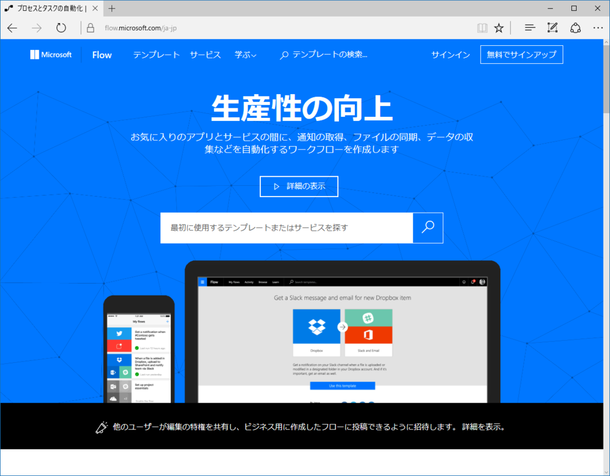

まず <a href="https://flow.microsoft.com/">https://flow.microsoft.com/</a> へアクセスし――

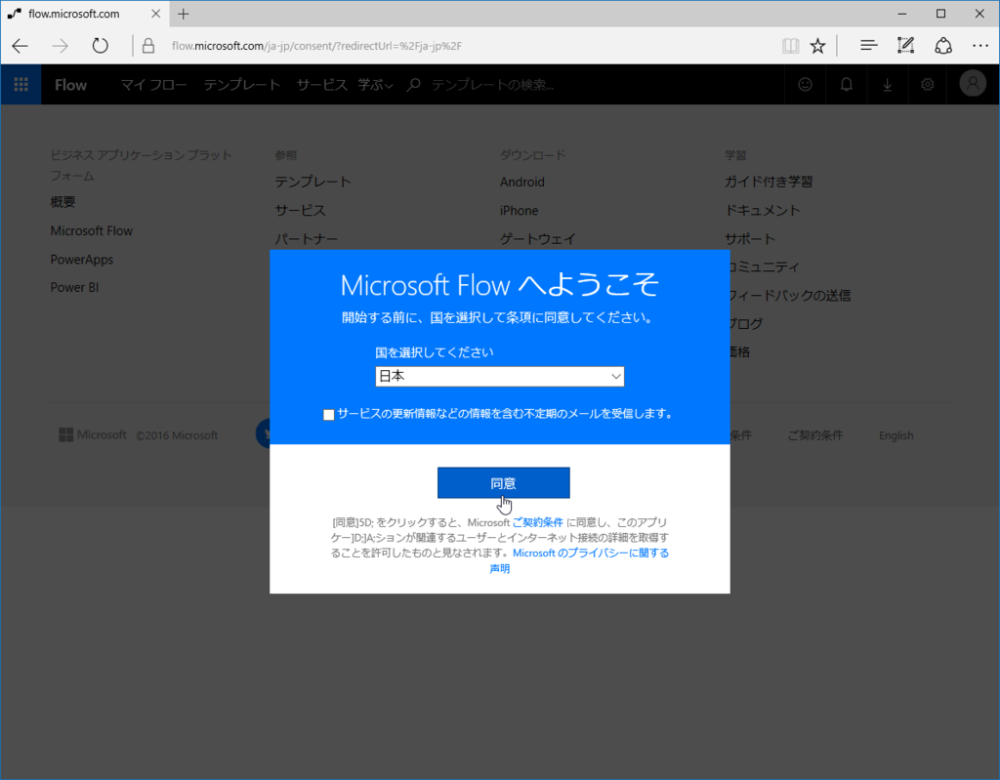

Microsoft アカウントでサインインします。

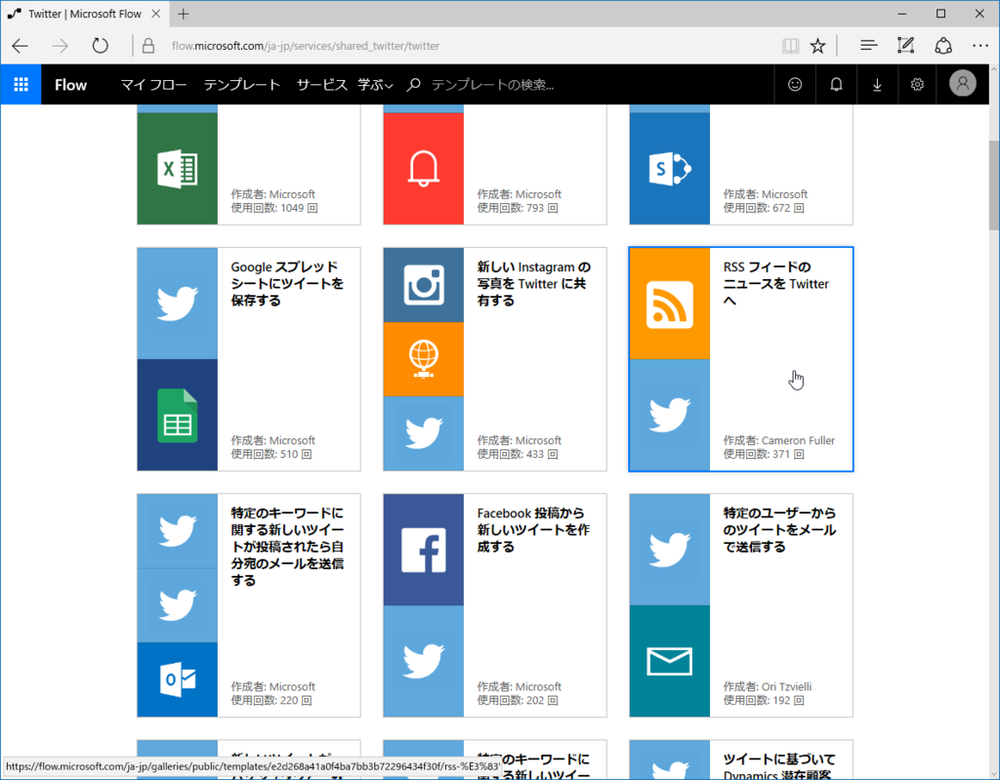

あとはフローを組み立てていくだけなのですが、実はもう「フィードを Twitter へ投稿する」という作業のテンプレートがありますので、それを使っちゃいます。

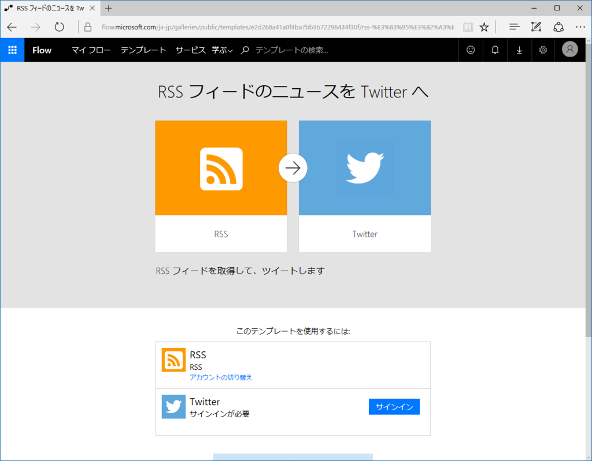

テンプレートを選択すると――

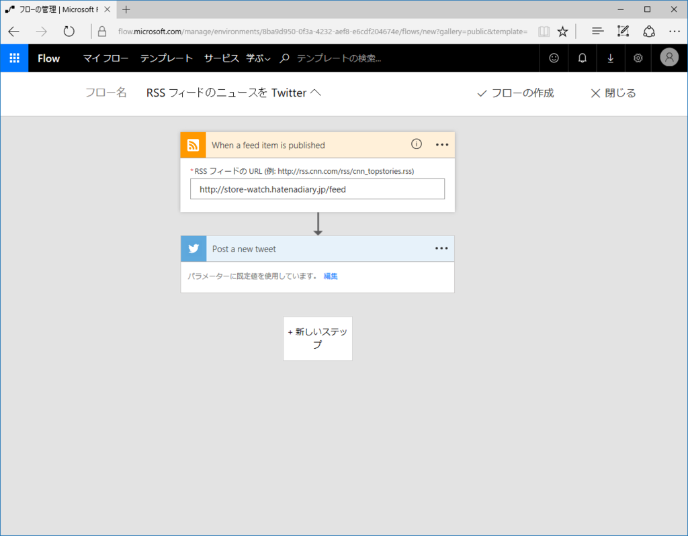

編集画面が現れるので、Twitter 連携とフィード URL の入力をし、画面右上の［フローの作成］ボタンを押せば完成です。簡単すぎて思わず鼻毛伸びそう。

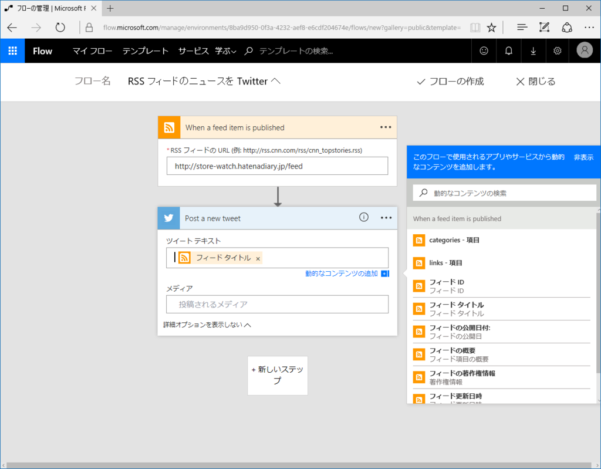

「ツイートの文言をカスタマイズしたいなー」という場合は、編集することもできます。エディター機能がまだあんまりイケてないのでサックリ消して、「［フィードのタイトル］［プライマリフィードリンク］」を配置してみました。これで

<blockquote class="twitter-tweet" data-lang="ja">
【新規追加】Shazam（もう終了しちゃってたけど！）<a href="https://t.co/RycKq50w3r">https://t.co/RycKq50w3r</a>
&mdash; Windows Store Watch (@win_store_watch) <a href="https://twitter.com/win_store_watch/status/841319258109833226">2017年3月13日</a></blockquote>

みたいなツイートになるはずです。ハッシュタグなんかを追加してみてもいいかもしれませんね。メディアの投稿は今回のケースではちょっと難しいかもですが、「画像を添付したメールを Gmail に送信したらそれを Twitter へ投稿」なんていうフローを作るときに役立つかも。

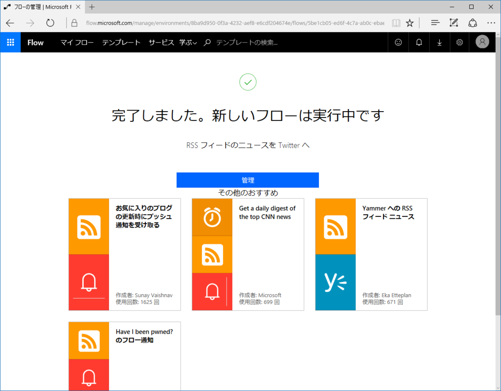

お疲れさまでした！

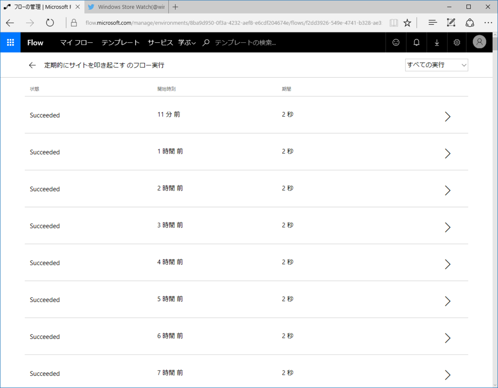

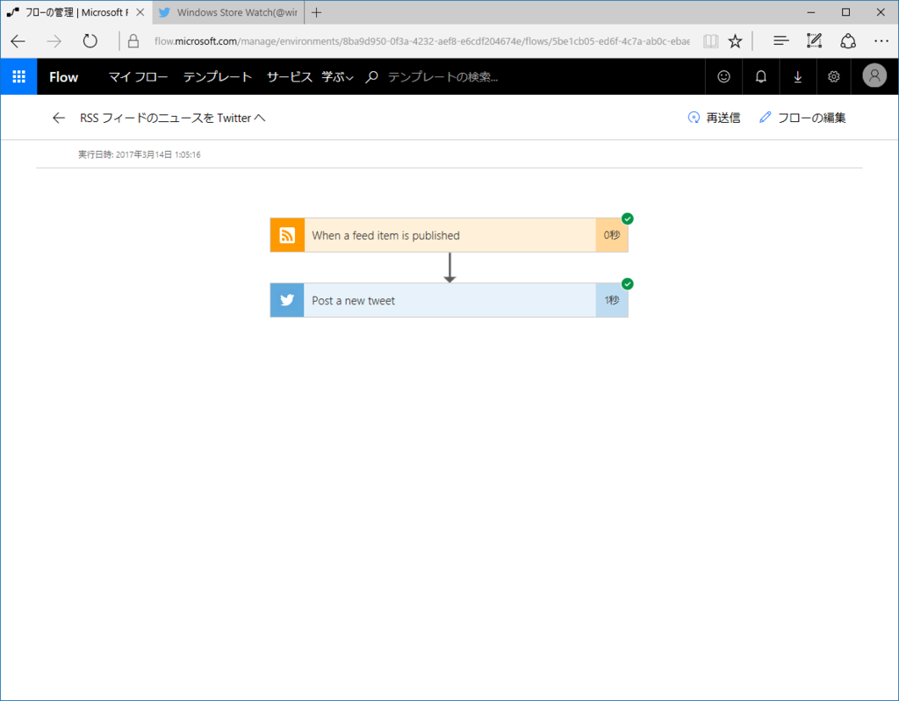

管理画面からはフローの実行結果なんかもチェックできますよ～

<h3>追伸</h3>

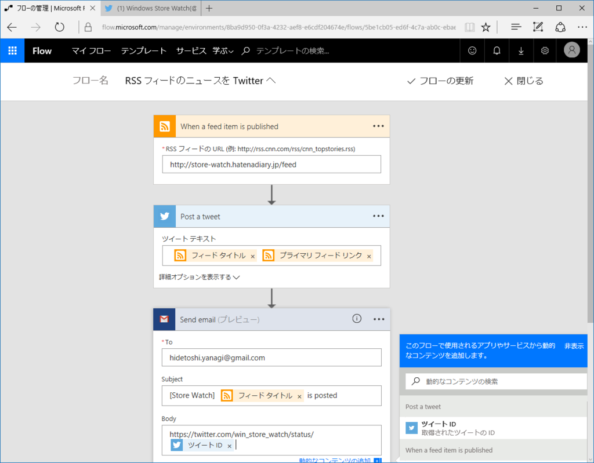

プレビュー版の Gmail 送信機能を使ってみた（ツイートを投稿したらメールで通知、みたいな）んだけど、メールが送られてこない……まぁ、プレビューだし仕方ない。

<h3>追伸その２</h3>

あとで確認したら、ちゃんと Gmail に送られていた。えらいえらい。

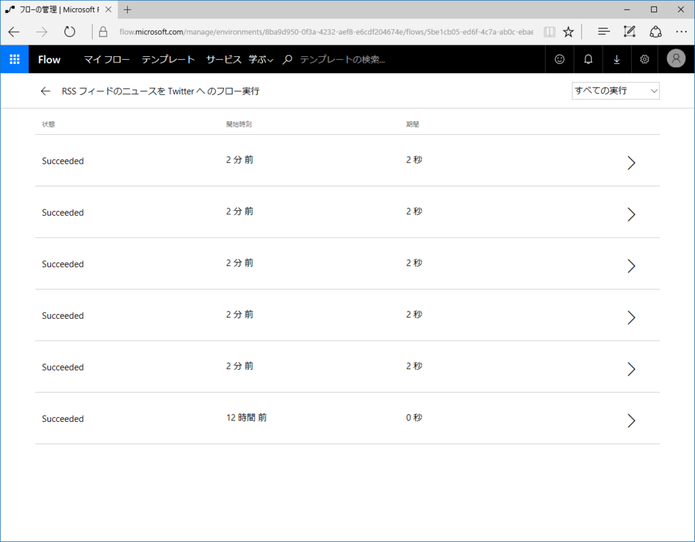

一気に記事を更新すると、一度に配信が始まるようだ。連投は嫌だから、ディレイをもうけたいなぁ……いい方法がないか後で探してみる。

<blockquote class="twitter-tweet" data-lang="ja">
Flow で Twitter を投稿したんだけど、タイトルが半角で終わると URL に引っ付いちゃう。間に挟んでたのを 半角スペース → 全角スペース にして回避 <a href="https://t.co/bdJdiM5DM5">pic.twitter.com/bdJdiM5DM5</a>
&mdash; だるやなぎドロップアウト (@daruyanagi) <a href="https://twitter.com/daruyanagi/status/841508791501783040">2017年3月14日</a></blockquote>

