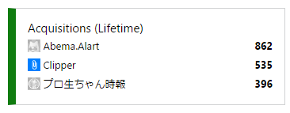

<blockquote>

当社は、インターネットTV局「AbemaTV」（以下、「本サービス」といいます。）を運営しております。 
 
当社は、貴殿による、本書末尾に記載するウェブサイト（以下「貴殿サイト」といいます。）上におけるアプリケーションソフトウェア「Abema.Alart」を用いて 
本サービス上のコンテンツを視聴予約する方法の解説及び当該ソフトの提供について、以下のとおり通知いたします。 
 
当社は、貴殿による上記行為は、著作権侵害等の不法行為を構成するものと判断しております。 
したがいまして、当社は、貴殿に対し、直ちに、貴殿サイトにおいて、本サービス上のコンテンツを視聴予約する方法について解説すること 
及び当該ソフトの提供をすべて中止するよう求めます。併せて、貴殿が過去に提供された同様のソフトについても、以後利用されないよう求めます。

つきましては、本書到達後10日以内に、本件に対する貴殿のご対応を当社宛にご回答いただきますようお願い申し上げます。 
 
万が一、上記回答期限内に貴殿からの誠意あるご対応をいただけない場合には、当社は貴殿に対し、法的措置を採ることを検討せざるを得ませんので、その旨申し添えます。

</blockquote>

ﾋﾟｬ━━━━(ﾟ∀ﾟ)━━━━!!

というわけで、公開停止にしました（ソフト名の綴り間違ってんの直そうと思ってそれっきりだった／(^o^)＼）。

<iframe src="https://hatenablog-parts.com/embed?url=https%3A%2F%2Fblog.daruyanagi.jp%2Fentry%2F2016%2F10%2F11%2F201541" title="AbemaTV の視聴予約をする UWP アプリ「Abema.Alart」を作りました。 - だるろぐ" class="embed-card embed-blogcard" scrolling="no" frameborder="0" style="display: block; width: 100%; height: 190px; max-width: 500px; margin: 10px 0px;"></iframe><cite class="hatena-citation"><a href="https://blog.daruyanagi.jp/entry/2016/10/11/201541">blog.daruyanagi.jp</a></cite>

ちなみに、862人の方にご利用いただけたようです（最高記録だ！）。レビューは散々でしたけどｗ

