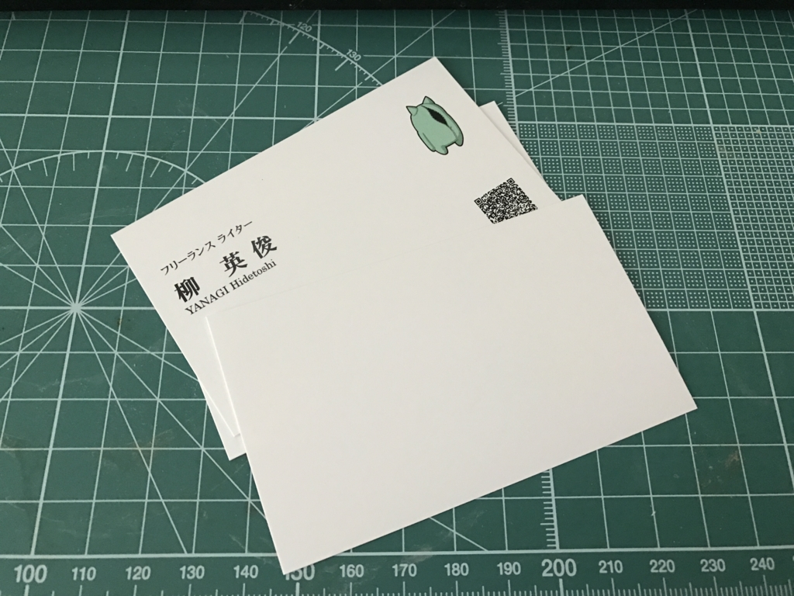

この前、新規開拓した居酒屋さんでとある町のお役人さんとお話をしていて、名刺をいただいたのだけど、返すものがなかった。@mitsuba_tan にデザインしてもらった<a href="#f-eb020f20" name="fn-eb020f20" title="しかもそのあとすぐにドメインを失効して記載したホームページがなくなった……">*1</a>勉強会用の名刺はあったのだけど、フツーの、リアルなホモサピエンスに渡してもそんなに恥ずかしくない名刺は作っていなかった。引きこもりだから、そんなに渡すチャンスもないしね。

右も左もわからないけれど<a href="#f-674c9593" name="fn-674c9593" title="前々職で名刺を自分で発注したはずなんだけど、社員のも一緒にたくさん頼んだので、あっちが事務所まで来ていろいろやってくれた。ので、あんまり経験としては意味がない">*2</a>、今回はオンラインで適当に注文してみた。今度 de:code にも出るつもりだし、必要になるだろう。前回はデザインしてもらったのを近所の印刷所にもっていったけれど、今回は軽いデザインもお任せしたかったので、ググって見つけた適当なお店に頼んだ。

<ul>
<li><a href="https://www.designmeishi.net/">&#x9AD8;&#x54C1;&#x8CEA;&#x306E;&#x540D;&#x523A;&#x4F5C;&#x6210;&#x306A;&#x3089;&#x30C7;&#x30B6;&#x30A4;&#x30F3;&#x540D;&#x523A;.net &#x3010;&#x5373;&#x65E5;&#x30B9;&#x30D4;&#x30FC;&#x30C9;&#x5370;&#x5237;/&#x767A;&#x9001;&#x3011;</a></li>
</ul>
テンプレートを選んで、テキストを入力するだけ。めっちゃ簡単だった。

テンプレートはできるだけシンプルに、けれど余白が寂しいのでテキトーなロゴを配置してもらい（デザインのセンスがないやつの典型的発想だな！）、あと QR コードを追加した。肩書は“無職”というわけにもいかず、ほとんど同じ意味の“フリーランス ライター”にしておいた。お値段はこんな感じ。

<blockquote>

●ご注文名刺内訳 
◯その1- 
サンプルNo：c-1155qr×100枚＝2,808円 
台紙（上質紙）108円×100枚＝108円

◯その他料金のご案内 
送料＝756円 
代引き手数料＝324円

　合計金額＝3,996円(税込）

</blockquote>

見積もりの見方がいまいちわからんかった（108円×100枚＝108円？　たぶん台紙？×1 なんだろうな）が、まぁ、お値段はこんなもんなのかな。ロゴを追加するのに少しデザイン料がかかった気がするけど、自分でいろいろガチャガチャするのは面倒だったのでむしろ小金で済むならありがたいところ。デザイナーとやり取りをするオプションもあったけど、めんどくさいし、納期も長くなるので一発勝負にしてもらった。休みを挟んで3営業日で到達したので、割と満足かな。

<h3>反省点</h3>

Twitter と Facebook のアドレスを入れるの忘れてた。次回頼むときは入れよう。

あと、フォントが思ったよりダサい。オンラインでデザインするときにフォントは選べるので、今度は別のものにしてみようと思う。

ロゴも工夫して、表は顔だけど、裏はお尻みたいな感じにしてもいいな、両面刷りにして。もらった名刺も参考にしながら、いろいろ考えたい。無職なんだし、かしこまった感じじゃなくて、ちょっとクダけた感じにしたいよねー。

今回はそんなこんな。ぶっちゃけ名刺にこだわりはないのだけど、今のはちょっとテキトー感ありすぎな感じもする。“いい感じ”にしてくれるならもうちょっと払ってもよかったかなって思った。

<a href="#fn-eb020f20" name="f-eb020f20" class="footnote-number">*1</a>:しかもそのあとすぐにドメインを失効して記載したホームページがなくなった……

<a href="#fn-674c9593" name="f-674c9593" class="footnote-number">*2</a>:前々職で名刺を自分で発注したはずなんだけど、社員のも一緒にたくさん頼んだので、あっちが事務所まで来ていろいろやってくれた。ので、あんまり経験としては意味がない

