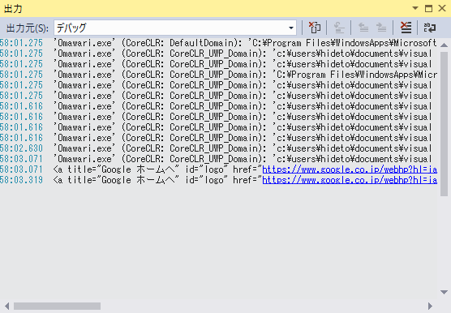
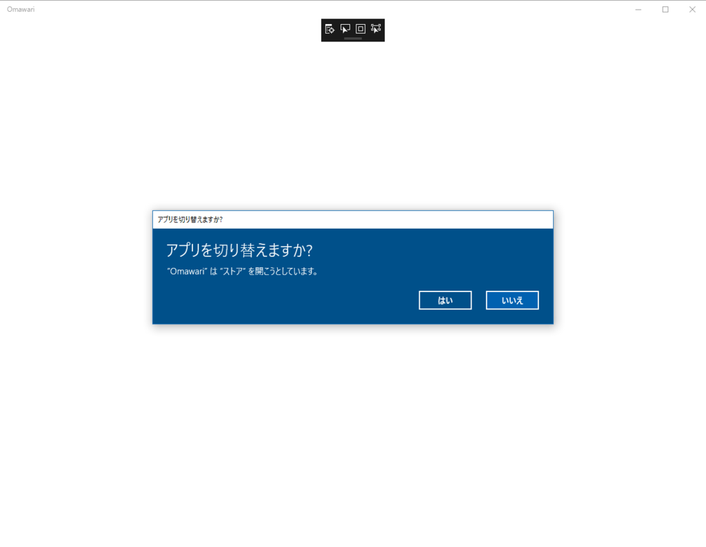

WebView の InvokeScriptAsync() を利用してスクレイピングしてみた。

<pre class="code lang-cs" data-lang="cs" data-unlink>public sealed partial class MainPage : Page
{
public MainPage()
{
this.InitializeComponent();

Loaded += MainPage_Loaded;
}

private void MainPage_Loaded(object sender, RoutedEventArgs e)
{
var browser = new WebView();
var url = &quot;https://google.co.jp/&quot;;
var xpath = &quot;//h1&quot;;
var result_type = &quot;XPathResult.FIRST_ORDERED_NODE_TYPE&quot;;
var function = $&quot;document.evaluate(&quot; +
&quot;'{xpath}', 'document', null, {result_type}, null&quot; +
&quot;).singleNodeValue.innerHTML;&quot;;

browser.NavigationCompleted += async (s, args) =&gt;
{
if (!args.IsSuccess) throw new Exception();

var html = await browser.InvokeScriptAsync(
&quot;eval&quot;,
new string[] { function, }
);

System.Diagnostics.Debug.WriteLine(html);
};

browser.Navigate(new Uri(url));
}
}
</pre>
一応うまくいっているみたい。

しかし、Windows ストアなんかでスクレイピングをやろうとすると、アプリの切り替えダイアログが出てしまう（プロトコルハンドラーとか言うのか？　これ）。

あと、AngularJS みたいなサイトでは使えないかもしれない（やり方が悪いだけかもしれない）。また、WebView は UI スレッドで動作するらしいので、バックグラウンドタスクで利用することもできない。あんまりスジのいい方法ではなさそうだ、というのが今回の結論かも。

