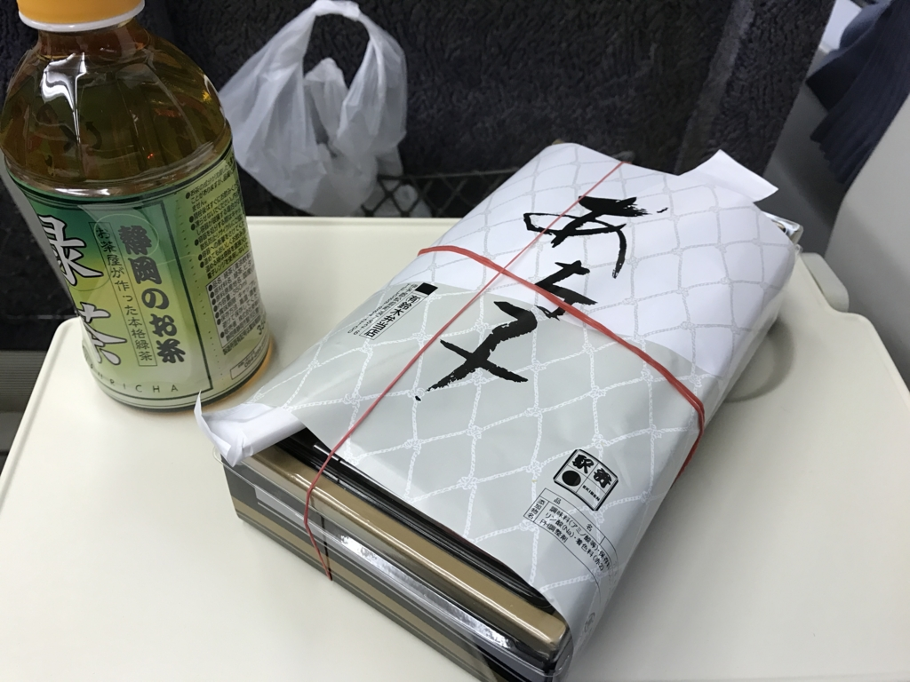
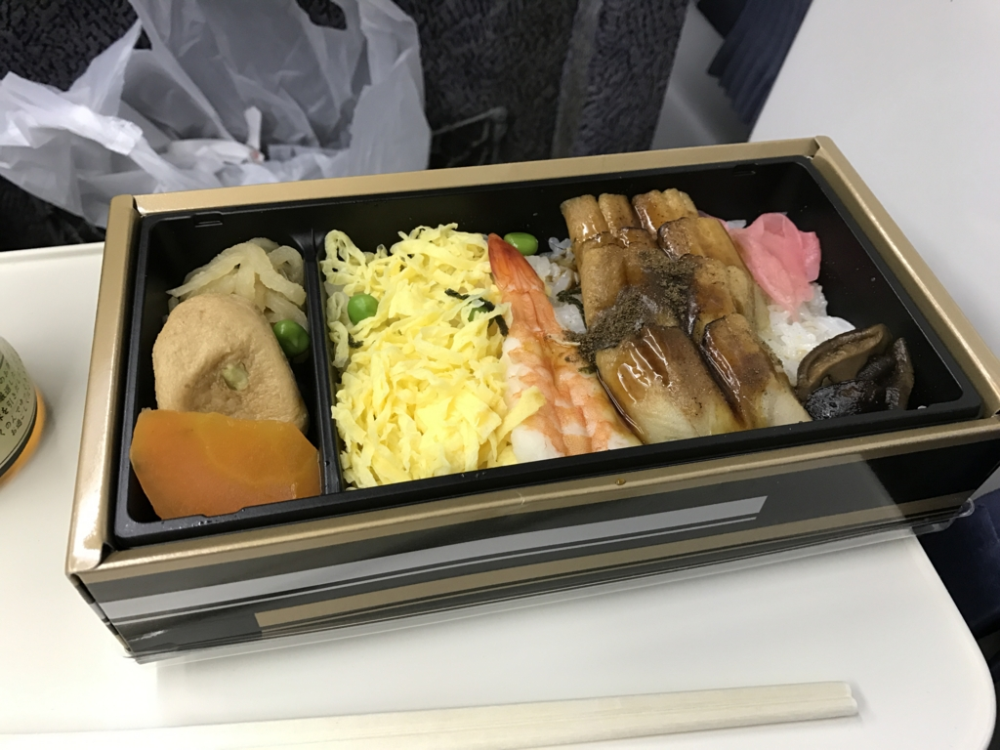
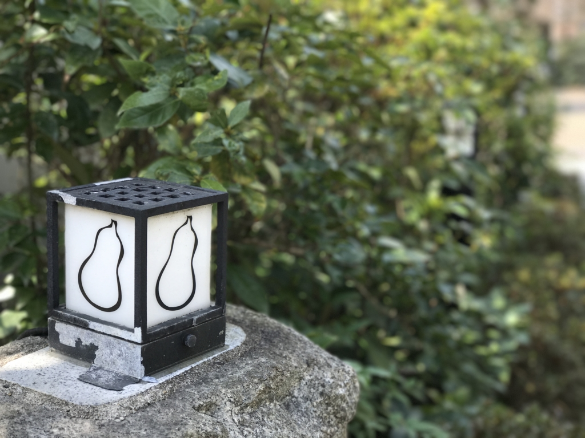
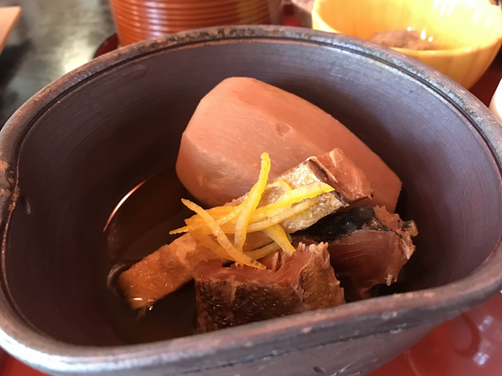
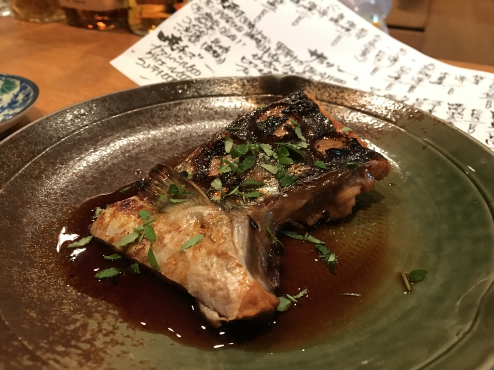
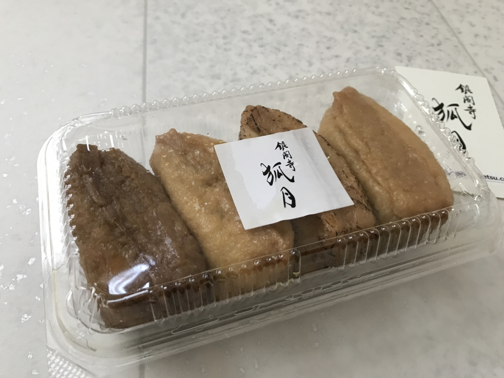
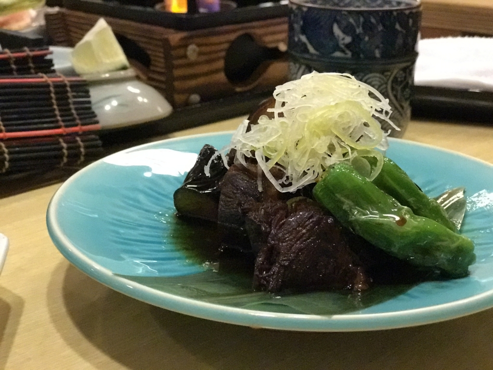
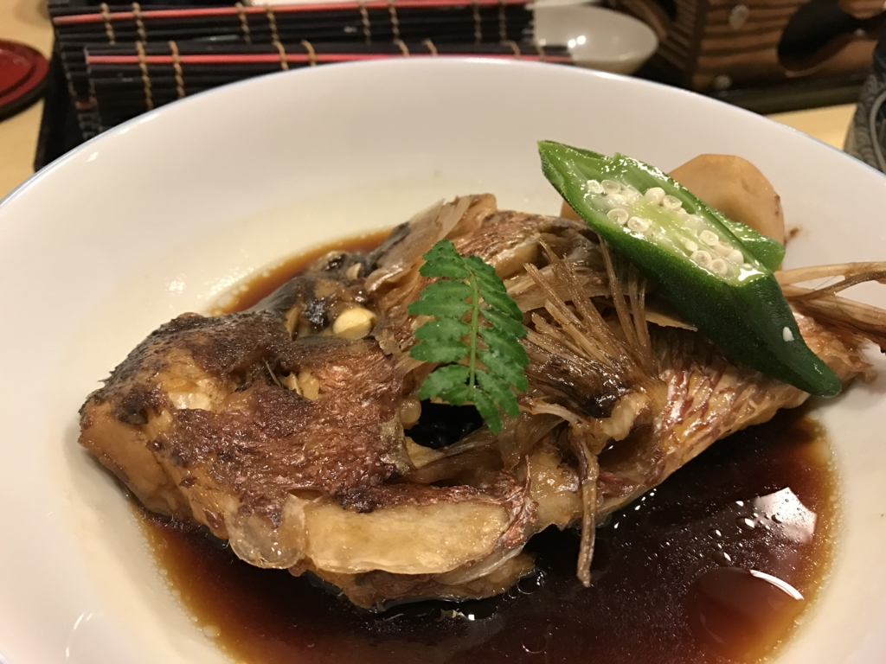
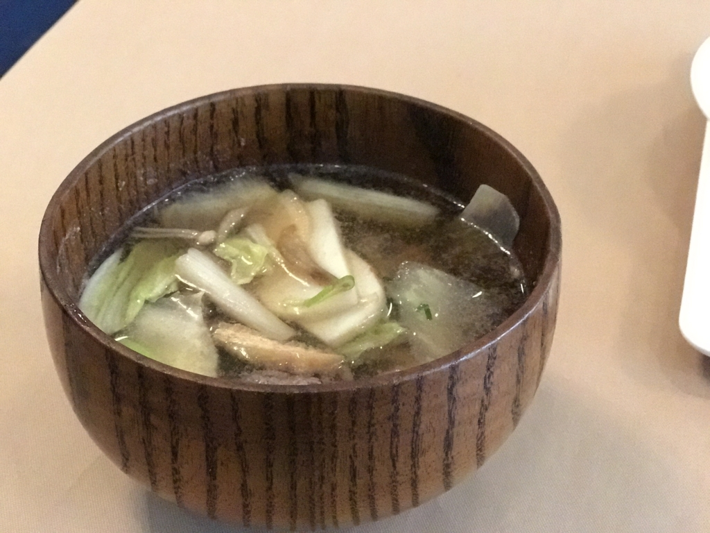
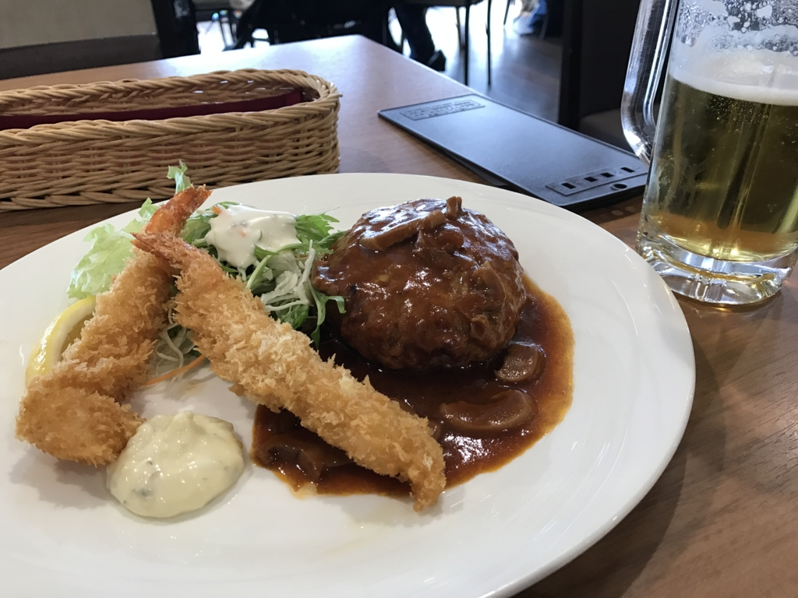

この三連休は墓参りついでに 松山 → 京都 → 奈良 → 三重 → 大阪 → 松山 と周ってきました。あくまでもメインは墓参りだけど、ついでに（？）いろいろ食べてきました。

<h3>あなご弁当</h3>

飛行機の予約が取れなかったので、泣きながら朝5時に起きて JR で京都へ向かいました。最初のごはんは、あなご弁当。確か 750 円ぐらいだった気がする。目新しかったのでつい買っちゃったけど、いつも食べてた松山鮨のお弁当の方が好きかな？　前日徹夜しておいたおかげで、特急しおかぜ では岡山まで爆睡できました。

<h3>いもぼう</h3>

京都では友人に「いもぼう」へ連れて行ってもらいました。円山公園のあたりにあるんだけど、なんか本店だか本家だか、同じような店が二つあるんだなー。ちなみに、「いもぼう」とは京都の伝統料理なのだそうです。

一口食べてみて思い出したんだけど、前にもここに来たことある。食べてるときは、まぁ、普通においしい芋炊きでございますなーと思っていたけど、ちょっと Wikipedia 読んでみて、なるほど、これはなかなかスゴいもんなんだなと気づきました（ぇ

<blockquote cite="https://ja.wikipedia.org/wiki/%E8%8A%8B%E6%A3%92">

芋棒（いもぼう）とは、京料理のひとつ。京都の伝統料理。

海老芋と棒鱈を炊き合わせたもの。海老芋は里芋の一種で、江戸時代中期に九州で作られていた唐芋（とうのいも）を京都に持ち込んだのが始まり。上等品のため、倹約を旨とする商家などでは正月など特別な機会のみに使った。棒鱈は真鱈を干したもので、その昔は安価だったため、ただの里芋と棒鱈の芋棒は京都の庶民の惣菜であった。

<ul>
<li>厚く面取りした海老芋と、1週間 - 10日程かけて柔らかく戻した棒鱈を、1日以上かけて炊き上げる。</li>
<li>煮崩れしやすい芋と煮えにくい棒鱈を普通は一緒に煮ないが、棒鱈から出る成分が海老芋を包み込み煮崩れを防ぎ、海老芋から出る灰汁が棒鱈を柔らかくする。</li>
</ul>
<cite><a href="https://ja.wikipedia.org/wiki/%E8%8A%8B%E6%A3%92">&#x828B;&#x68D2; - Wikipedia</a></cite>
</blockquote>

イモとタラにそんないい関係があったなんてなぁ……。そういえば、昔読んだタラの本は面白かったです。ぜひぜひ。

<iframe src="https://hatenablog-parts.com/embed?url=https%3A%2F%2Fblog.daruyanagi.jp%2Fentry%2F2015%2F08%2F04%2F231815" title="『魚で始まる世界史: ニシンとタラとヨーロッパ』 - だるろぐ" class="embed-card embed-blogcard" scrolling="no" frameborder="0" style="display: block; width: 100%; height: 190px; max-width: 500px; margin: 10px 0px;"></iframe><cite class="hatena-citation"><a href="https://blog.daruyanagi.jp/entry/2015/08/04/231815">blog.daruyanagi.jp</a></cite>

僕は 3,000 円のコース（とビール）を頼んだのだけど、山芋をおろしたのを海苔で巻いたやつも個人的には好きでした。

<h3>居酒屋 Kihara</h3>

夜は僕の希望で銀閣寺の居酒屋 Kihara さんにお邪魔しました。久しぶり！

写真撮るのなんか忘れて食べまくってたので、これぐらいしかない……。何食べたかな？　ぐぢのお造りやら、よくわかんないイワシの天ぷら（めっちゃビールに合う！）、ホワイトアスパラ……もう思い出せないや。ともかくさんざん飲み食いしたあげく、最後に〆のどんぶりまで頼んじゃいました。なのに、たいしておカネがかからなかったのが誤算といえばうれしい誤算（

<h3>にしんいなり（銀閣寺 狐月）</h3>

哲学の道へ入るあたりに、なんかおいしそうな（！？）提灯がでていたので、つい買っちゃいました。

“にしんいなり”なんだそうですけど、初めて聞いたかも……いろんな種類があったのですが、ランダムで6つ包んでくれるセットがあったのでそれをお願いしたところ、閉店間際（6時）なので、と2個オマケしてもらっちゃいました。ちょっと炙ってあったり、あまーかったり、柚子が効いていたり――お稲荷さんなんてフツーな感じでも絶対美味しいと思うんですが、これはちょっとヒネりというか、ひと手間かかっていて、ちょっと大人な感じですねー。リピートしたいかも。

<h3>月日亭</h3>

2日目の晩は、友人と大和・八木の月日亭にいきました。割と接客の丁寧なお店で、百貨店の上じゃなくてなんかお洒落な店を自前で持てばいいのにとか思っちゃいました。

大和ポークと茄子の煮物が個人的には好き。鯛もおいしゅうございました。

<h3>名張の牛汁</h3>

名張の宿は転々としていたのだけど、やっぱり駅前のシティホテルが鉄板というか、安心というか、面倒がなくていい気がしています。朝ご飯に牛汁や牛スジカレーが食べられるのもいい。

伊賀市はさいきん忍者でハデにやってるみたいですが、名張市は細々と牛汁でがんばってほしいですね（ぁ

<h3>伊丹空港</h3>

伊丹空港から飛行機で松山に帰ったら、友人に「珍しいな？」と言われてしまいました。そういえば、いつも電車やら船だもんね。

空港では出発までの間に、レストランでハンバーグとエビフライを食べました。なんか大人のお子様ランチみたいやけど、なんかこういうのを食べたい気分だったんだよ！（わかるひとにはわかるでしょ？　フツーにおいしかったです。

