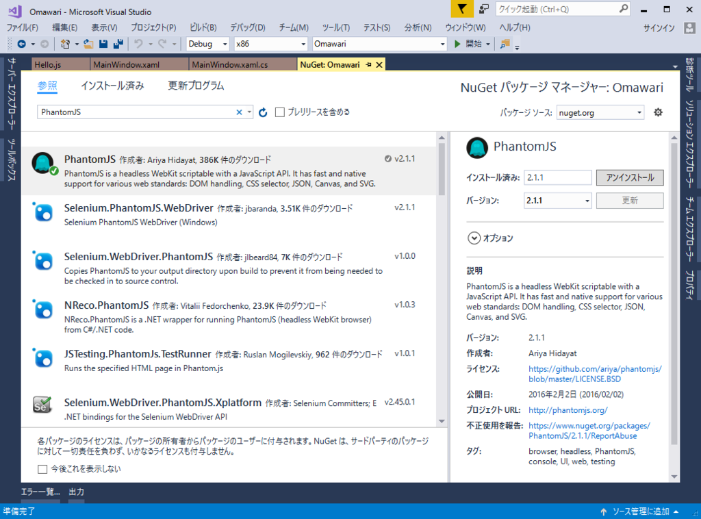
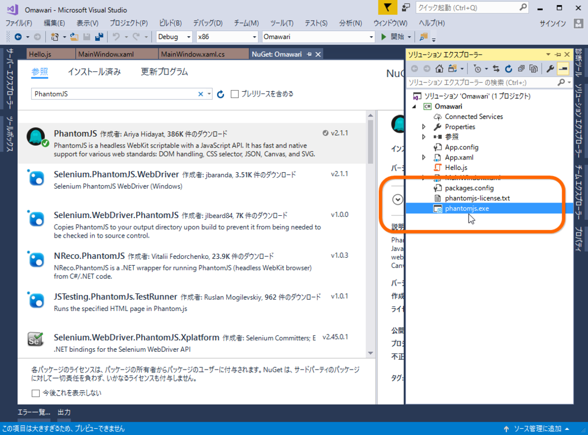
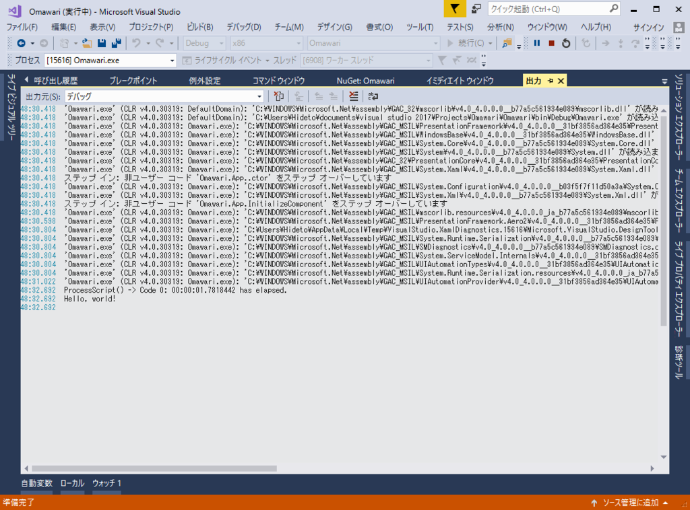
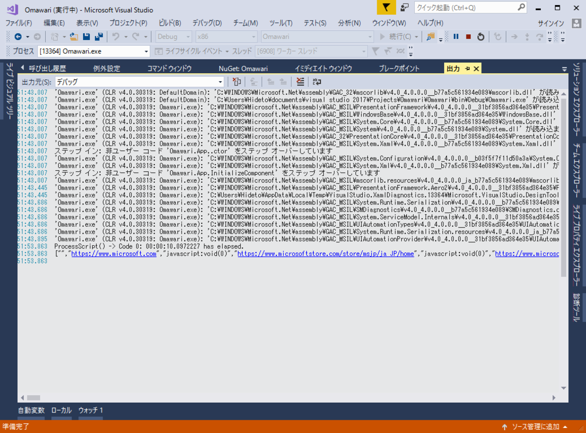

「AngularJS で作られた Web サイトの内容がとれないよ……」って Twitter で泣いてたら、@nakaji 先生が「PhantomJS 使えばええやろ」的なことを言っていた気がするので、ちょっと試してみました。

<h3>PhantomJS とは</h3>

ぶっちゃけあんまりよくわかってないのですが、<i>“Google Chrome のユーザーインターフェイスがない<a href="#f-32b25991" name="fn-32b25991" title="ヘッドレスっていうらしい">*1</a>やつ”</i>だと思えばだいたい合ってるみたいです。JavaScript で動的にデータをとってくるタイプの Web サイトの DOM をわちゃわちゃしたり、スクリーンショットをとって保存したり、ユーザーインターフェイスの操作を自動化してテストしたり……みたいな感じに使えるっぽいですね。

<ul>
<li><a href="http://phantomjs.org/">http://phantomjs.org/</a></li>
</ul>
スタンドアロンのバイナリになっているので、C# からはそれを叩いて、あらかじめ用意しておいたスクリプトを処理してもらう感じになるようです。なので、任意のプロセスを叩けない UWP で使うのは難しそうですね。今回は WPF でサンプルを作りましたが、WPF 要素は皆無です。

<h3>使い方</h3>

まず NuGet で PhantomJS をとってきます。

すると phantomjs.exe というのがソリューションに追加されます。これはコンパイル時に出力フォルダーにコピーされます。

次に、JavaScript を用意します。今回はソリューションフォルダーのルートに Hello.js を作成。

<pre class="code lang-javascript" data-lang="javascript" data-unlink>console.log('Hello, world!');
phantom.exit();
</pre>
最初なので、動作確認をするだけです。これも phantomjs.exe と同様、コンパイル時に出力フォルダーへコピーされるようにしておけばいいと思います。

次は、これを呼ぶための C# コードを書きます。標準出力でやり取りする感じにしてみました。

<pre class="code lang-cs" data-lang="cs" data-unlink>public MainWindow()
{
InitializeComponent();

Loaded += MainWindow_Loaded;
}

private void MainWindow_Loaded(object sender, RoutedEventArgs e)
{
var result = ProcessScript(&quot;hello.js&quot;);

System.Diagnostics.Debug.WriteLine(result);
}

private string ProcessScript(string script, params string[] args)
{
using (var process = new System.Diagnostics.Process())
{
process.StartInfo.CreateNoWindow = true;
process.StartInfo.UseShellExecute = false;
process.StartInfo.RedirectStandardOutput = true;
process.StartInfo.RedirectStandardInput = false;
process.StartInfo.FileName = &quot;phantomjs.exe&quot;;
process.StartInfo.Arguments = $&quot;{script} {string.Join(&quot; &quot;, args)}&quot;;

process.Start();
var result = process.StandardOutput.ReadToEnd();
process.WaitForExit();

System.Diagnostics.Debug.WriteLine($&quot;ProcessScript() -&gt; Code {process.ExitCode}: {process.ExitTime - process.StartTime} has elapsed.&quot;);

return result;
}
}
</pre>
本当はパスの管理とかもう少し何とかしないとだめかもしれませんけど、まぁ、いいや。

とりあえず、実行してみましょう。

 

<pre class="code lang-ps1" data-lang="ps1" data-unlink>&gt; ProcessScript() -&gt; Code 0: 00:00:01.7818442 has elapsed.
&gt; Hello, world!
</pre>
いい感じになってる気がします。今度はちょっと複雑にしてみます。といっても、a.href の値を配列で受け取るだけです。

<pre class="code lang-cs" data-lang="cs" data-unlink>// MainWindow.cs

private void MainWindow_Loaded(object sender, RoutedEventArgs e)
{
var result = ProcessScript(&quot;hello.js&quot;, &quot;なんか URL&quot;);

System.Diagnostics.Debug.WriteLine(result);
}
</pre><pre class="code lang-javascript" data-lang="javascript" data-unlink>// hello.js

var system = require('system');

// 引数のチェック
switch(system.args.length) {
case 2:
var url = system.args[1];
break;
default:
console.log('error: invalid argument');
phantom.exit(1);
break;
}

var page = require('webpage').create();

// Web Page を開く
page.open(url, function (status) {
switch (status) {
case 'success':
var links = page.evaluate(function () {
return [].map.call(document.querySelectorAll('a'), function (link) { return link.getAttribute('href'); });
});
console.log(JSON.stringify(links));
phantom.exit(0);
break;
default:
console.log('error: page.open() ' + status);
phantom.exit(1);
break;
}
});
</pre>

とりあえず動いている気がします。JavaScript がよくわからないのが困ったちゃんですが、まぁ、おいおいマスターしていけばいいよね。これでいろんなことに使える気がしてきました。

<a href="#fn-32b25991" name="f-32b25991" class="footnote-number">*1</a>:ヘッドレスっていうらしい

