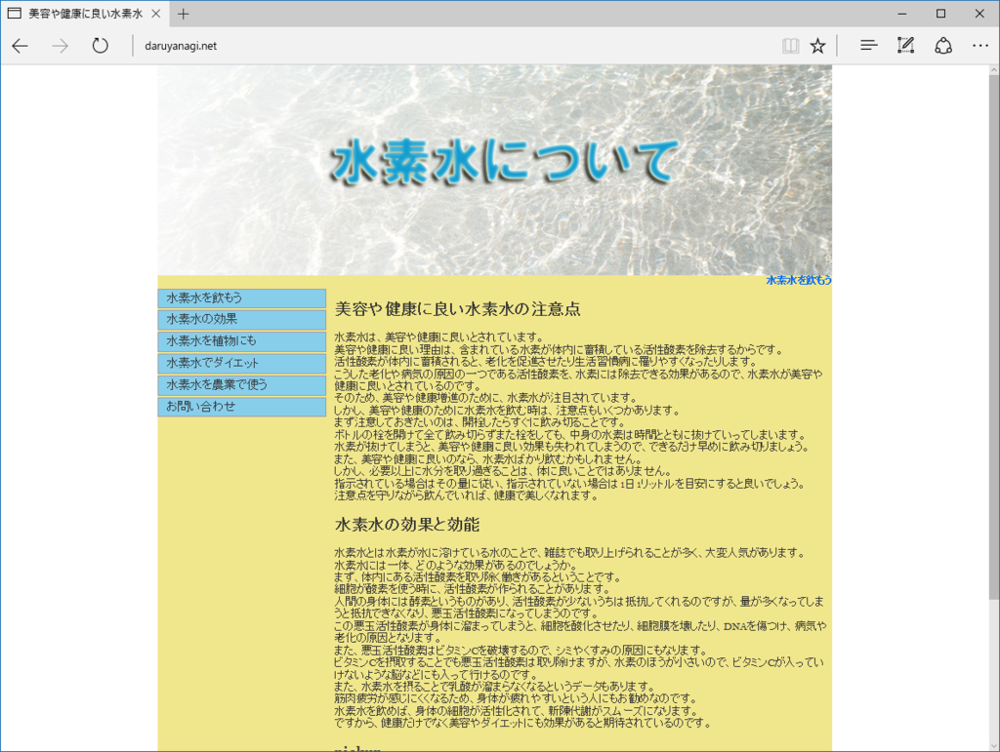
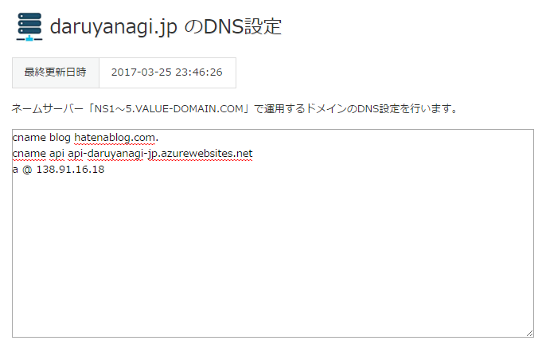
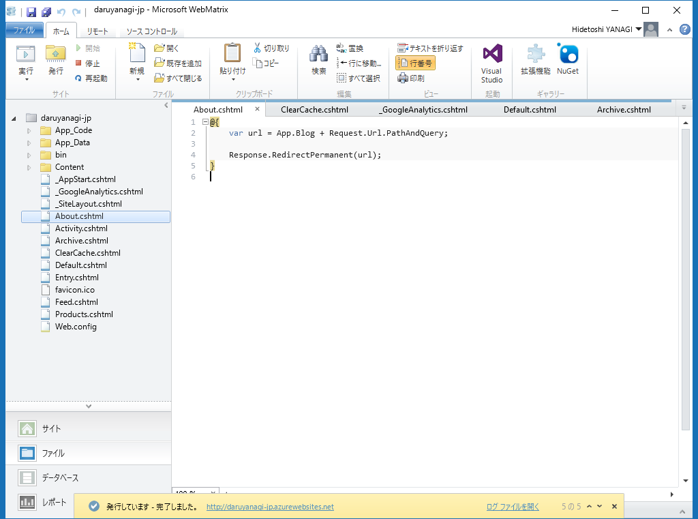

あまり気付かれてない気がしますが（こっそりやったので！）、はてなブログのドメインをお引越ししました。はてなブログを独自ドメインにする話はよく見かけますが、独自ドメインで運用していたはてなブログを別のドメインへ移動させた例はあまりないかもしれないので、メモがてら残しておきます。

とはいえ、心配したようなトラブルもとくに起こりませんでした。1時間ちょっと はてなブログ がダウンしたのと、AdSense がちょっと減ったような気がする程度です。

<h3>以前の状態と解決すべき課題</h3>

以前は

<ul>
<li>daruyanagi<b>.net</b>：メインのブログ（WordPress）</li>
<li>daruyanagi<b>.jp</b>：はてなブログ</li>
</ul>
という運用をしていたのですが（こういうちょっと謎な構造になっていたのは、もっぱら歴史的な事情によります）、WordPress よりも はてなブログの方が管理が楽だったこともあり、いつしか daruyanagi.jp がメインに。持て余していた daruyanagi.net をポートフォリオサイト（というか自己紹介サイト）っぽい感じにして使っていたのですが、とある日、ドメインの延長手続きを失念してしまい、daruyanagi.net を失ってしまいました。

現在は水素水を布教するサイトになっています。

そんなわけで、

<ul>
<li>daruyanagi.jp：はてなブログ</li>
<li><b>about.</b>daruyanagi.jp：自己紹介サイト</li>
</ul>
というよくわからない構造になってしまい、ちょっと困っていました。できればこれを

<ul>
<li><b>blog.</b>daruyanagi.jp：はてなブログ</li>
<li>daruyanagi.jp：自己紹介サイト</li>
</ul>
という感じに整理したかった。あと、トップドメインで はてなブログ を運用するのはあまりよくないので直したかった、というのもあります。

<blockquote cite="http://help.hatenablog.com/entry/customdomain">

※はてなブログでは、サブドメインを使用しないexample.comでブログを運用すると、ドメイン名の仕組み上、トラブルの原因になることがあります。取得したドメインの前に、必ずサブドメイン（wwwやblogなど）を付加してください。

<cite><a href="http://help.hatenablog.com/entry/customdomain">&#x306F;&#x3066;&#x306A;&#x30D6;&#x30ED;&#x30B0;&#x3092;&#x72EC;&#x81EA;&#x30C9;&#x30E1;&#x30A4;&#x30F3;&#x3067;&#x5229;&#x7528;&#x3059;&#x308B; - &#x306F;&#x3066;&#x306A;&#x30D6;&#x30ED;&#x30B0; &#x30D8;&#x30EB;&#x30D7;</a></cite>
</blockquote>

Twitter で煽られるのも悲しいですしね！

<blockquote class="twitter-tweet" data-lang="ja">
<a href="https://twitter.com/daruyanagi">@daruyanagi</a> RFC 違反ドメイン
&mdash; しばやん (@shibayan) <a href="https://twitter.com/shibayan/status/845588375209881600">2017年3月25日</a></blockquote> 

<h3>WebMatrix × ASP.NET Web Pages で自己紹介サイトを構築し、Azure へ配置する</h3>

というわけで、サイトのお引越し処理です。やらなければいけないのは以下の2つになります。

<ol>
<li>はてなブログを daruyanagi.jp から blog.daruyanagi.jp へ移動
<ol>
<li>独自ドメインの割り当てを解除し、daruyanagi.hatenablog.com に戻す</li>
<li>DNS設定を行う</li>
<li>はてなブログに新しい独自ドメインを割り当てる</li>
</ol></li>
<li>自己紹介サイトを daruyanagi.jp にする
<ol>
<li>DNS設定を行う</li>
<li>Azure のカスタムドメイン機能で daruyanagi.jp を割り当てる</li>
</ol></li>
</ol>
うちは20年近くバリュードメインですので、そこで DNS の設定を書き換えます。

これが反映されるのを待って、はてなブログ と Azure 側でもドメインの設定をしました。

はてなブログのドメイン移動は、反映までに少し時間がかかりましたが（1時間ちょい）、問題なく行えました。あまり期待していなかったんですが、はてなブックマークなどもちゃんと受け継がれたようです。さすが！<a href="#f-2bea128f" name="fn-2bea128f" title="スターはダメなんだっけ？　よくわかんないけどいいや">*1</a>

しかし、以前に外部からいただいた はてなブログ へのリンクが、移転に伴い 404 になってしまうのはあまりいただけません。というわけで、自己紹介サイトを拡張し、blog.daruyanagi.jp へリダイレクトを行うことにしました。幸い、自己紹介サイトは WebMatrix × ASP.NET Web Pages で作ってあったので、そんなに難しくはなさそう。

しかも幸運なことに、はてなブログ は記事を配信するディレクトリを一段深く掘ってあります（ドメイン直下ではない）。

<blockquote cite="http://help.hatenablog.com/entry/import/directory">

※ディレクトリとして、はてなブログで使用しているaboutやarchiveなどを設定することはできません。

<cite><a href="http://help.hatenablog.com/entry/import/directory">&#x8A18;&#x4E8B;&#x3092;&#x914D;&#x4FE1;&#x3059;&#x308B;&#x30C7;&#x30A3;&#x30EC;&#x30AF;&#x30C8;&#x30EA;&#x3092;&#x5909;&#x66F4;&#x3059;&#x308B; - &#x306F;&#x3066;&#x306A;&#x30D6;&#x30ED;&#x30B0; &#x30D8;&#x30EB;&#x30D7;</a></cite>
</blockquote>

というわけで、<code>daruyanagi.jp/entry</code>、<code>daruyanagi.jp/archive</code>、<code>daruyanagi.jp/about</code> へのリクエストをそのまま <code>blog.daruyanagi.jp</code> の各ディレクトリへリダイレクトすればよさそう。

 

<pre class="code lang-cs" data-lang="cs" data-unlink># ~/Entry.cs、 ~/Archive.cs、 ~/About.cs

@{
var url = App.Blog + Request.Url.PathAndQuery;

Response.RedirectPermanent(url);
}
</pre>
<code>App.Blog</code> には、blog.daruyanagi.jp が格納されています<a href="#f-e1a7f04d" name="fn-e1a7f04d" title="開発中は daruyanagi.jp にしていろいろテストしていました">*2</a>。<a href="https://msdn.microsoft.com/ja-jp/library/system.web.httpresponse.redirectpermanent(v=vs.110).aspx">HttpResponse.RedirectPermanent &#x30E1;&#x30BD;&#x30C3;&#x30C9; (System.Web)</a> は 301 リダイレクトを行ってくれるらしいです。楽ちんですね！ WebMatrix/ASP.NET Web Pages を使ってる人は少ないと思いますが、他の言語やフレームワーク、サーバーでも似たような感じの運用で対処できそうな気がします。

フィードもリダイレクトしようかなと思いましたが、それはなんとなくやめました。ごめんなさい。購読してくれてる方は、URL の登録をやり直してください。<a href="#f-a6c4b1b3" name="fn-a6c4b1b3" title="daruyanagi.jp/feed を登録している場合は、はてなブログと僕のもう一つのブログ（コラムのみ）の新着情報の両方を受け取れます">*3</a>

Azure のカスタムドメイン割り当ては、はてなブログの独自ドメイン設定よりも早く、30分弱で反映されました。うまくいってるみたいでよかったです。Google はすぐに古い URL を参照しなくなりましたが（RedirectPermanent のおかげでしょうか？）、まだ古い URL からくるトラフィックもあるみたいで、残念な思いをさせなくてよかったと思います（ブログを読んでがっかりするのは防げませんが！）。

丸一日様子を見てから、daruyanagi.jp -> Azure も cname ではなく a レコードで引くようにしてみました。これで今回のミッションは完了！　お疲れさまでした。WebMatrix は今年いっぱいでサポート終了ですけど、最後まで役に立ってくれました。僕のようなアマチュアにはピッタリなツールだったのですが、やっぱり Visual Studio Code などと比べてエディターが弱いので仕方がないかな。ともあれ、ありがとうと言いたいです。

<h3>追記</h3>

<blockquote class="twitter-tweet" data-lang="ja">
<a href="https://t.co/yNcU3LEMXE">https://t.co/yNcU3LEMXE</a> を売る相手がいなくなったので、水素水サイトにするか
&mdash; しばやん (@shibayan) <a href="https://twitter.com/shibayan/status/846011368872427520">2017年3月26日</a></blockquote>

<a href="#fn-2bea128f" name="f-2bea128f" class="footnote-number">*1</a>:スターはダメなんだっけ？　よくわかんないけどいいや

<a href="#fn-e1a7f04d" name="f-e1a7f04d" class="footnote-number">*2</a>:開発中は daruyanagi.jp にしていろいろテストしていました

<a href="#fn-a6c4b1b3" name="f-a6c4b1b3" class="footnote-number">*3</a>:daruyanagi.jp/feed を登録している場合は、はてなブログと僕のもう一つのブログ（コラムのみ）の新着情報の両方を受け取れます

