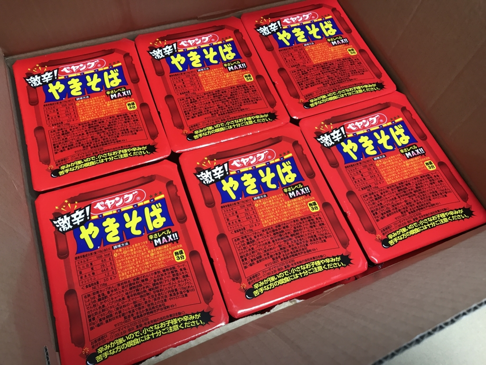
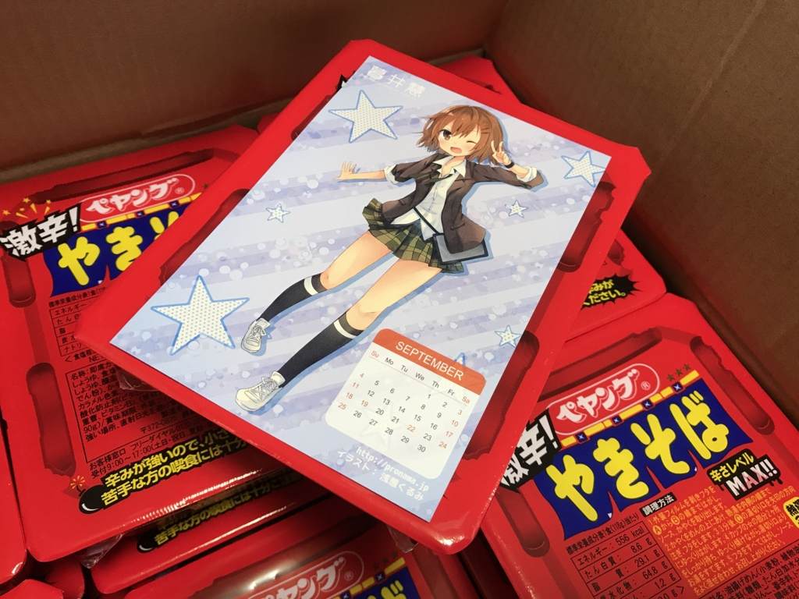

この前、「辛辛魚ラーメン 辛辛MAXバージョン 」10袋が送られてきたんですよ。

<iframe src="http://blog.daruyanagi.jp/embed/2017/01/13/173352" title="風邪ひいて死にかけてたら、辛辛魚が送られてきた。 - だるろぐ" class="embed-card embed-blogcard" scrolling="no" frameborder="0" style="display: block; width: 100%; height: 190px; max-width: 500px; margin: 10px 0px;"></iframe><cite class="hatena-citation"><a href="http://blog.daruyanagi.jp/entry/2017/01/13/173352">blog.daruyanagi.jp</a></cite>

こいつはマジで辛くて、食べた翌日は必ず下痢に見舞われてた。ただ辛いだけならまだいいんだけど、案外おいしくて、スープまで全部飲んでしまうのがよくない。なんかお尻の穴もヒリヒリする感じだし、こいつは本当にヤバいと思う。

<a href="http://www.amazon.co.jp/exec/obidos/ASIN/B01IQJPE3E/bestylesnet-22/">寿がきや 井の庄監修 辛辛魚ラーメン 辛辛MAXバージョン 135g×10袋</a>
<ul><li>出版社/メーカー: 寿がきや食品</li><li>メディア: 食品&飲料</li><li><a href="http://d.hatena.ne.jp/asin/B01IQJPE3E/bestylesnet-22" target="_blank">この商品を含むブログを見る</a></li></ul>

それでもなんとかすべてを消費した（正確に言うと一袋だけ残っているのだが、ほぼ食べきったといってよいだろう）ところ……

<blockquote class="twitter-tweet" data-lang="ja">
今ので一ケース辛辛魚追加
&mdash; しばやん (@shibayan) <a href="https://twitter.com/shibayan/status/845538195827703809">2017年3月25日</a></blockquote>

悲劇、再び――。

脅し文句が怖い。今度こそ、ケツの穴から血を吹くかもしれん。

大きさはそれほどでもなく、<a href="http://pronama.jp">&#x30D7;&#x30ED;&#x751F;&#x3061;&#x3083;&#x3093;</a>（マジ天使！）の絵葉書と同じぐらいの大きさだった。自分はあんまりペヤングを食べたことがないのだけど、量的には高校生のおやつといったところか。

さっそく作ってみた。いかにも辛そうなにおいがたちこめ、鼻の粘膜を突き刺す。これはヤバい、と俺のゴーストが叫んでいる。

けれど、実際口にしてみると、辛さはそれほどでもなかった。辛辛魚に鍛えられすぎていたのかもしれない。カップ焼きそばはスープをもたないので、辛みが麺とともにやってきてすぐに去っていく。それも辛みをそれほど感じなかった原因の一つかもしれない。

とはいえ、それは“辛辛魚に比べて”というだけで、フツーの感覚でいえば十分に、むしろ、ぶっちゃけ、めっちゃ辛い。もうアホか、バカかというぐらい辛い。ハァハァしないと舌が燃えるようで、口がなかなか閉まらない。しかし、けっしてマズくはなく、量が少ないこともあってペロっと完食してしまった。

おかげで、次の日の朝も下痢だったけれど。ケツの穴が無事だったのが不幸中の幸いだ（辛辛魚ほどには痛くならなかった）。

<a href="http://www.amazon.co.jp/exec/obidos/ASIN/B007JE76M0/bestylesnet-22/">ぺヤング 激辛やきそば 118g×18個</a>
<ul><li>出版社/メーカー: まるか商事</li><li>メディア: 食品&飲料</li><li>購入: 1人 クリック: 147回</li><li><a href="http://d.hatena.ne.jp/asin/B007JE76M0/bestylesnet-22" target="_blank">この商品を含むブログ (12件) を見る</a></li></ul>

<h3>追記</h3>

おまけに『漢文を読むための助字小字典』をもらった。

これはもともとなにかの字典の巻末付録かなにかだったのだそうで、とても薄い（のに486円する）。前から欲しかったけど、自分で買うのはなんだかなーと思っていたので、もらえてうれしかった。ペラペラめくって読んでみたけど、なかなか役に立ちそう。これで漢文がはかどる……かもしれない。

<a href="http://www.amazon.co.jp/exec/obidos/ASIN/4900196126/bestylesnet-22/">漢文を読むための助字小字典</a>
<ul><li>出版社/メーカー: 内山書店</li><li>発売日: 1996/07</li><li>メディア: 単行本</li><li><a href="http://d.hatena.ne.jp/asin/4900196126/bestylesnet-22" target="_blank">この商品を含むブログを見る</a></li></ul>

<h3>追記その2</h3>

<blockquote class="twitter-tweet" data-lang="ja">
ペヤング先生、背脂によりついに検索予測から「ゴキ◯リ」を消すことに成功した様子。さすがです。 <a href="https://t.co/noOd7NMGVn">pic.twitter.com/noOd7NMGVn</a>
&mdash; えこちこ (@ecochiko) <a href="https://twitter.com/ecochiko/status/846942717003399168">2017年3月29日</a></blockquote>

おめでとう！　ペヤングｗｗｗ　これで新製品ラッシュも一段落するのかしら？

