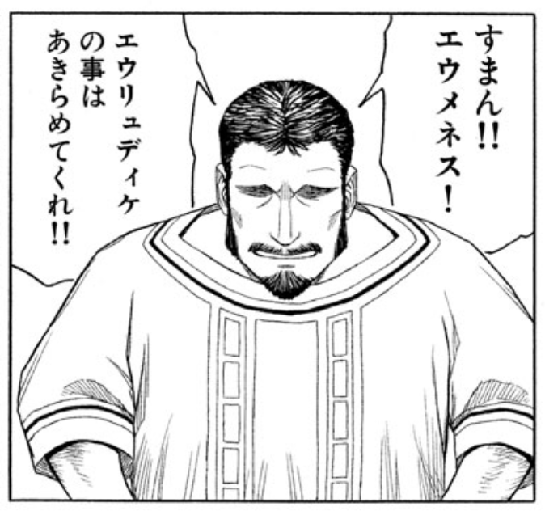
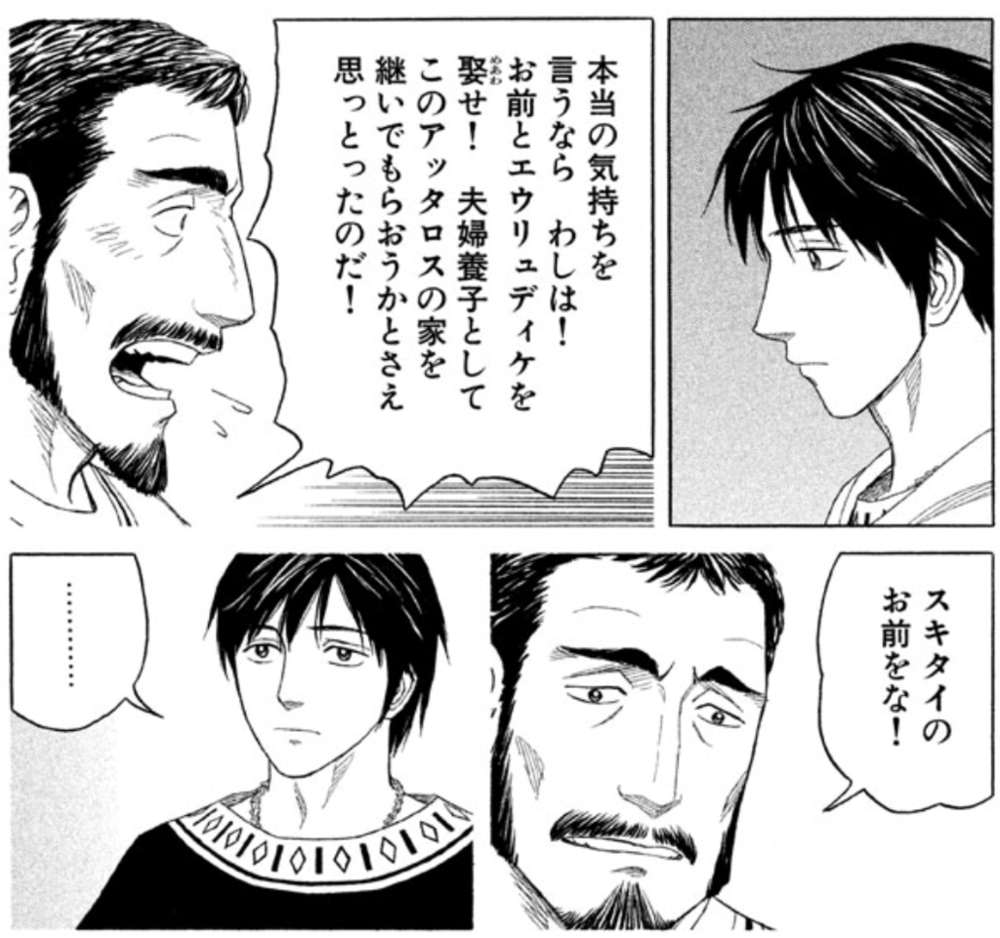
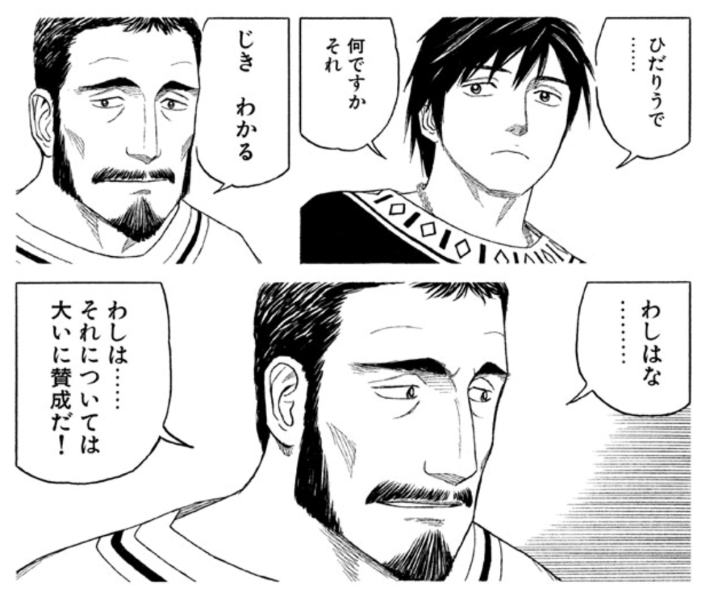
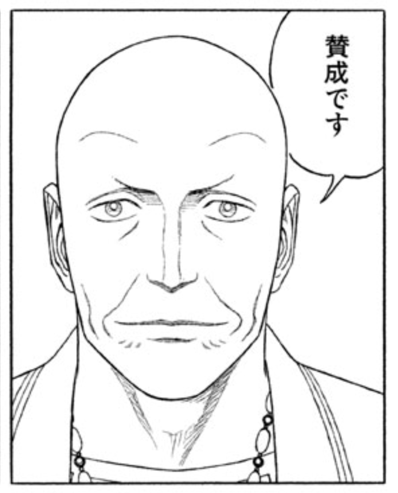
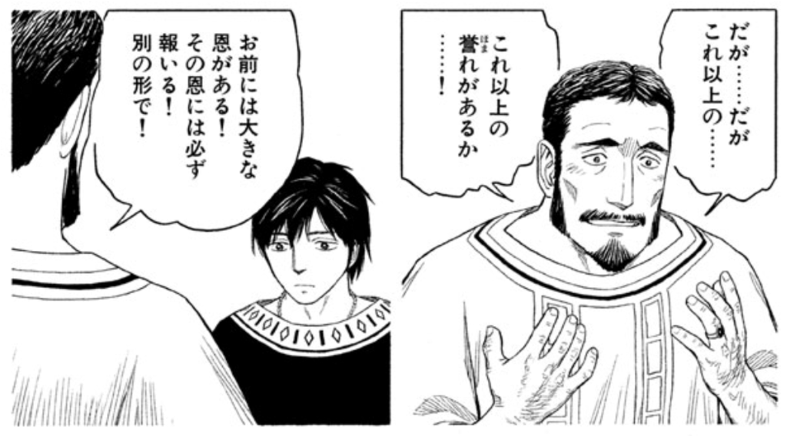
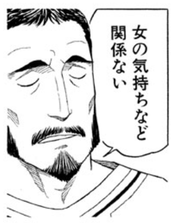

<a href="http://www.amazon.co.jp/exec/obidos/ASIN/B06XHL1WLX/bestylesnet-22/">ヒストリエ（１０） (アフタヌーンコミックス)</a>
<ul><li>作者: 岩明均</li><li>出版社/メーカー: 講談社</li><li>発売日: 2017/03/23</li><li>メディア: Kindle版</li><li><a href="http://d.hatena.ne.jp/asin/B06XHL1WLX/bestylesnet-22" target="_blank">この商品を含むブログ (6件) を見る</a></li></ul>

『ヒストリエ 10』はアレクサンドロスがカイロネイアでひたすら暴れる話でした。ずっとでるの楽しみにしてたし、まぁ、面白かったのだけど、ちょっと淡白な感じもしなくもなかったかな？

それにしても、カッコいいのはアッタロスさんですよ。

オトコらしく潔い謝り方でカッコよい。

マケドニア貴族であることに誇りを持ちつつも、スキタイの血を侮蔑することはない。むしろ能力を高く認めて、自分の家を継がせたいとまで考えるのがカッコよい。

史実でのその後を思うと、ここでマケドニア貴族になれていればかなり趨勢は違っていたんじゃないかと思ったりもする（生まれだけはどうにもならんけど）。フィリッポスとアンティパトロスの思惑はまだよくわからんが、エウメネスがグレてしまわないか心配。

そんなことはともかく、エウメネスの前途を祝福しつつも、手元を離れる寂しさを隠し切れないアッタロスさんもまたカッコよい。

アンティパトロスさんもそんなアッタロスさんに大賛成。

そして、相変わらず恩義を大事にするところもカッコよい。

それにしても、エウメネスは女運ないなぁ。サテュラに続き、切ない別れ方になってしまった。

<blockquote cite="http://blog.daruyanagi.jp/entry/2015/06/16/222354">

このエウリュディケっていう子、もしかしてフィリッポスの嫁さんになる人なんじゃぁ……。どうやって話を付けていくんだろう？

<cite><a href="http://blog.daruyanagi.jp/entry/2015/06/16/222354">&#x300E;&#x30D2;&#x30B9;&#x30C8;&#x30EA;&#x30A8; 9&#x300F; &#x304A;&#x308C;&#x306E;&#x30A2;&#x30C3;&#x30BF;&#x30ED;&#x30B9;&#x3055;&#x3093;&#x304C;&#x3050;&#x3093;&#x3050;&#x3093;&#x30AB;&#x30C3;&#x30B3;&#x3088;&#x304F;&#x306A;&#x308B;&#x4EF6;&#x306B;&#x3064;&#x3044;&#x3066; - &#x3060;&#x308B;&#x308D;&#x3050;</a></cite>
</blockquote>

とりあえず前巻での疑問があっさり解決されてしまって、スッキリしたやら、ちょっとしんみりするやらでした。

<h3>追記</h3>

女の気持ちはどうでもいいと切り捨てるところもカッコよい（あれ？）。

<h3>追記その２</h3>

このコマ、めっちゃ気に入った。　

