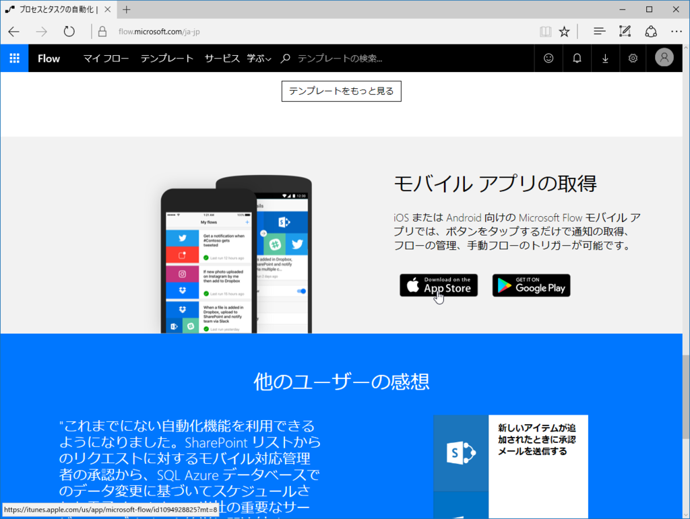
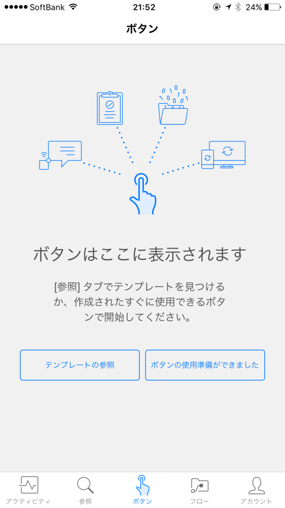
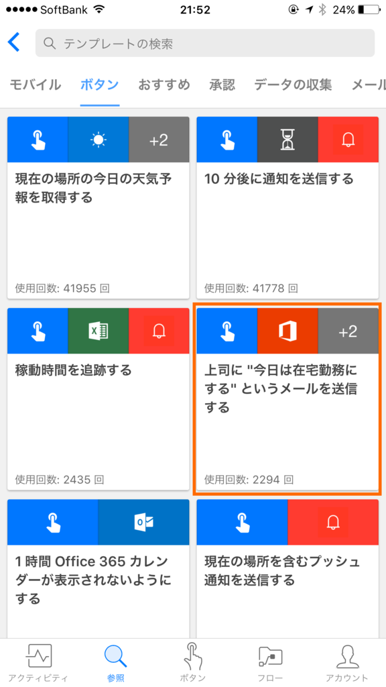
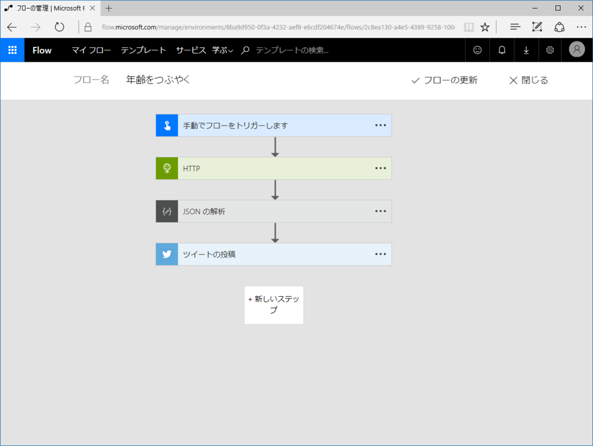
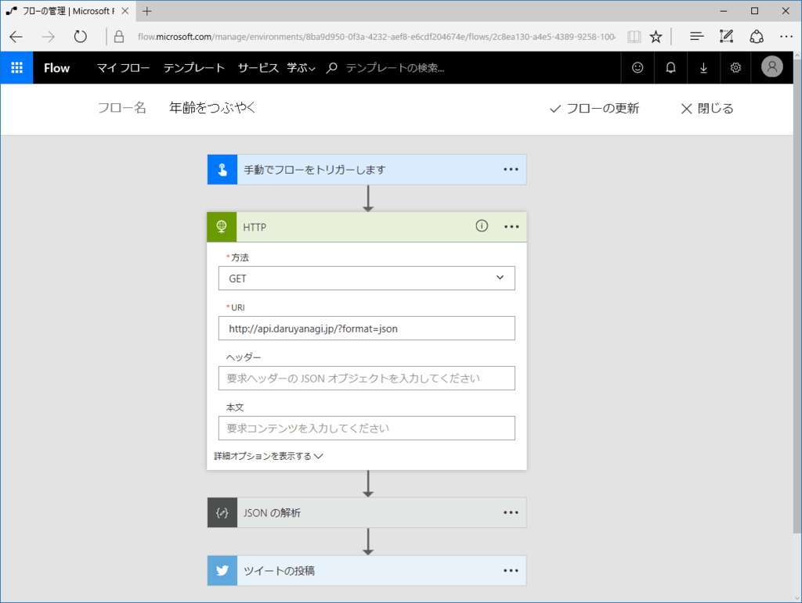
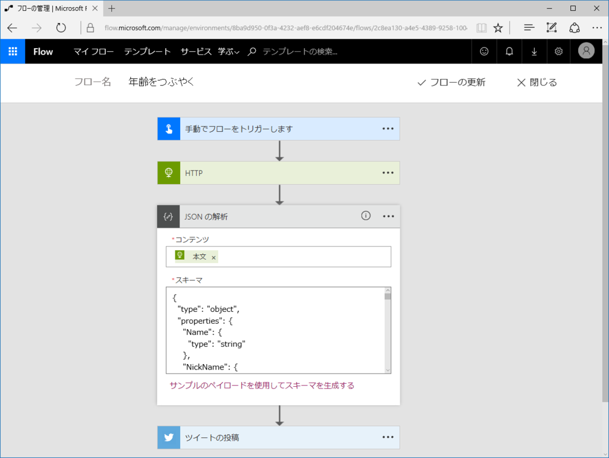
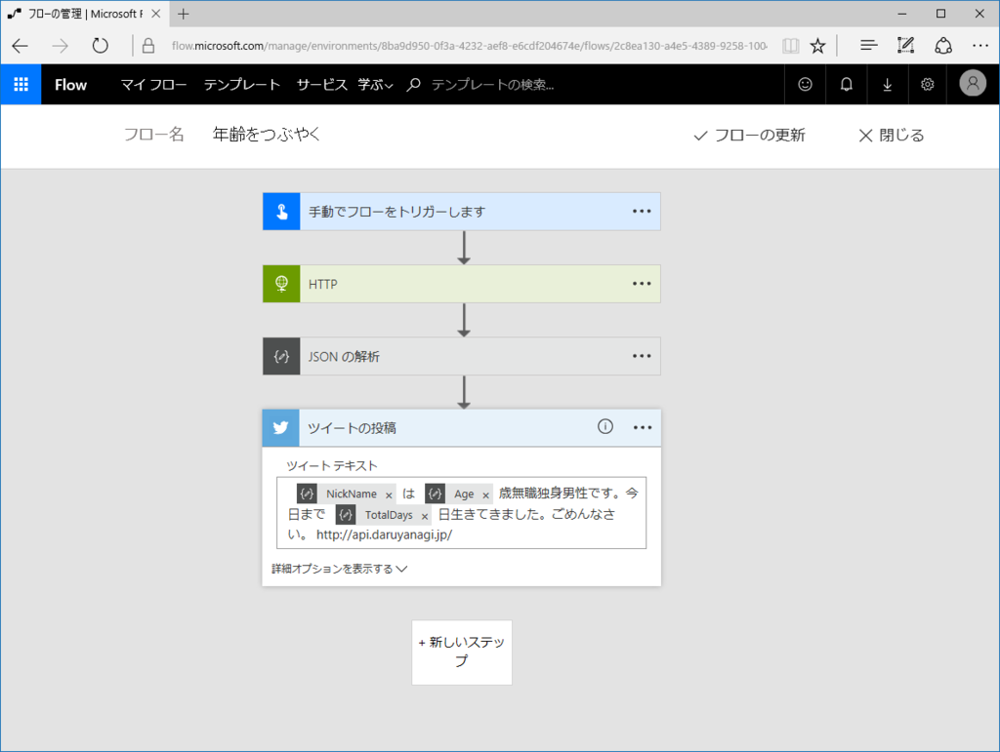
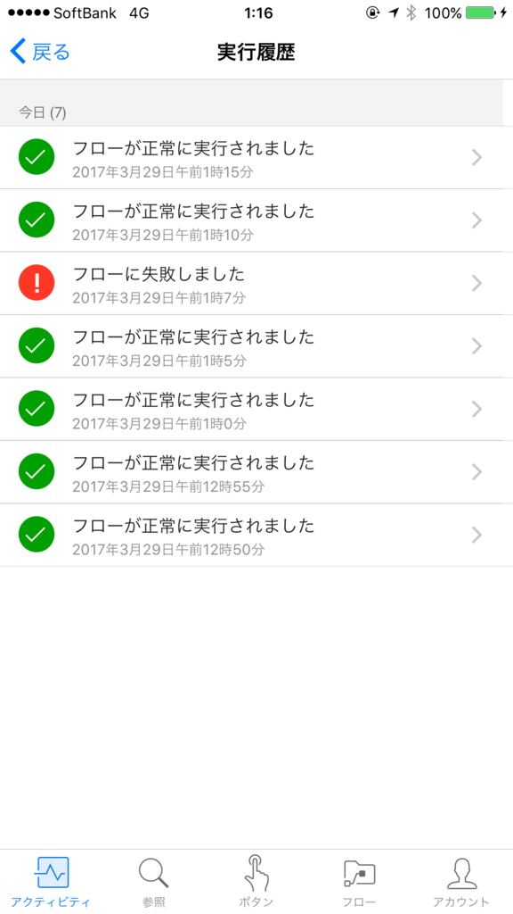

Microsoft Flow は

<ul>
<li>API にアクセスして</li>
<li>データを解析し</li>
<li>それをツイートする</li>
</ul>
といったこと（ロジックフローの連鎖）を簡単に実現できるサービスです。“あーして、こうして、そんでもってこうする！”みたいなのをダイアグラム的に書けるわけですね。あとでスクリーンショットをのせておくので見てほしいのですが、割とビジュアルでわかりやすいです。

この Microsoft Flow はスタンドアロンで

<ul>
<li>定期的に</li>
<li>フィードが配信されたら</li>
</ul>
みたいなトリガー（処理のきっかけ）を使うこともできますが、モバイルアプリを利用すれば<b>「このボタンを押すと」</b>をトリガーにすることができます。

今回は だるやなぎ API を利用してモバイルアプリから年齢をつぶやく例を紹介します。毎日、僕の年齢を Twitter につぶやけて、とても便利です。

<h3>だるやなぎ API</h3>

だるやなぎ API <a href="http://api.daruyanagi.jp/">http://api.daruyanagi.jp/</a> は、だるやなぎのさまざまな情報を取得できる API です。たとえば、<a href="http://api.daruyanagi.jp/?format=xml">http://api.daruyanagi.jp/?format=xml</a> を叩くと、

<pre class="code lang-xml" data-lang="xml" data-unlink>&lt;object&gt;
&lt;Name&gt;YANAGI, Hidetoshi&lt;/Name&gt;
&lt;NickName&gt;daruyanagi&lt;/NickName&gt;
&lt;Birth&gt;1980-04-20T09:00:00&lt;/Birth&gt;
&lt;DateTime&gt;1998-04-20T09:00:00&lt;/DateTime&gt;
&lt;Elapsed&gt;
&lt;Ticks&gt;5679936000000000&lt;/Ticks&gt;
&lt;Days&gt;6574&lt;/Days&gt;
&lt;Hours&gt;0&lt;/Hours&gt;
&lt;Milliseconds&gt;0&lt;/Milliseconds&gt;
&lt;Minutes&gt;0&lt;/Minutes&gt;
&lt;Seconds&gt;0&lt;/Seconds&gt;
&lt;TotalDays&gt;6574&lt;/TotalDays&gt;
&lt;TotalHours&gt;157776&lt;/TotalHours&gt;
&lt;TotalMilliseconds&gt;567993600000&lt;/TotalMilliseconds&gt;
&lt;TotalMinutes&gt;9466560&lt;/TotalMinutes&gt;
&lt;TotalSeconds&gt;567993600&lt;/TotalSeconds&gt;
&lt;/Elapsed&gt;
&lt;Age&gt;18&lt;/Age&gt;
&lt;AgeAtLastBirthday&gt;18&lt;/AgeAtLastBirthday&gt;
&lt;AgeByCalendarYear&gt;19&lt;/AgeByCalendarYear&gt;
&lt;Married&gt;false&lt;/Married&gt;
&lt;Job&gt;Oil King&lt;/Job&gt;
&lt;Photos&gt;
https://onedrive.live.com/?authkey=%21ALMyzgcuZ67AAng&amp;id=2260696B6A4680D7%2118945&amp;cid=2260696B6A4680D7
&lt;/Photos&gt;
&lt;Place&gt;
&lt;Name&gt;愛媛 松山市&lt;/Name&gt;
&lt;SouthWest&gt;
&lt;Latitude&gt;33.687285&lt;/Latitude&gt;
&lt;Longitude&gt;132.491125&lt;/Longitude&gt;
&lt;/SouthWest&gt;
&lt;NorthEast&gt;
&lt;Latitude&gt;34.073779&lt;/Latitude&gt;
&lt;Longitude&gt;132.926666&lt;/Longitude&gt;
&lt;/NorthEast&gt;
&lt;/Place&gt;
&lt;/object&gt;
</pre>
というデータが返ってきます。年齢や職業も一発ですね！　JSON 形式でも取得できるんですよ。

<h3>ざっとした使い方</h3>

ますは <a href="https://flow.microsoft.com/ja-jp/">https://flow.microsoft.com/ja-jp/</a> からアプリをダウンロードします。iOS 版と Android 版があります。Windows 10 Mobile？……知らない子ですね。

 

ダウンロードしたら、まずなにかフローを作成してみてください。わかんなかったらテンプレートがいっぱいあるので、なにか選んでみましょう。たとえばこの<b>“上司に今日は在宅勤務にするというメールを送信する”</b>なんて便利じゃないでしょうか。これを改造すれば、遅刻メールがワンボタンで送れるようになります。

<h3>Microsoft Flow に API を食わせる</h3>

フローはモバイルアプリでも作れますが、個人的にはオンラインで作る方が好きです。画面がでかいので。

今回作ったフローはこんな感じです。シンプルですね！　ほんとうは API が 200（成功）以外のレスポンスを返すことも考慮した方がよいでしょう。失敗したらメールで通知、みたいなのとか、どうでしょう？

ポイントとなるのは、HTTP アクセスと――

JSON の解析でしょうか。

JSON の解析は一見難しそうですけど、サンプルの JSON データを一度食べさせると、それを解析し、他の処理に使いまわせるようにしてくれます。めっちゃ簡単ですね。

だいたいこんな感じです。変数がビジュアルな感じで、わかりやすいと思います。

 

フローを保存するとアプリにボタンが現れるので、さっそく押してみましょう。

<blockquote class="twitter-tweet" data-lang="ja">
daruyanagi は 18 歳無職独身男性です。今日まで 6574 日生きてきました。ごめんなさい。 <a href="https://t.co/5FcERn6wgP">https://t.co/5FcERn6wgP</a>
&mdash; だるやなぎドロップアウト (@daruyanagi) <a href="https://twitter.com/daruyanagi/status/847829505712336897">2017年3月31日</a></blockquote>

ちゃんと 18歳 とツイートされました！

<h3>補足</h3>

<ul>
<li>JSON データの解析・変数化は、階層まで考慮してくれません。異なる階層で同じ名前の変数があるとちょっと厄介（見分けがつかない</li>
<li>Twitter に紐づけられるアカウントの数は 2 つまでのようです。無料アカウントで3つ目を登録するとエラーがでます（言い忘れていましたが、<b>MicrosoftFlow は基本タダ</b>です。ただし、回数などに制限があります……が、個人利用ならそんなに気にしなくていいかな）</li>
<li>Twitter でつぶやくテキストは自由に編集できますが
<ul>
<li>スパム防止のために @ は削除されます（メンションできません</li>
<li>そもそも @ を使うとフローが壊れるっぽい</li>
</ul></li>
</ul>

<h3>P.S.</h3>

この記事は 4月1日の午前中 に作成されました。

