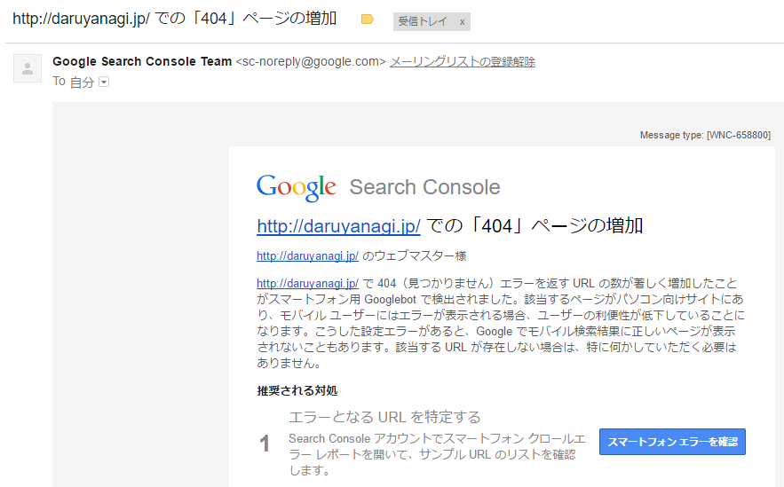

(゜レ゜)！

確かにめっちゃ増えてる。これはヤバい。

<blockquote cite="http://blog.daruyanagi.jp/entry/2017/03/26/234347">

というわけで、daruyanagi.jp/entry、daruyanagi.jp/archive、daruyanagi.jp/about へのリクエストをそのまま blog.daruyanagi.jp の各ディレクトリへリダイレクトすればよさそう。

<cite><a href="http://blog.daruyanagi.jp/entry/2017/03/26/234347">&#x306F;&#x3066;&#x306A;&#x30D6;&#x30ED;&#x30B0;&#x306E;&#x30C9;&#x30E1;&#x30A4;&#x30F3;&#x3092; daruyanagi.jp &#x304B;&#x3089; blog.daruyanagi.jp &#x3078;&#x5F15;&#x8D8A;&#x3057;&#x3057;&#x305F; - &#x3060;&#x308B;&#x308D;&#x3050;</a></cite>
</blockquote>

これでは少し足りなかったみたいですね。いろいろ調査した結果

<ul>
<li>/entry</li>
<li>/archive</li>
<li>/about</li>
<li><b>/category</b></li>
<li><b>/entries</b></li>
<li><b>/search</b></li>
<li><b>/touch</b></li>
<li><b>/embed</b></li>
</ul>
PC 向けでは下の5つが足りなかったみたいです。同じようなリダイレクトページを足して解決。

<ul>
<li>/mobile</li>
<li>/m</li>
</ul>
モバイルでこいつらもエラーになるのですが、こいつらはリダイレクトしても はてなブログ でエラーになるので、何かやり方が間違ってるかも。まぁ、いいや。

ちょっとっだけエラー減ってきたかなぁ。当分はこれで様子見です。

