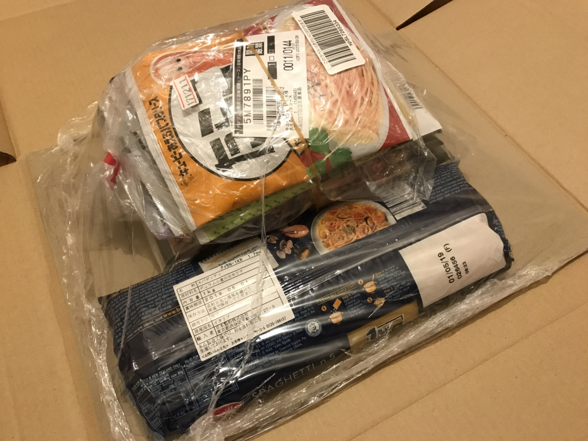
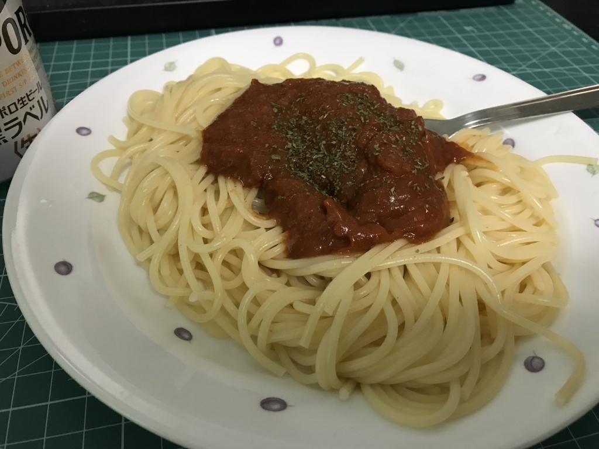

なんか大量に食料が送られてきました。パスタと、パスタソースと……その他もろもろ！

<a href="http://www.amazon.co.jp/exec/obidos/ASIN/B003NNVF28/bestylesnet-22/">バリラ スパゲッティ1.7mm(No.5) [正規輸入品] 1kg</a>
<ul><li>出版社/メーカー: 日本製粉</li><li>メディア: 食品&飲料</li><li>購入: 6人 クリック: 32回</li><li><a href="http://d.hatena.ne.jp/asin/B003NNVF28/bestylesnet-22" target="_blank">この商品を含むブログ (3件) を見る</a></li></ul>

<a href="http://www.amazon.co.jp/exec/obidos/ASIN/B00DCKF4OC/bestylesnet-22/">キユーピー あえるパスタソース6種 [カルボナーラ1袋(2食入)、たらこ1袋(2食入)、ミートソース フォン・ド・ヴォー1袋(2食入)、バジル1袋(2食入)、ツナマヨ1袋(2食入)、きのこの醤油バター1袋(2食入り)]</a>
<ul><li>出版社/メーカー: キユーピー</li><li>メディア: 食品&飲料</li><li><a href="http://d.hatena.ne.jp/asin/B00DCKF4OC/bestylesnet-22" target="_blank">この商品を含むブログを見る</a></li></ul>

<a href="http://www.amazon.co.jp/exec/obidos/ASIN/B007JQBS7C/bestylesnet-22/">熊本もっこすラーメン 123g×10個</a>
<ul><li>出版社/メーカー: 五木食品</li><li>メディア: 食品&飲料</li><li>購入: 2人 クリック: 15回</li><li><a href="http://d.hatena.ne.jp/asin/B007JQBS7C/bestylesnet-22" target="_blank">この商品を含むブログ (8件) を見る</a></li></ul>

ちょっとはやめの誕生日プレゼントのことですが、3月は降ってわいた実家への支出やら、5月に行く de:code 代やら飛行機代やらでぶっちゃけ金欠だったので（もう4月ですけど！）、めっちゃうれしいです。

さっそくミートソースを食べてみたけど、フツーに美味しかったです（パセリの色変わってら……早く使い切らないと）。こういうパスタソースがあれば、パスタを電子レンジでチンしてサクッと食べられるので、忙しいときや、プログラミングに夢中になっているときはだいぶありがたい。

<iframe src="http://blog.daruyanagi.jp/embed/2015/02/22/182748" title="「電子レンジで簡単パスタ」で蕎麦を茹でてみた。 - だるろぐ" class="embed-card embed-blogcard" scrolling="no" frameborder="0" style="display: block; width: 100%; height: 190px; max-width: 500px; margin: 10px 0px;"></iframe><cite class="hatena-citation"><a href="http://blog.daruyanagi.jp/entry/2015/02/22/182748">blog.daruyanagi.jp</a></cite>

辛辛魚で凌いでいたので、お尻の穴がいくつあっても足りないので助かる……。

<iframe src="http://blog.daruyanagi.jp/embed/2017/03/29/184130" title="「辛辛魚ラーメン 辛辛MAXバージョン 」10袋を食べきったら、「ぺヤング 激辛やきそば」が18個送られてきた件について - だるろぐ" class="embed-card embed-blogcard" scrolling="no" frameborder="0" style="display: block; width: 100%; height: 190px; max-width: 500px; margin: 10px 0px;"></iframe><cite class="hatena-citation"><a href="http://blog.daruyanagi.jp/entry/2017/03/29/184130">blog.daruyanagi.jp</a></cite>

