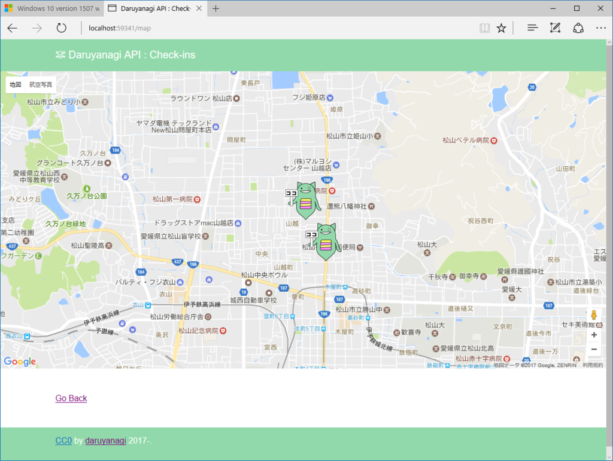
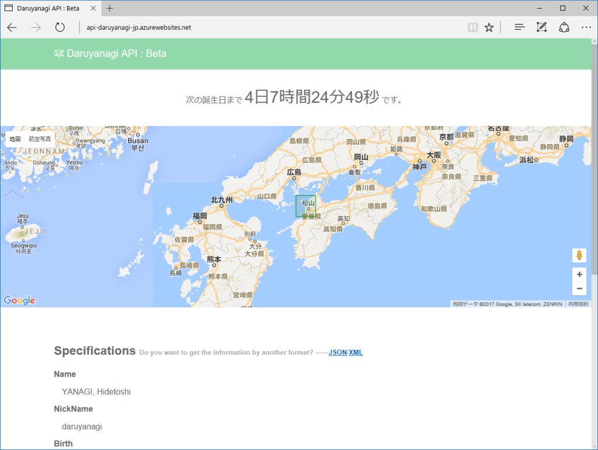
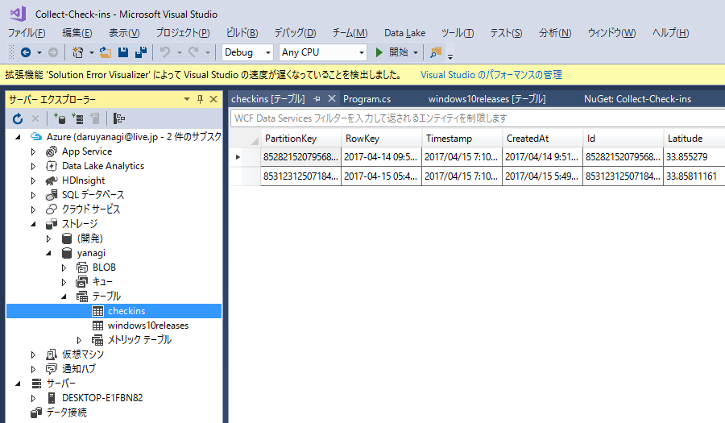
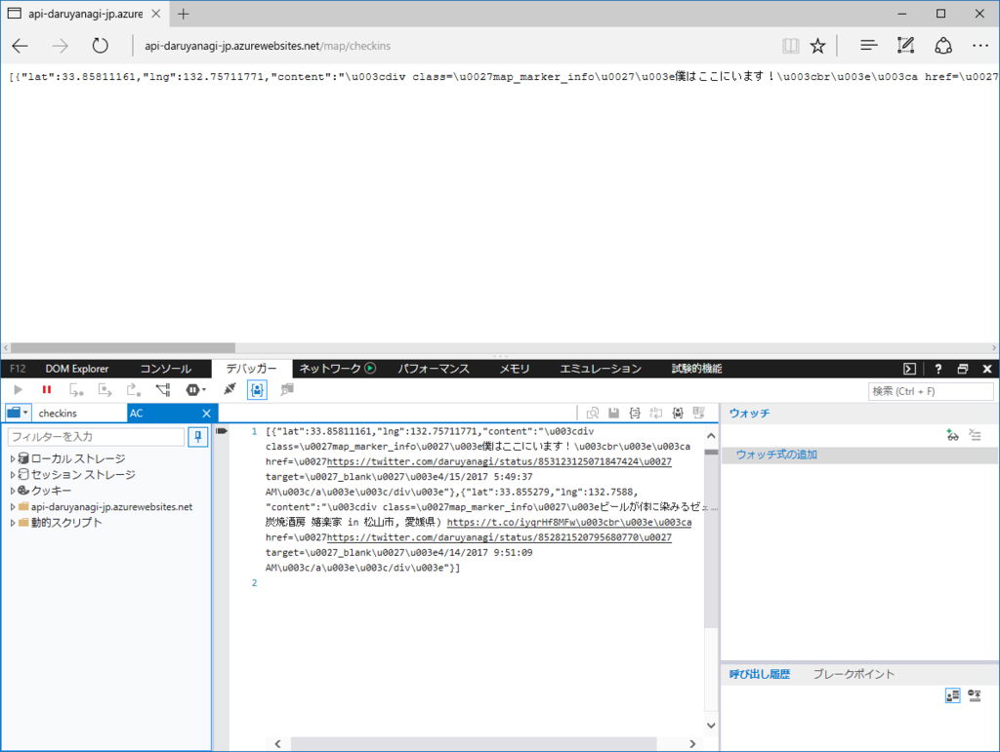
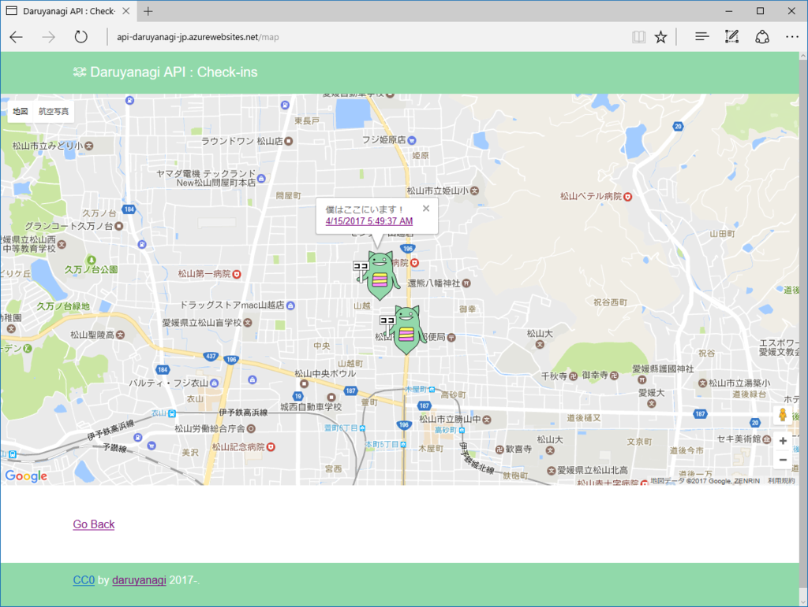

以前 WebMatrix＋SQL CE で作っていたものを Visual Studio 2017 で編集したら、ランタイムだかライブラリのバージョンの食い違いで起動不能になった＆いろいろ試行錯誤したけど Visual Studio 2017 から SQL CE（WebMatrix.Data）がうまく扱えなかったので、データを Azure Table Storage へ保存するように書き換えた。

<ul>
<li><a href="http://api.daruyanagi.jp/map">Daruyanagi API : Check-ins</a></li>
</ul>
ぶっちゃけよくわかっていないのだけど、ちゃんと動いているみたいなのでよしとする（ぉ

<h3>Twitter の位置情報</h3>

Twitter の位置情報は

<ul>
<li>Place：大まかな位置を共有（矩形）</li>
<li>Coordinates：経度・緯度を正確に共有（点）</li>
</ul>
の2つがあるみたい。

面倒な話だが Coordinates はアプリで明示的に・共有する都度［正確な位置情報を共有］オプションを有効にしなければ共有されない（Foursquare/Swarm などのチェックインアプリでは共有されることもあるみたいだが、それはアプリの意図した動作だと思うので問題ない）。今回ほしいのは Coordinates なので、これを定期的に収集することにした。

<pre class="code lang-cs" data-lang="cs" data-unlink>public static void CollectCheckIns()
{
// CONNECTION_STRING は Azure Table Storage の接続文字列
//
// Web Jobs プロジェクトを作成
// ・単なるコンソールアプリみたい
//
// NuGet で
// ・CoreTweet：Twitter のライブラリ
// ・WindowsAzure.Storage
// なんかをインストールしておく

try
{
var account = CloudStorageAccount.Parse(CONNECTION_STRING);
var client = account.CreateCloudTableClient();
var table = client.GetTableReference(&quot;checkins&quot;);
table.CreateIfNotExists();

// めいいっぱいツイートをかき集めてくる
var tweets = tokens.Statuses
.UserTimeline(count: 200)
.Where(_ =&gt; _.Coordinates != null);

foreach (var tweet in tweets)
{
var entity = new CheckinEntity(tweet);

var operation = TableOperation.InsertOrReplace(entity);

table.Execute(operation);

Console.WriteLine($&quot;{entity.Url} is collected&quot;);
}
}
catch (Exception exception)
{
System.Diagnostics.Debug.WriteLine(exception.Message);
}
}
</pre>
基本的な流れは簡単だと思った。Table Storage に保存するデータ（モデル？）を TableEntity の派生クラスとして定義し、InsertOrReplace 操作にそのインスタンスをわたし、実行するだけ。

モデルの定義には、引数のないコンストラクター（必須）と、使いやすいように引数を設定したコンストラクターを作り、後者で PartitionKey と RowKey（いずれも string 型、必須）を設定する。この二つのキーでデータを特定・範囲指定・並び替えするみたいだけど、よくわからんかったのでツイートの Id と CreatedAt をキーにしておいた。

<pre class="code lang-cs" data-lang="cs" data-unlink>public class CheckinEntity : TableEntity
{
public CheckinEntity() { }

public CheckinEntity(Status status)
{
this.PartitionKey = status.Id.ToString();
// RowKey にスラッシュは含められない
this.RowKey = status.CreatedAt.UtcDateTime.ToString(&quot;u&quot;);

Id = status.Id;
Text = status.Text;
ScreenName = status.User.ScreenName;
Latitude = status.Coordinates.Latitude;
Longitude = status.Coordinates.Longitude;
CreatedAt = status.CreatedAt.UtcDateTime;
}

public long Id { get; set; }

public string Text { get; set; }

public string ScreenName { get; set; }

public double Latitude { get; set; }

public double Longitude { get; set; }

public DateTime CreatedAt { get; set; }

public string Url { get { return $&quot;https://twitter.com/{ScreenName}/status/{Id}&quot;; } }
}
</pre>
ちょっとハマったのは、RowKey にスラッシュを含められないこと。table.Execute() が 400 という HTTP ステータスコードを返して失敗するときは、このあたりを疑ってみるといいのかも。今回はスラッシュを含まず、並び替えにも使える書式 "u" で ToString() しておいた。

成功すると、こんな感じで Table Storage にデータが格納される。

データを読み出す場合は、こんな感じ。

<pre class="code lang-cs" data-lang="cs" data-unlink>public static IEnumerable&lt;CheckinEntity&gt; Get()
{
var account = CloudStorageAccount.Parse(CONNECTION_STRING);

var client = account.CreateCloudTableClient();

var table = client.GetTableReference(&quot;checkins&quot;);

var rangeQuery = new TableQuery&lt;CheckinEntity&gt;();

return table.ExecuteQuery(rangeQuery).OrderByDescending(_ =&gt; _.CreatedAt);
}
</pre>
データが多くなってきたら、ちゃんと範囲を絞ってクエリしたほうがいいのかもしれない。

あとはこれを JSON で吐くようにして――

<pre class="code lang-javascript" data-lang="javascript" data-unlink>var map_element = document.getElementById(&quot;daru_map&quot;);
var map;

var markerData;

var xhr = new XMLHttpRequest();

xhr.open(&quot;get&quot;, &quot;/map/checkins&quot;, false);
xhr.onload = function(){
markerData = JSON.parse(this.responseText);
}
xhr.send(null);

function initMap() {
map = new google.maps.Map(map_element, { center: markerData[0], zoom: 15, });

for (var i = 0; i &lt; markerData.length; i++) {
(function () {
//マーカーの設定と作成
var marker = new google.maps.Marker({
position: {
lat: markerData[i].lat,
lng: markerData[i].lng
},
// title: markerData[i].title,
icon: &quot;/Assets/Marker.png&quot;,
map: map
});

//情報ウインドウの設定と作成
var infoWindow = new google.maps.InfoWindow({
content: markerData[i].content
});

//情報ウインドウのオープンをマーカーのクリックイベントに登録
marker.addListener('click', function () {
infoWindow.open(map, marker);
setTimeout(function () { infoWindow.close(); }, 1000 * 3)
});
}());
}
}
</pre>
Google マップにプロットしてみた（情報ウィンドウは一つ開いたら一つ閉じるようにしたかったけど、なんかうまくいかんのでタイマーで閉じた）。

テキトーだけど、今回はこのぐらいで。

<h3>追伸</h3>

Web Job の話をするのを忘れたけど、単に作った Job をアップロードしてスケジューリング実行するだけなので割愛。今は 3 時間おきにデータを収集するようにしている。

