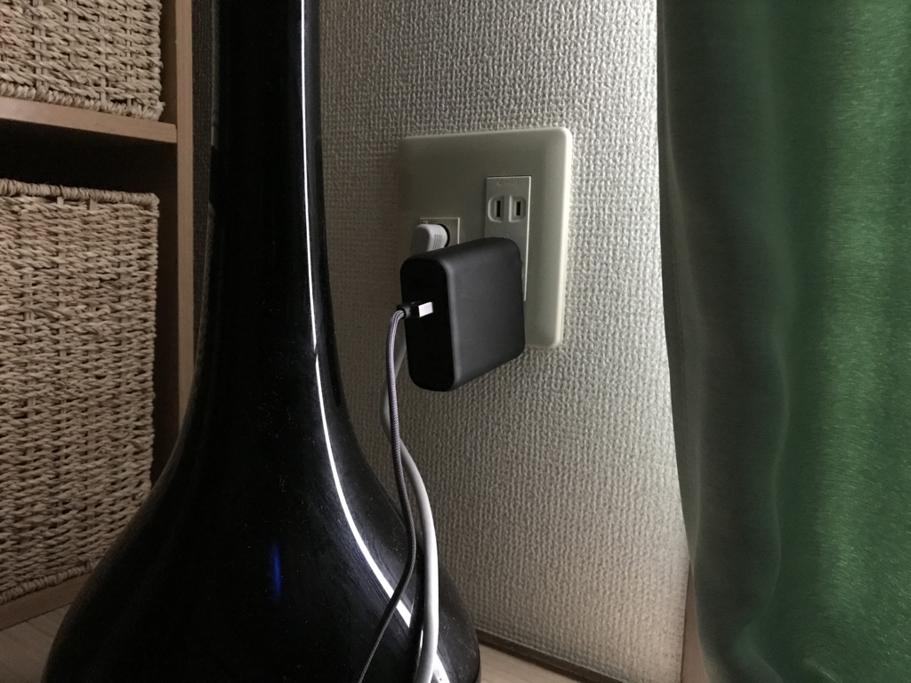

<a href="http://www.amazon.co.jp/exec/obidos/ASIN/B01LATWL5G/bestylesnet-22/">Anker PowerCore Fusion 5000 (5000mAh モバイルバッテリー搭載 USB急速充電器) 【PowerIQ搭載 / 折畳式プラグ搭載】 iPhone、iPad、Android各種対応</a>
<ul><li>出版社/メーカー: Anker</li><li>メディア: エレクトロニクス</li><li><a href="http://d.hatena.ne.jp/asin/B01LATWL5G/bestylesnet-22" target="_blank">この商品を含むブログを見る</a></li></ul>

この前の東京帰りのために買ってみた。旅行のときは、やっぱり荷物は極力減らしたいしね……。

Anker PowerCore Fusion 5000 は、“Fusion”の名の通り

<ul>
<li>5000mAh のモバイルバッテリー</li>
<li>USB 充電器（USB は 2ポート、折り畳みコンセント付き）</li>
</ul>
の2役をこなすエラいやつです。5000mAh は最近のモバイルバッテリーでは少し控えめな印象もありますが（最近、モンスターなバッテリーが多いからなぁ）、iPhone 7 を1.5回フル充電できるわけで、十分十分。それよりもコンパクトなのがうれしいよね。お値段も手ごろだし。

誰でも思いつきそうな単なるニコイチなんだけど、「とりあえずこれがあればなんとかなる」感はすごく頼りになる。なんで今までなかったんだろう……。

あと、バッテリーの充電忘れがないのがいい。モバイルバッテリーって割と充電するのめんどくない？　自分はいくつも持ってるけど、いつも肝心なときに家に忘れて居たり、放電してたりする。でも、こいつなら大丈夫。日ごろからコンセントにぶっ刺してモバイルデバイスの給電に使ってりゃ、勝手に充電される（あまりいい使い方ではないかもしれない）。もし充電を忘れても、出先でなんとかコンセントを確保できれば iPhone への給電と同時に充電できる。新幹線や飛行機だとコンセントは1つしかないから、給電と充電が一緒にできるのは心強いぜ……。

ぜいたくを言えば Macbook 対応の USB-C がついていればいいんだけど……さすがに難しいかな。でたら絶対買い足すと思う。

とくに欠点らしい欠点は見当たらないけど、強いて言えば、ただのアダプターよりは重いのか、実家のコンセントで抜けやすかった。とはいえ、これはどっちかというと実家がボロなせいかもしれんと思わんでもない。気になるなら、延長ケーブルでも持っていけばいい……がそれほど不便は感じない（し、面倒だし、刺したままだとコンセントが折りたためる利点がなくなりそう）ので、そのまま運用するつもり。

