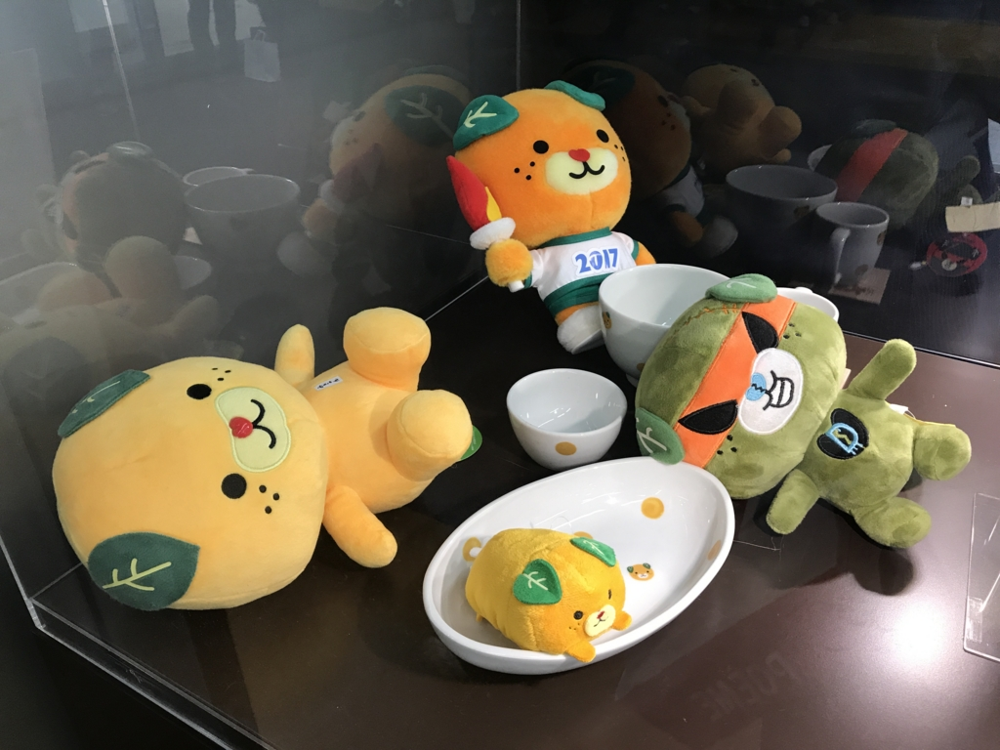
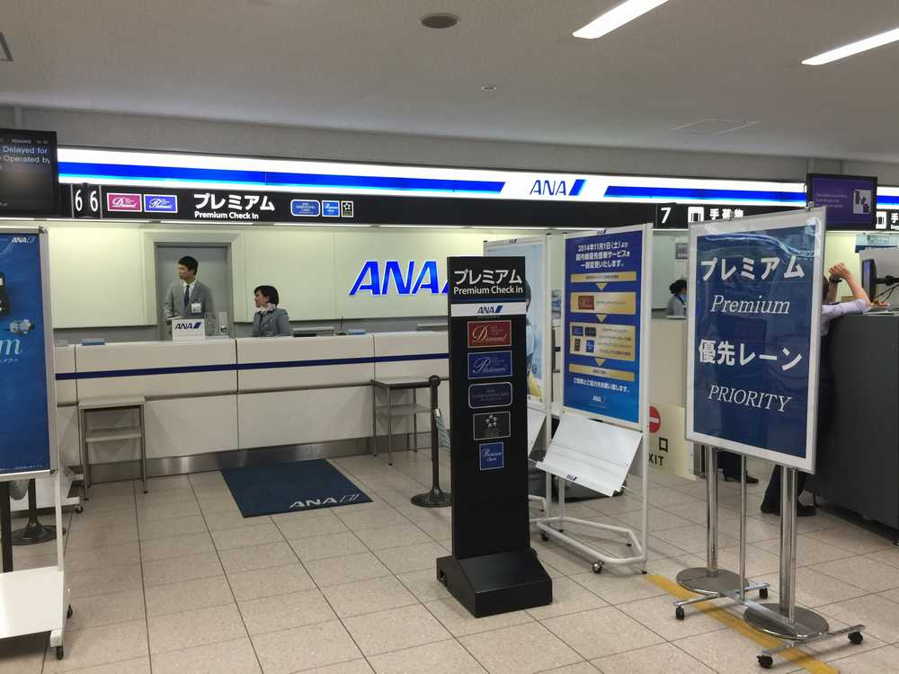
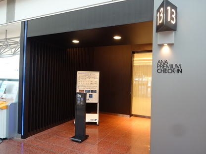
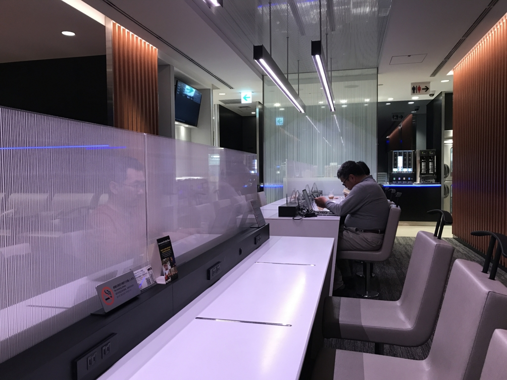
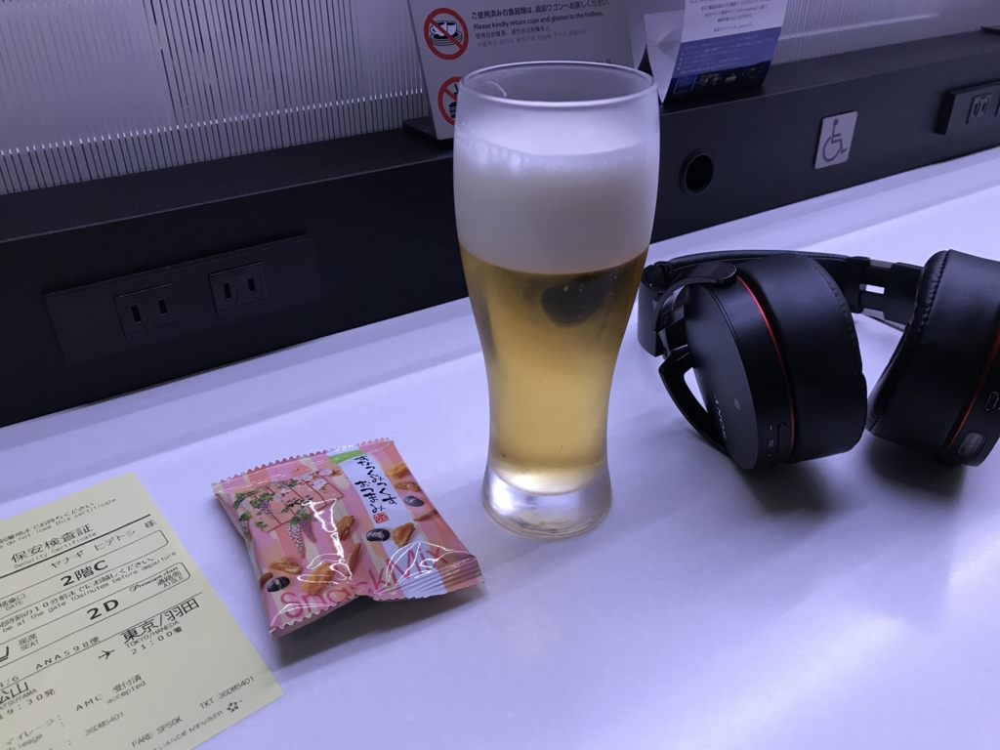
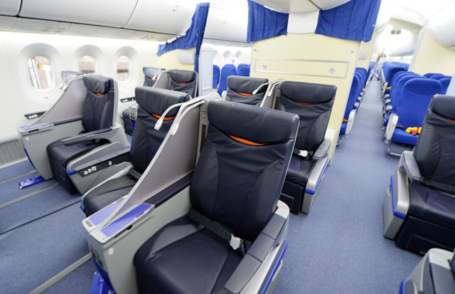
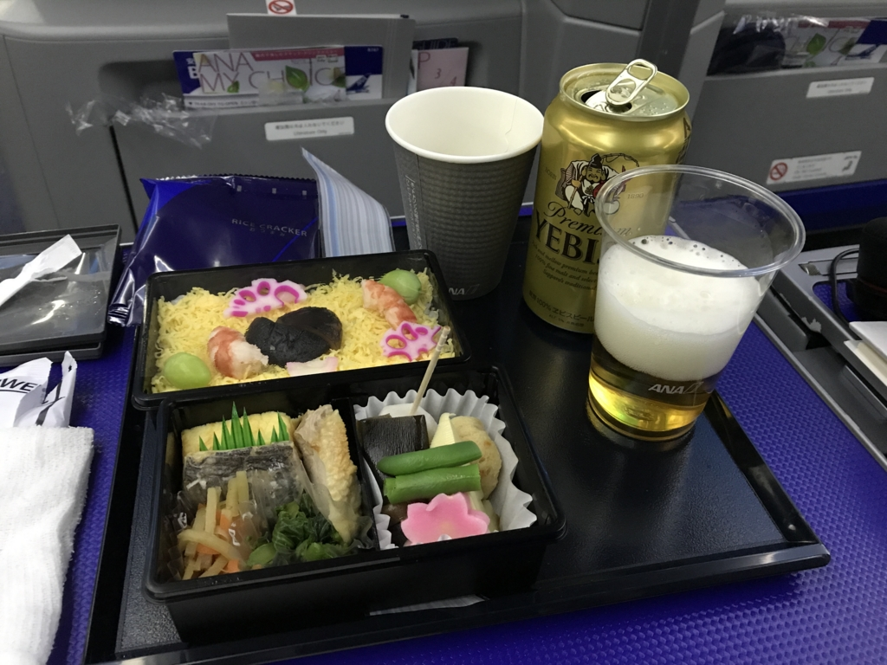
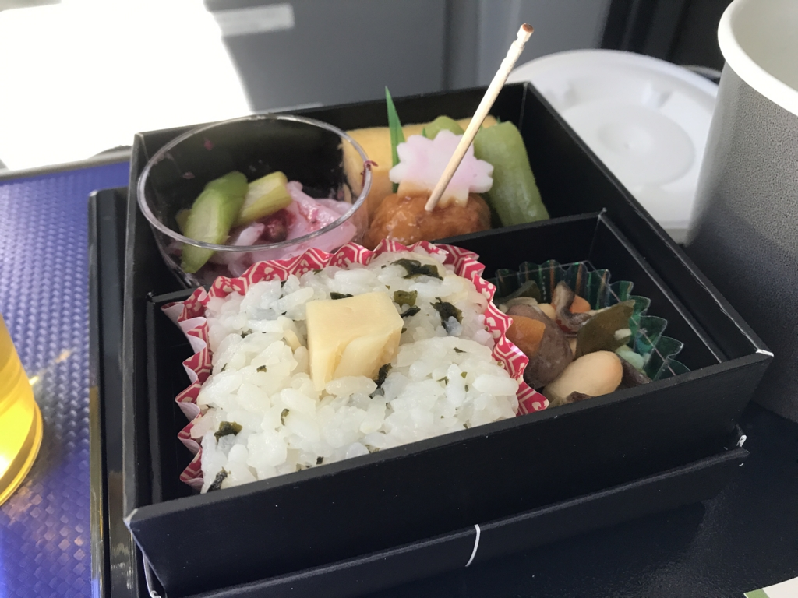
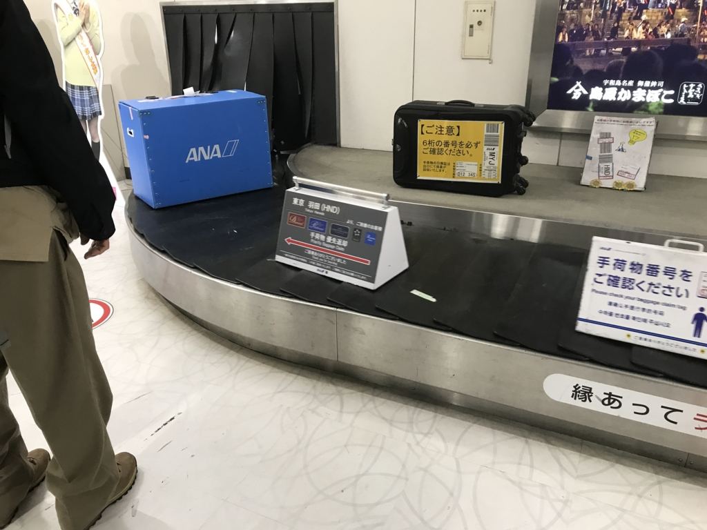

いつもはジェットスターで安く済ますのですが、そろそろ株主優待券を消費しないと期限が切れてしまう ＆ @shibayan と @mitsuba_yu に煽られて ANA のプレミアムクラスにデビューしました。

<h3>プレミアクラスのメリット</h3>

<iframe src="//hatenablog-parts.com/embed?url=https%3A%2F%2Fwww.ana.co.jp%2Fserviceinfo%2Fdomestic%2Finflight%2Fguide%2Fpremiumclass%2F" title="プレミアムクラス｜Service &amp; Info[国内線]｜ANA" class="embed-card embed-webcard" scrolling="no" frameborder="0" style="display: block; width: 100%; height: 155px; max-width: 500px; margin: 10px 0px;"></iframe><cite class="hatena-citation"><a href="https://www.ana.co.jp/serviceinfo/domestic/inflight/guide/premiumclass/">www.ana.co.jp</a></cite>

まず、メリットをおさらいしておきましょう。

<h4>搭乗手続きがスムーズ</h4>

（via <a href="http://xn--sfc--886fp990a.com/%E7%BE%BD%E7%94%B0-%E9%B9%BF%E5%85%90%E5%B3%B6-nh621-630-%E3%83%97%E3%83%AC%E3%83%9F%E3%82%A2%E3%83%A0%E3%82%AF%E3%83%A9%E3%82%B9/">ANA SFC&#x4FEE;&#x884C; (5) &#x7FBD;&#x7530;&hArr;&#x9E7F;&#x5150;&#x5CF6;&#xFF08;NH621&#xFF0F;NH630&#xFF09;&#x30D7;&#x30EC;&#x30DF;&#x30A2;&#x30E0;&#x30AF;&#x30E9;&#x30B9; | ANA SFC &#x4FEE;&#x884C;.com</a>）

こんな感じの優先カウンターがあります。松山空港ではそれほど有効に感じないですが（そもそも人が多くないし）、この前の伊丹空港ではちょっとうんざりしたので、結構うれしいかも。

（via <a href="http://geiwai.net/domestic/201502-matsuyama-ana-nh585-premium-class/">&#x677E;&#x5C71;&#x65C5;&#x884C;&#x8A18;2015/02 &#x7FBD;&#x7530;&#x767A;&#x677E;&#x5C71;&#x884C;&#x304D;NH585&#x4FBF;&#x30FB;&#x30D7;&#x30EC;&#x30DF;&#x30A2;&#x30E0;&#x30AF;&#x30E9;&#x30B9;&#x642D;&#x4E57;&#x8A18; &ndash; &#x5730;&#x6ED1;&#x5C0F;&#x5FC3;&#x306A;&#x56FD;&#x5185;&#x65C5;&#x884C;&#x30D6;&#x30ED;&#x30B0;</a>）

羽田空港には保安検査からラウンジ（後述）に直行できる入り口まであるらしいですね（<b>気付かなかったぞ……orz</b>）。手荷物を預ける機械にスーツケースをポイして、サクッとラウンジに通れるのはいいのかも。

<h4>プレミアムラウンジ</h4>

搭乗手続きのあと、こじゃれたラウンジで休憩できます。ラウンジに入るときは、搭乗券（iPhone に保存したパスでもいいみたい）のバーコードを受け付けの読み取り機にかければいいみたいです。僕はよくわからなかったので、<b>お姉さんに保安検査証をみせてしまった</b>のですが……次こそは<i>「（知ってるよ＾＾）」</i>って顔してスマートに通りたいです（震え声

ラウンジはとても過ごしやすいのですが、なんといっても<i>ビールとおつまみがタダだぞー！</i>ついつい調子に乗って。行きしな（松山）は3杯ぐらい飲んでしまいました。帰りしな（羽田）は早朝便だったのでさすがにビールは控えて、コーヒー飲んでましたけど。

自分は<b>ビールを注ぐ機械の使い方が一瞬わからずにマゴマゴしてしまいました</b>。グラスを置いてボタンを押すだけで自動で注いでくれるんだな……どのレバーをぶしゃっとすればビールがだばーって出てくるんだろう……って少し悩んで、ノズルにグラスをグリグリしてしまいました。壊さないでよかったです。

<h4>機内サービス</h4>

（via <a href="http://www.aviationwire.jp/archives/21267">ANA&#x3001;&rdquo;&#x771F;&#x306E;&#x56FD;&#x5185;&#x7DDA;&#x4ED5;&#x69D8;&rdquo;787&#x3092;&#x6295;&#x5165; &#x521D;&#x306E;&#x65B0;&#x30D7;&#x30EC;&#x30DF;&#x30A2;&#x30E0;&#x30AF;&#x30E9;&#x30B9;&#x5C0E;&#x5165;&#x6A5F;</a>）

シートが広い……。スリッパがあるのもいいなぁ……。リクライニングのボタン、なんか3つもあるぞ！？

――と、ちょっとウキウキして挙動不審だったところに、客室乗務員のお姉さんが隣に来、片膝をついて話しかけてきます。<i>「おれ、なんか悪いことしたのか((((；ﾟДﾟ))))ｶﾞｸｶﾞｸﾌﾞﾙﾌﾞﾙ」</i>と一瞬焦ったのですが、ただの挨拶でした。なんか名前まで呼ばれて、本日はご搭乗ありがとうございます、ときたもんだ。きれいなお姉さんとこの距離で会話をするのはだいぶ久しぶりだったので、「ﾄﾞ、ﾄﾞｰﾓ」しか言えませんでしたが、さすがプレミアムクラスやなぁ、と感心してしまいますね。

隣のおじさんはかなりプレミアムクラスに慣れているようで、客室乗務員のお姉さんと楽しそうにお話をしていました。自分はとくにしゃべりたいとは思わなかったのですが（きれいなお姉さんがキビキビ働いているのを見てるだけで、すごくうれしい気分になる）、もう少し自然に振舞えるようになりたいですね（震え声

あと、やっぱりお楽しみはごはんですな。松山 → 羽田便は夜出発だったので、夕食がでました。駅弁のちょっと豪華バージョンといった感じですが、フツーに美味しかったです。おかずの重箱はビールのアテにぴったりやなー。

羽田 → 松山便は早朝だったので軽食。こっちはかわいらしくて、これまたフツーに美味しかったです。食事できる時間が正味1時間ないぐらいなのであんまりゆっくりできず、もしゃもしゃ忙しかったですけど、それもまたプレミアムっすなー。

<h4>降機と荷物受け取り</h4>

プレミアクラスは最初に降機できます。松山 → 羽田便はボーディングブリッジではなくバスでターミナルまで移動だったのですが、最初に降りられるためバスでも座れます。これは地味にプレミアム。夜便なら積極的にプレミアムクラスを使っていきたい！

荷物も最初に出てくるので、ささっと空港を後にできるのもよし。ただ、どうせリムジンバスにのって市外へ向かうなら、この特典の意味は薄れてしまうかなー。実際、なんとなく調子に乗ってタクシーで家に帰っちゃいました（まぁ、松山は空港が街から近いので2,000円ちょっとで済みます）。

<h3>プレミアクラスのデメリット</h3>

ジェットスターなら 5,000 円～ 10,000 円ぐらいで済むのですが、プレミアクラスは株主優待や早期割引を使っても 20,000 円を超えます。お財布を直撃しますね。

あと、便によっては十分なメリットを引き出せないなと思いました。優先搭乗などのサービスは、空港が混む時間ならいざ知らず、空いている早朝や、松山空港みたいな小さな空港では少しメリットが薄いですね（とはいえ、松山空港も夜7時あたりは結構混むので、割とありかもしれない）。

自分は週末の夜に 松山 → 羽田、月曜の早朝に 羽田 → 松山 を使うケースが多いのですが、前者はかなりメリットが大きいけれど、後者はそれほどでもないかなって思いました。今回はいろいろ体験してみたかったので、行きと帰りの両方でプレミアクラスを使いましたが、次からはメリハリをつけて使っていきたいですね。

<h3>追伸</h3>

実家が市川なので、成田も羽田も時間的にはあまり変わらなかったり。むしろグリーン車的なものが羽田 ⇄ 市川にはないので（成田からだったらちょっと時間がかかるけど JR でグリーン車が使える）、電車での移動が堪えました。品川まで出て、そこから総武横須賀線のグリーン車ってのもちょっとアホらしいしなぁ。

