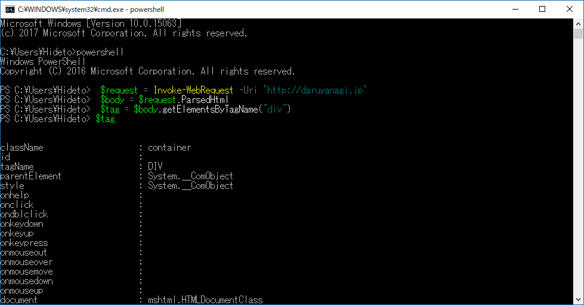

メインに使っているデスクトップ端末を Windows 10 Creators Update へアップデートしたのだけど、

<iframe src="http://blog.daruyanagi.jp/embed/2017/03/04/220000" title="PowerShell：ストアアプリのセール情報を取得する - だるろぐ" class="embed-card embed-blogcard" scrolling="no" frameborder="0" style="display: block; width: 100%; height: 190px; max-width: 500px; margin: 10px 0px;"></iframe><cite class="hatena-citation"><a href="http://blog.daruyanagi.jp/entry/2017/03/04/220000">blog.daruyanagi.jp</a></cite>

以前に作った PowerShell が動作しなくなった。

<pre class="code lang-ps1" data-lang="ps1" data-unlink>$urls =@(
&quot;https://www.microsoft.com/ja-jp/store/p/nextgen-reader/9wzdncrfj262&quot;
)

foreach ($url in $urls)
{
try
{
$request = Invoke-WebRequest $url

$body = $request.ParsedHtml
$price_node = $body.getElementsByTagName(&quot;s&quot;) | where {
$_.getAttributeNode(&quot;class&quot;).Value  -eq &quot;srv_saleprice&quot;
}　#&lt;-- ここで例外
</pre>
――結果。

<pre class="code" data-lang="" data-unlink>HRESULT からの例外:0x800A01B6</pre>
Internet Explorer（<code>Invoke-WebRequest()</code> などで内部的に利用されている）がメソッドをサポートしていないときにでるエラーみたい。

<h3>解決</h3>

<code>getElementsByTagName()</code> のかわりに <code>IHTMLDocument3_getElementsByTagName()</code> を用いる。以下のメソッドでも同様のエラーが出るので、適宜読み替える。

<pre class="code" data-lang="" data-unlink>getElementsByTagName -&gt;
IHTMLDocument3_getElementsByTagName

getElementsByName -&gt;
IHTMLDocument3_getElementsByName

getElementByID -&gt;
IHTMLDocument3_getElementByID</pre>
<ul>
<li><a href="https://www.sepago.com/blog/2016/05/03/powershell-exception-0x800a01b6-while-using-getelementsbytagname-getelementsbyname">PowerShell Exception 0x800A01B6 while using getElementsByTagName, getElementsByName or getElementByID | sepago</a></li>
</ul>

<h3>なぞ</h3>

PowerShell スクリプトからではなく、PowerShell のシェルから <code>getElementsByTagName()</code> を使うとそのまま通った。よくわからんな……。

