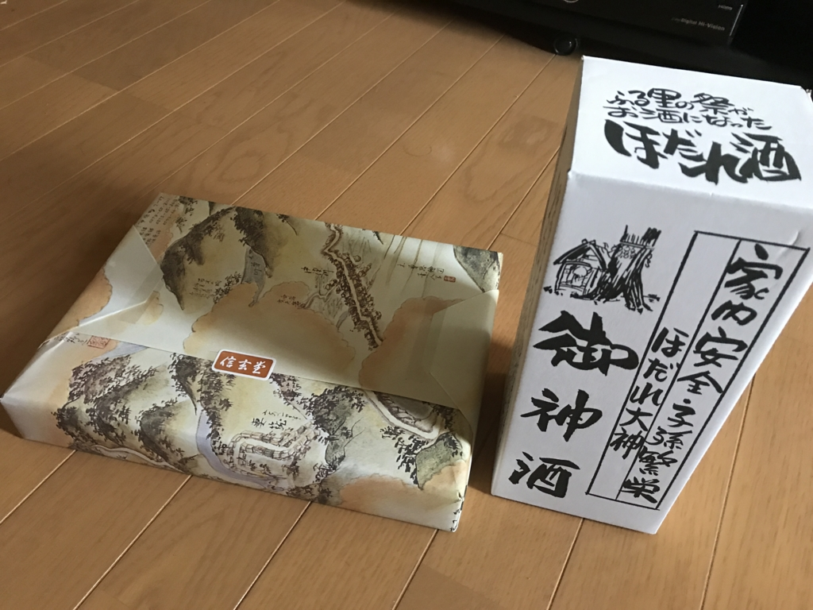
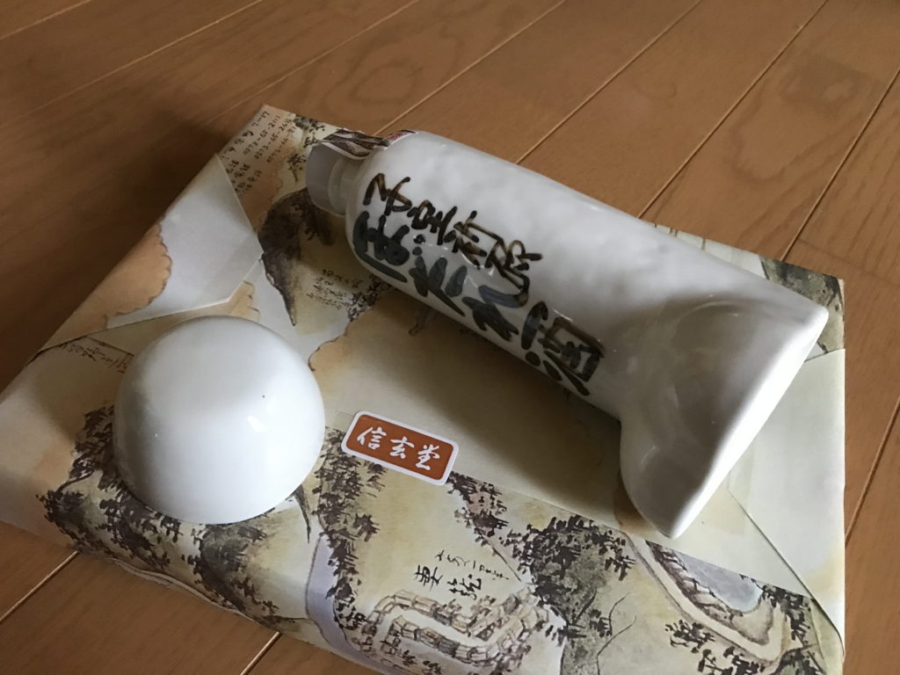
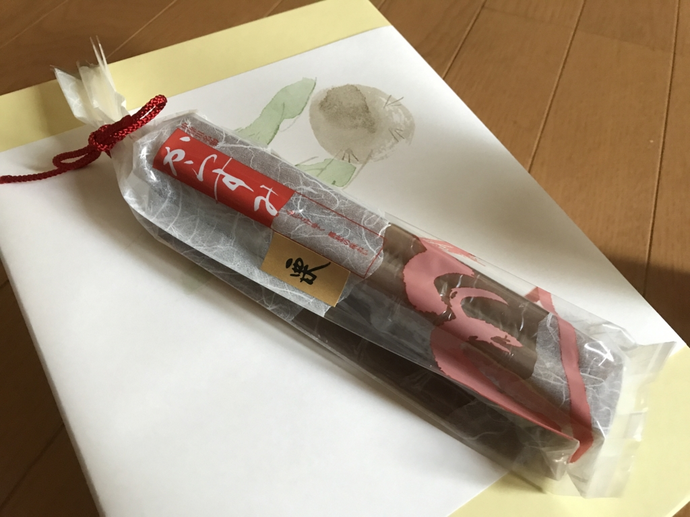

GW 前進行ですごく忙しかった ＆ 次々と送られてくるので（クロネコのヒト、呆れてたんじゃないかな！）、なかなかお礼が書けなかったのですが……いろいろいただきありがといございました！

<h3>ひわいなおさけ</h3>

ひとつめは、ち○このカタチをした日本酒です。家内安全・子孫繁栄にご利益がありそうで、絶滅危惧種のだるやなぎにはピッタリと言えます。一口飲んでみましたが、味もそこそこというか、割とおいしいというか、つい二口目飲んじゃうぐらい美味しいです（← 飲んだのかよ！）。

<h3>からすみ</h3>

Twitter で「カラスミって食ったことあるはずだけどどんなのか覚えてない」などと呟いていたせいか、カラスミもいただきました。ただし、ひらがなの“からすみ”でした。コレジャナイ！！

<ul>
<li><a href="http://gifu-omiyage.sakura.ne.jp/karasumi.html">&#x304B;&#x3089;&#x3059;&#x307F; - &#x5C90;&#x961C;&#x770C;&#x304A;&#x571F;&#x7523;&#x30DE;&#x30C3;&#x30D7;</a></li>
</ul>
味は……独特な感じの羊羹？　甘さ控えめ。岐阜の名物だそうで、そういえば、ちょこっとだけ“ういろう”感がある気もします。

<h3>本</h3>

<a href="http://www.amazon.co.jp/exec/obidos/ASIN/4805727047/bestylesnet-22/">英語史で解きほぐす英語の誤解―納得して英語を学ぶために (125ライブラリー)</a>
<ul><li>作者: 堀田隆一</li><li>出版社/メーカー: 中央大学出版部</li><li>発売日: 2011/10</li><li>メディア: 単行本</li><li>購入: 2人 クリック: 22回</li><li><a href="http://d.hatena.ne.jp/asin/4805727047/bestylesnet-22" target="_blank">この商品を含むブログを見る</a></li></ul>

<a href="http://www.amazon.co.jp/exec/obidos/ASIN/4121023471/bestylesnet-22/">代議制民主主義 - 「民意」と「政治家」を問い直す (中公新書)</a>
<ul><li>作者: 待鳥聡史</li><li>出版社/メーカー: 中央公論新社</li><li>発売日: 2015/11/21</li><li>メディア: 新書</li><li><a href="http://d.hatena.ne.jp/asin/4121023471/bestylesnet-22" target="_blank">この商品を含むブログ (20件) を見る</a></li></ul>

あと、本を2冊いただきました。英語史の本はさっそく読了しちゃったのですが、結構面白い……っていうか、なんで高校の英語の時間でこれを教えてくれないんだって感じ。

代議制の本は何冊か積んであるのですが、早く読めってことですよね、わかります(｀･ω･´)ゞ

この前の救援物資ともども、いろいろありがとうございました。十分なお返しもできていないのに、恐縮至極です。

<iframe src="http://blog.daruyanagi.jp/embed/2017/04/03/011347" title="Amazon ウィッシュリスト：救援物資をいただきました - だるろぐ" class="embed-card embed-blogcard" scrolling="no" frameborder="0" style="display: block; width: 100%; height: 190px; max-width: 500px; margin: 10px 0px;"></iframe><cite class="hatena-citation"><a href="http://blog.daruyanagi.jp/entry/2017/04/03/011347">blog.daruyanagi.jp</a></cite>

