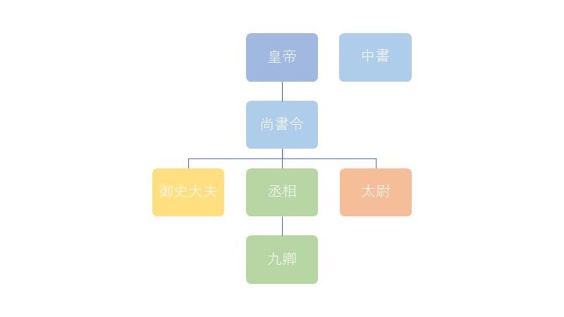

『宋名臣言行録』を読んでいて、どの官職が宰相・副宰相野かがよくわからなかったので、ざっくりまとめてみた。

<iframe src="http://blog.daruyanagi.jp/embed/2017/05/05/200119" title="『宋名臣言行録』 - だるろぐ" class="embed-card embed-blogcard" scrolling="no" frameborder="0" style="display: block; width: 100%; height: 190px; max-width: 500px; margin: 10px 0px;"></iframe><cite class="hatena-citation"><a href="http://blog.daruyanagi.jp/entry/2017/05/05/200119">blog.daruyanagi.jp</a></cite> 

<h3>三省六部</h3>

世界史の授業では、唐の官制・<b>三省六部</b>をしっかり学ぶと思う。あとは、それが次第に崩れてきて（<b>節度使</b>とかやね）、明代には<b>中書省</b>が廃止されて皇帝の中央集権が確立された――みたいな流れだと思う（あまりよく覚えていないのだけど）。

なので、唐の時代から始めてもいいのかもしれないけど、今回は官制が複雑化していく様子もちょっと見てみたいので、漢代から始めようかなって思う。ちなみに、一口に漢・唐・宋などといっても、時代によってかなり官制はかわるので、参考程度に。

<h4>漢代から唐代の官制</h4>

漢代の官制は、だいたい三公・九卿で成っていました。

のちの三省の一角を占める<b>尚書</b>は、もとは皇帝の私設秘書のような役割でした。しかし、臣下から皇帝への奏上・皇帝から臣下への勅書を取り次ぐという職務の性格から、格こそ三公・九卿に劣るものの、次第に大きな権力を持つようになります。

一時期は「皇帝の耳目をふさぐ」という理由で廃止されたりもしましたが、後漢には<b>尚書台</b>と呼ばれる専用の役所を構えるほどまでになりました（正確に言うと、九卿の一つ・少府<a href="#f-ab3c602f" name="fn-ab3c602f" title="今でいう宮内庁、内朝の財政も担当">*1</a>に属するので、位階的にはだいぶ下）。

一方、<b>中書</b>は尚書よりさらにプライベートな部分を担当する秘書職で、もともとは宦官のポストでした（中書令は司馬遷も歴任）。尚書が外朝の一機関として力を持つと、それを内朝から統御するために重用されたようです。外戚（皇妃の親族）の支配する外朝と、宦官が跋扈する内朝の諍いは、後漢王朝の特色でもありますね――あれ？　丞相とか、もう要らなくね？

そんなわけで、魏の時代に中書令には非宦官を起用し、勅命の起草と行わせることにしました。晋代には夕食貴族が勅命を吟味する<b>門下省</b>（長は門下侍中）も置かれ、唐代には <i>中書（起草） → 門下（吟味） → 尚書（実施）</i> の役割分担が行われるようになりました。これに実際の行政を担当する<b>六部</b>を加えると、三省六部のできあがりです（ほんとはほかにもいっぱいある）。

三省の長官は<b>令</b>（例：中書令。門下のみ侍中）、次官は<b>侍郎</b>（例：中書侍郎）、その下は郎、郎中です。ただし、尚書省は唐の太祖・李世民が就いていた職ということで長官である尚書令が置かれず、左右の僕射が代わりに職務を担当しました。唐代では、中書令と門下侍中、そして少しランクが下がりますが、尚書右僕射・尚書左僕射が宰相と呼べるポストでした。

ちなみに、六部の長官は<b>尚書</b>（尚書省の尚書とは別）、次官は<b>侍郎</b>。

<h3>宋代の官制</h3>

唐代の官制はとても秩序だっていて、見た感じうまく設計してあるように見えます。しかし、さまざまな状況への対応を迫られる中で、高位職の形骸化、律令にはない職の新設（節度<b>使</b>など）、臨時権限の付与（とその常態化）が進み、官制は乱れていきます。

官職ってどうしても年功序列になるけれど、パソコンのパの字もわからない爺さんのクビは切れない、しかし若くてピチピチしたヤツに権限あげないと二進も三進もいかないなんてこと、たまによくあるじゃない？　お給料も抑えられるしね！（増大する人件費は王朝にとっても悩みの種なのだ！）　皇帝が権限を強化したければ、有力貴族のすくつ（変換できない）である門下省の力なんかは削いでおきたいしね。豪族連合体に過ぎない魏・晋とは状況が違うのだよ！

そんなわけで、唐の半ば以降から、尚書省の局長レベル（？）の人まで宰相をやらされるようになりました（“差遣”といって、唐の官制をランクとして持つけど、実際の仕事＜ポスト＞は別、みたいなややこしいことに）。しかし、さすがに中書令・門下侍郎と位が釣り合わないのは具合が悪い。そこで、宰相ポストに就く人には“<b>同中書門下三品</b>（中書令や門下侍郎と同じ正三品官扱いにするよ）”という位が臨時に授けられるようになりました。これがのちの<b>同中書門下平章事</b>です。

要するに、吏部尚書みたいなポストに入るヒトでも、皇帝が「お前、同中書門下平章事な」と言えば、その日から宰相というわけです。基本は他の職と兼任で、二人から三人の平章事がいました。ちなみに、その下のポストが“<b>参知政事</b>”。平章事と同じように運用されていて、副宰相としての権限を持ちました。

そしてもう一つ大事なのが、中書省と並んで<b>二府</b>と称された<b>枢密院</b>です。

中書省などが民政を担当するのに対し、枢密院は軍政を担当しました（軍隊の指揮権はなし）。長官は<b>枢密使</b>（知枢密院事）、副官は<b>枢密副使</b>（同知枢密院事）です。民政官よりは少し格下ですが、枢密使は参知政事と同格で、副宰相に相当するポストでした（両者を合わせて<b>執政</b>（≒副宰相）と呼ぶ）。

枢密院と兵部の職掌が完全にかぶってるやん？　と思ってちょっと調べたのですが、兵部は儀仗的なことをやるだけになっていたみたいです。

<h3>元豊の改革以降の官制</h3>

さらに、王安石の新法では、宰相職の改革が行われました。

<blockquote cite="https://ja.wikipedia.org/wiki/%E5%85%83%E8%B1%8A%E3%81%AE%E6%94%B9%E9%9D%A9">

元豊の改革では外見上は唐制を継いで三省六部を立てるが、三省の長官（中書令・尚書令・門下侍中）は名前のみあって空席とされ、尚書左僕射（副長官）に門下侍郎（副長官）を、尚書右僕射（副長官）に中書侍郎を兼任させてこの二人を宰相とし、さらに尚書丞（左右1人ずつ）および尚書僕射を兼任しない門下侍郎・中書侍郎（1人ずつ）合わせて四人を執政（副宰相）としておき、これまで人数不確定の同中書門下平章事・参知政事に代わらせ、確定した六人の宰執官に国政を委ねた。

<cite><a href="https://ja.wikipedia.org/wiki/%E5%85%83%E8%B1%8A%E3%81%AE%E6%94%B9%E9%9D%A9">&#x5143;&#x8C4A;&#x306E;&#x6539;&#x9769; - Wikipedia</a></cite>
</blockquote>

尚書左僕射（兼門下侍郎）、尚書右僕射（兼中書侍郎）を宰相に、尚書右丞、尚書左丞、門下侍郎（兼任なし）、中書侍郎（兼任なし）を副宰相にする6人制で内閣を作って政権運営をするようになりました。これに加えて、軍政面では枢密院使、枢密院副使（枢密院の廃止は先送り）がいるというわけですね。

んー、ちゃんと整理された……んかいな？

<h3>まとめにならないまとめ</h3>

位階（年功序列）と職責（実際の職務）の制度設計は難しい。ましてや、臨機応変な運用をや。

<a href="#fn-ab3c602f" name="f-ab3c602f" class="footnote-number">*1</a>:今でいう宮内庁、内朝の財政も担当

