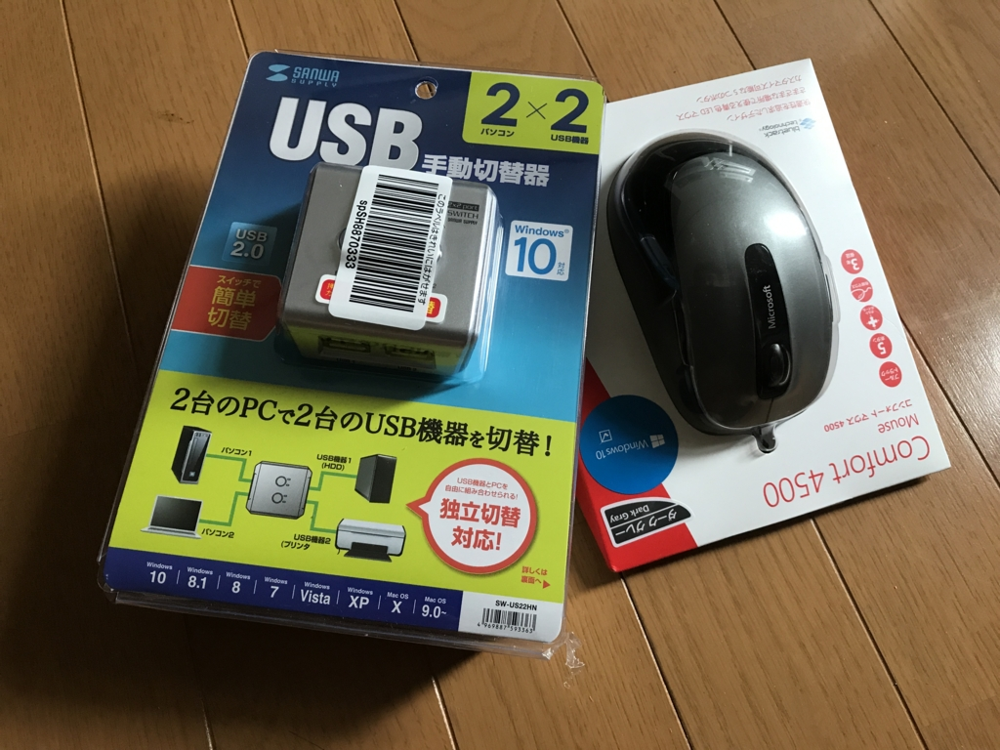
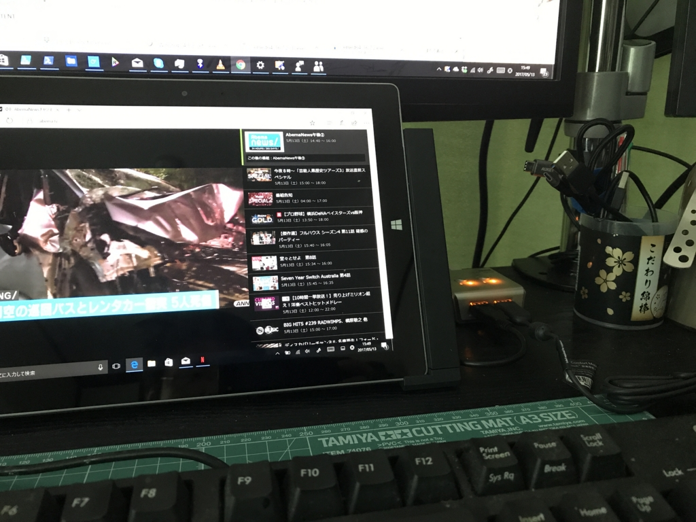
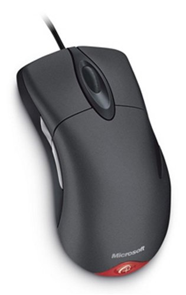

この前 Surface 3 のドックを買ったのだけど、ドッキング中は TypeCover が使えないのがちょっと面倒。

<iframe src="http://blog.daruyanagi.jp/embed/2017/05/10/185255" title="いまさらながら Surface 3 のドックを買った - だるろぐ" class="embed-card embed-blogcard" scrolling="no" frameborder="0" style="display: block; width: 100%; height: 190px; max-width: 500px; margin: 10px 0px;"></iframe><cite class="hatena-citation"><a href="http://blog.daruyanagi.jp/entry/2017/05/10/185255">blog.daruyanagi.jp</a></cite>

というわけで、USB 切り替え機を導入してみた。デスクトップ PC とドッキング中の Surface でマウス＆キーボードを共用できるぜー。

<a href="http://www.amazon.co.jp/exec/obidos/ASIN/B01CU4QD1I/bestylesnet-22/">UGREEN USB 2.0 切替器 4台対応 手動切り替えスイッチ 4台のパソコンで1台のUSB機器 ハブ プリンタなどを切替 Windows Vista、7、8、10、Mac OS 8.6以降対応 4ポート切替器</a>
<ul><li>出版社/メーカー: UGREEN GROUP LIMITED</li><li>メディア: エレクトロニクス</li><li><a href="http://d.hatena.ne.jp/asin/B01CU4QD1I/bestylesnet-22" target="_blank">この商品を含むブログを見る</a></li></ul>

最初はこれがいいかなーと思ったのだけど、どうやら PC は 4 台接続できる（2 台版もある）けど、USB 機器は 1 台しか繋げないみたい。

<a href="http://www.amazon.co.jp/exec/obidos/ASIN/B017R02C56/bestylesnet-22/">サンワサプライ USB2.0ハブ付き手動切替器(2回路) SW-US22HN</a>
<ul><li>出版社/メーカー: サンワサプライ</li><li>発売日: 2015/11/01</li><li>メディア: Personal Computers</li><li><a href="http://d.hatena.ne.jp/asin/B017R02C56/bestylesnet-22" target="_blank">この商品を含むブログを見る</a></li></ul>

どうせならマウスも繋ぎたいかなと思った（Bluetooth マウスを愛用してるけど、たまに接続が切れるのがストレス）ので、結局、これにした。2 PC ⇔ 2 USB 機器を切り替えられる。

すんなり動いた……けど、

<ul>
<li>どうにもダサい</li>
<li>ゴム足ぐらい付けてくれないと、本体が軽くてマウスの移動でズレそう</li>
<li>ケーブルが 1 本しかついてない（ショボいのをつけるぐらいなら、2 本付けるか、いっそのことないほうがいい）</li>
</ul>
みたいな。エレコムってどうにもダサいよね……まともなデザイナーのヒトを入れれば、もう少し売れそうなのに。でも、

<ul>
<li>接続先を示すインジケーターは左右色が違っていて分かりやすい</li>
<li>なにより、ちゃんと動く</li>
</ul>
のはいいかなって思った。ぜいたくを言えば、2 系統同時に切り替えるボタンがあってもよかったけど、まぁ、無駄に高くなるかもしれないし、なくてもいいか。

<a href="http://www.amazon.co.jp/exec/obidos/ASIN/B0098BDPWC/bestylesnet-22/">マイクロソフト マウス 有線/USB接続/5ボタン/人間工学デザイン グレー Comfort Mouse 4500 4FD-00029</a>
<ul><li>出版社/メーカー: マイクロソフト</li><li>発売日: 2012/10/12</li><li>メディア: Personal Computers</li><li><a href="http://d.hatena.ne.jp/asin/B0098BDPWC/bestylesnet-22" target="_blank">この商品を含むブログを見る</a></li></ul>

ちなみに、有線マウスは信頼のマイクロソフト製を選んだ――が、これが大失敗。ボタンはキシキシいうわ、スクロールはふにゃふにゃで、指を話した時に戻ったりするわ、往年の品質はどこへやらって感じ。これは今度、家電量販店で試して買いなおそうと思う。

これを作り直してほしいんじゃぁ……。復刻してくれたら5個ぐらい予備を買うのに。

