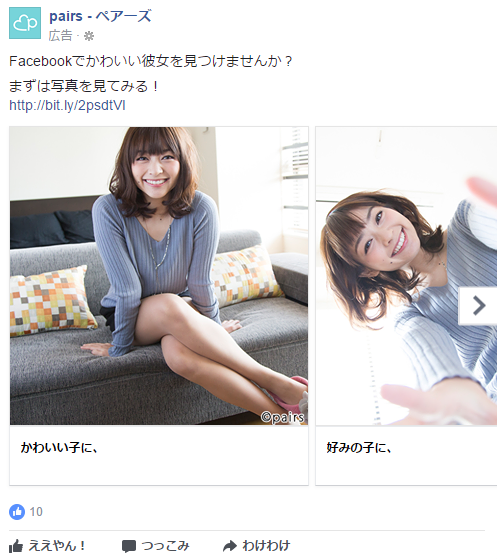
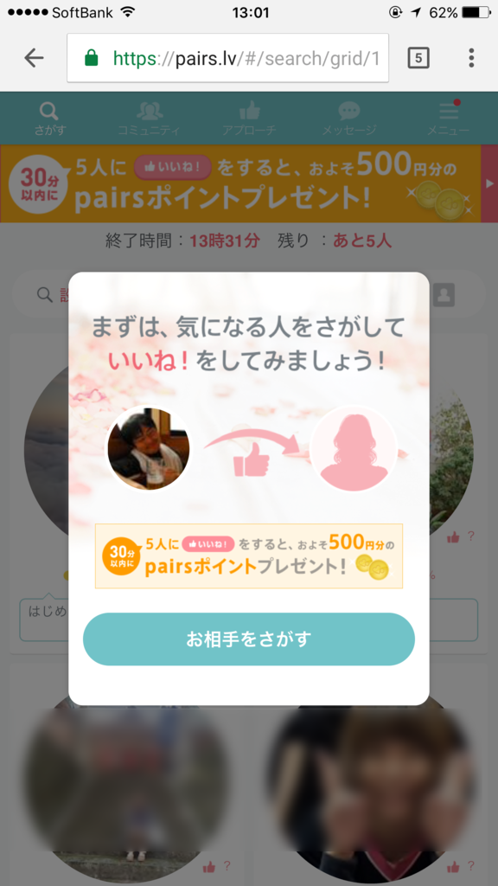
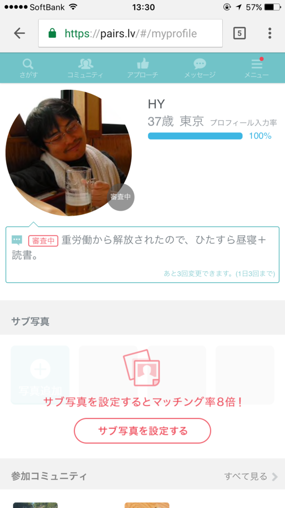
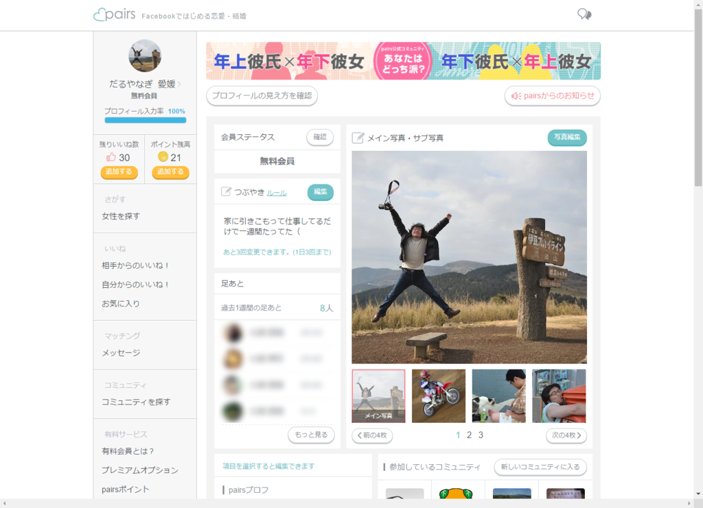

 

前々から Facebook で広告を見かけて、<i>「こんなかわいい女の子とお付き合いできるのか、辛抱たまらんなー」</i>と思ってたのだけど、37歳になったのを機に登録してみた。

<blockquote class="twitter-tweet" data-lang="ja">
ペアーズはじめて6時間で可愛い彼女ができた  っていうブログ記事かきたいんで、色々よしなにお願いしたい
&mdash; エロやなぎ先生 (@daruyanagi) <a href="https://twitter.com/daruyanagi/status/858979940531748864">2017年5月1日</a></blockquote> 

<h3>基本的なすぃすてむ</h3>

 

ほぼ予習なしで<a href="#f-443d32c2" name="fn-443d32c2" title="いろいろ知り合いに聞いてみたけど、よくわからんかった">*1</a>登録してみたのだけど、男女で互いに“いいね”を付けあって、相思相愛（？）になったらメッセージを交わせるようになり<a href="#f-a73ec523" name="fn-a73ec523" title="男だけカネかかるのかな？">*2</a>、ウマくいけばワンチャンって感じらしい。――あまりのハードルの高さに眩暈がする。

よくはわからないが、検索機能で条件に合致する女の子を探し、気に入った子に手あたり次第“いいね”を付け、正座してお返しの“いいね”を待てばよいようだ。ただし、“いいね”には残弾制限があるので、無駄撃ちは慎まねばなるまい。

あと、昔懐かしい“mixi”でお馴染みの“足あと”機能がある。“足あと”が付いているっていうことは、検索機能で目に留まり、プロフィールをみてもらえたということらしい。また、自分が付けた“足あと”を手掛かりに、自分のプロフィールを見てもらえたという可能性もありうる。

つまり、魅力的なプロフィール画像を用意して検索機能で目を引くか、気になる女の子のプロフィールに“足あと”を付けまくって反応を窺う、というのが基本戦術になるようだ。

とにかく、プロフィールの充実は急務だな。

<h3>プロフィールやつぶやきの更新は承認制、らしい</h3>

プロフィールには実にさまざまな項目が設けられている。年収、出身地、居住地、勤務先、長男かどうか……以下諸々。こういうことは隠してもしょうがないから、すべての項目に正直に応えた。また、コミュニティにも参加して、なるべく自分がどんな属性をもつのかを明らかにしておく。

あと、1日3回まで交信できる短文“つぶやき”と、フリーテキストで自分をアピールできる“自己紹介文”というのがある。年収や勤務先といったパーソナルデータで十分に差別化できない負け組は、ここで創意工夫を凝らすしかない。フツーに趣味や休日の過ごし方を書いてるだけでは面白くないので、<i>「<a href="https://store.line.me/stickershop/product/1202603/ja">&#x81EA;&#x5206;&#x306E; LINE &#x30B9;&#x30BF;&#x30F3;&#x30D7;&#x304C;&#x3042;&#x308A;&#x307E;&#x3059;</a>」</i>という点もアピールしておいた。

――が、これは否認された。

どうやらプロフィールの更新には承認が必要らしく、個人情報の露出や下品な言動はハネられるようだ。オレの LINE スタンプがどっちに該当したのかは定かではないが、オリジナルスタンプがあるというアピールは引っ込めざるを得なかった。

<blockquote class="twitter-tweet" data-lang="ja">
ペアーズに載せるためのイケメン画像を探してる（ない
&mdash; エロやなぎ先生 (@daruyanagi) <a href="https://twitter.com/daruyanagi/status/858912783781330944">2017年5月1日</a></blockquote>

<blockquote class="twitter-tweet" data-lang="ja">
<a href="https://t.co/XqdyDvgNcK">pic.twitter.com/XqdyDvgNcK</a>
&mdash; エロやなぎ先生 (@daruyanagi) <a href="https://twitter.com/daruyanagi/status/859720702764605442">2017年5月3日</a></blockquote> 

<h3>ヒャッハー！　“いいね”を付けてやるぜー！</h3>

準備が完了したので、今度はこちらから行動を起こす番だ。幸先よく3人も“いいね”をもらったが、自分は地元・愛媛のかわいい子とお付き合いがしたいのでスルー。居住地でフィルタリングして検索すると、ぬいぐるみやネコ、風景に混じって、女の子もいくらかいる。その中から吟味に吟味を重ね、半日ぐらい逡巡したのち、漸く意を決して、一人の女の子に“いいね”を付けてみた。

<blockquote class="twitter-tweet" data-lang="ja">
ペアーズで勇気をだして「いいね」つけてみたけど華麗にスルーされた模様（震え声
&mdash; エロやなぎ先生 (@daruyanagi) <a href="https://twitter.com/daruyanagi/status/859381909675163649">2017年5月2日</a></blockquote>

どうやら応えてもはもらえなかったようだ。“足あと”欄に残る彼女の笑顔が眩しい。

よく考えれば、自分が「いいなー　イチャイチャしてみたいなー」って思う女の子は当然ほかのオスにも人気があるはず。おそらく今回選んだ子などは“いいね”の数も二桁、下手したら三桁はいっているはずで、そんななかに俺のようなおっさんが“いいね”をしても、郵便受けに入っている不動産屋のチラシのごとく、読まれもせずに捨てられるのがオチだ。ここれは発想の転換が必要であろう。

ちょうどゴールデンウィーク中は“いいね”が付け放題になるキャンペーンが開かれているらしい。スーパーマリオでいえば、スターを食った後の無敵状態。残機を気にせず“いいね”を付けられるのだから、手あたり次第付けた方が賢いというものだろう。

<blockquote class="twitter-tweet" data-lang="ja">
ペアーズで女の子に「いいね」付ける嫌がらせを楽しんでる
&mdash; エロやなぎ先生 (@daruyanagi) <a href="https://twitter.com/daruyanagi/status/860760233240436736">2017年5月6日</a></blockquote>

開始数日が経ち、要領を得、なんとなく「ペアーズ」を楽しめるようになったオレだったが――

<h3>限界集落アカウント</h3>

一週間経ち、なかなかお返しの“いいね”がもらえないことに焦りを感じ始める。それに伴い、ある種の虚しさが胸を支配するようになってきた。<i>「いい歳をしたおっさんが年下の女の子に“いいね”を付けて遊んでるの、どうなんだ……おかんがみたら泣くだろうなぁ」</i>“足あと”だけ残して、去っていく女性たち。きっとプロフィールを読んでガッカリしたり、嘲笑ったりしているのだろう。いや、それならばまだしも、気持ち悪いおっさんに絡まれて、イヤな思いはしていないだろうか<a href="#f-87c2fe1e" name="fn-87c2fe1e" title="だったらもう少しましな写真をあげろよって感じなんだが、元の素材が素材だけに、品質には限界がある">*3</a>。

そんなわけで、始めたころは2時間に1回ぐらい開いていた「ペアーズ」からだんだん足が遠のき、“足あと”をちょっと確認するだけになっていった。その“足あと”もだんだん減っていき、最終的には1日に2個あれば多い方という状態になる。

<blockquote class="twitter-tweet" data-lang="ja">
ペアーズ、とうとう昨日は足あとが一つもなかった
&mdash; エロやなぎ先生 (@daruyanagi) <a href="https://twitter.com/daruyanagi/status/862891007574065152">2017年5月12日</a></blockquote>

無料版では“足あと”の履歴を最大6個までしか保持できないが、自分のペースであれば一週間ほどの“足あと”が見れるわけで、まったく問題はない。遂にはもらった“足あと”を辿って相手のプロフィールを見る気力すらなくなり、毎日ログインだけして、ボーナスコインを集めるだけになってしまった。

今日現在、使い道のよくわからないコインが 21 枚溜まっている。いくつためれば、あの子からお返しの“いいね”を買えるのだろうか。

<h3>まとめ</h3>

ちょっと楽しかったけど、まぁ、もうそろそろいいかなって感じ。生まれ変わったら、婚活は20代から始めようって思った。

Facebook でいろっぺえお姉ちゃんの広告を見るのは嫌いじゃないので（どっちかっていうと貧乳派だけど、巨乳セーターっていうジャンルもいいな( *´艸｀)）、「ペアーズ」にはこれからも頑張ってほしいと思っている。

<a href="#fn-443d32c2" name="f-443d32c2" class="footnote-number">*1</a>:いろいろ知り合いに聞いてみたけど、よくわからんかった

<a href="#fn-a73ec523" name="f-a73ec523" class="footnote-number">*2</a>:男だけカネかかるのかな？

<a href="#fn-87c2fe1e" name="f-87c2fe1e" class="footnote-number">*3</a>:だったらもう少しましな写真をあげろよって感じなんだが、元の素材が素材だけに、品質には限界がある

