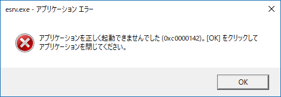
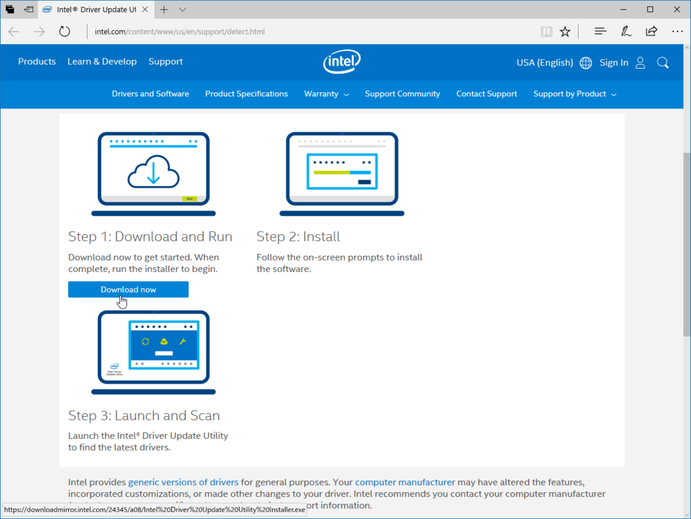
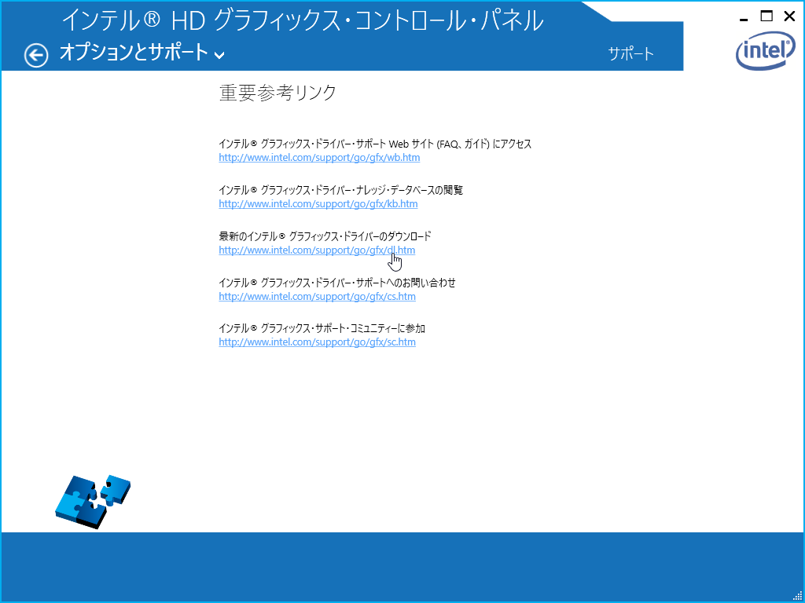
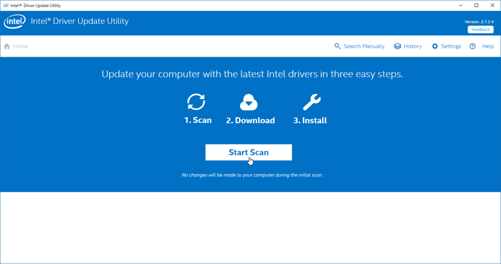
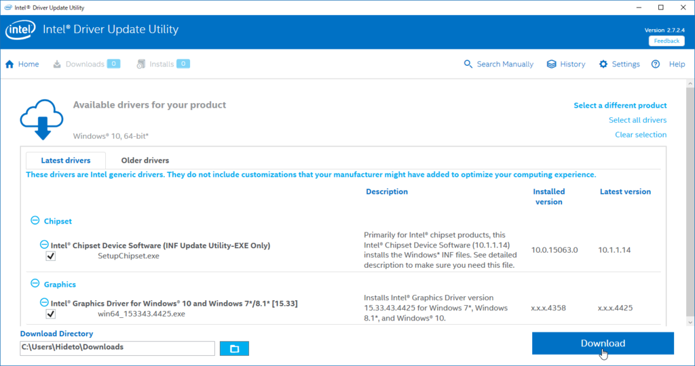

Intel Driver Update Utility が悪さをしているらしい。

<blockquote cite="https://answers.microsoft.com/en-us/windows/forum/windows_10-start/esrvexe-application-error-0xc0000142/24302510-82bb-4763-b860-2ad1284780b4">

<ol>
<li>Go to Control Panel (accessible by right clicking your Start Menu button if you are not on the Creators Update, if you are, type Control Panel into Cortana Search)</li>
<li>Open Programs and Features.</li>
<li>Look for Intel Driver Update Utility, if you find it, uninstall it</li>
<li>Reboot</li>
</ol>
<cite><a href="https://answers.microsoft.com/en-us/windows/forum/windows_10-start/esrvexe-application-error-0xc0000142/24302510-82bb-4763-b860-2ad1284780b4">ESRV.EXE Application Error (0xc0000142) - Microsoft Community</a></cite>
</blockquote>

このアンサーではアンインストールして再起動しろと書いてあったけど、うちはとりあえず最新版にして様子見。

以下の URL から Intel Driver Update Utility の最新版を入手し、ドライバーのアップデートを行う。

<ul>
<li><a href="http://www.intel.com/content/www/us/en/support/detect.html">http://www.intel.com/content/www/us/en/support/detect.html</a></li>
</ul>
この URL は、Intel Driver Update Utility からもアクセスできる。［Ctrl］＋［Alt］＋［F12］キーを押して Intel Driver Update Utility を起動し、［オプションとサポート］－［サポート］画面を開けばよい。

ウチの場合、チップセットとグラフィックスドライバーのアップデートがきてた。

直ってたらいいなー。

