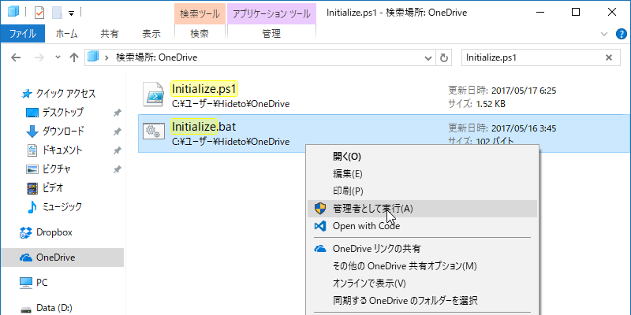

Windows 10 は［回復］オプションで割と簡単に初期化できるので、なんか調子悪くなったときは気軽にキレイサッパリにしているのだけど、そのあとの環境構築を毎回手動でやるのがいい加減かったるいので、できるだけスクリプトでできんもんかなーと考えてみた。

ウチは OS をわりとプレーンな状態で使う派なので、実はやることがそんなにないんだけど、それでも以下のことが必要っぽかった。

<ul>
<li>（データは OneDrive で同期する。スタンドアロンアプリもだいたい OneDrive で）</li>
<li>Set-ExecutionPolicy -ExecutionPolicy RemoteSigned</li>
<li>chocolatey で必要なアプリをセットアップ
<ul>
<li>chocolatey で管理できない（するとかえって面倒）なものは OneDrive へ保存済みのインストーラーでセットアップ</li>
</ul></li>
<li>シンボリックリンクを張る
<ul>
<li>Picture\Screenshots -> OneDrive\Screenshots（スクリーンショットを同期するため）</li>
</ul></li>
</ul>
これだったら自分の PowerShell 力でもなんとかなると思った。

<pre class="code lang-ps1" data-lang="ps1" data-unlink>Write-Host &quot;STEP 0: Set-ExecutionPolicy を RemoteSigned に書き換えます……&quot;

Set-ExecutionPolicy -ExecutionPolicy RemoteSigned
Write-Host &quot;&quot;

Write-Host &quot;STEP 1: chocolatey をセットアップしています……&quot;

if (Test-Path &quot;C:\ProgramData\chocolatey&quot;)
{
Write-Host &quot;すでにインストールされています。&quot;
}
else
{
iex ((New-Object System.Net.WebClient).DownloadString('https://chocolatey.org/install.ps1'))
# Get-PackageProvider -name chocolatey
Write-Host &quot;インストールが完了しました。&quot;
}

Write-Host &quot;&quot;

Write-Host &quot;STEP 2: ソフトウェアをインストールしています……&quot;

choco install -y paint.net
choco install -y sizer
choco install -y dotnetcore-sdk
choco install -y visualstudiocode
choco install -y dropbox
choco install -y vlc

# Nullsoft Install System
Start-Process -FilePath &quot;$Home\OneDrive\Apps\WinSnap_4.5.8-setup.exe&quot; -ArgumentList &quot;/S&quot;
# Advanced Installer
Start-Process -FilePath &quot;$Home\OneDrive\Apps\emed64_16.7.2.exe&quot; -ArgumentList &quot;/quiet&quot;

Write-Host &quot;&quot;

Write-Host &quot;STEP 3: シンボリックリンクを作成しています……&quot;

Write-Host &quot;Picture\Screenshots -&gt; OneDrive\Screenshots&quot;
Set-Location &quot;$Home\Pictures&quot;
Remove-Item &quot;Screenshots&quot;
New-Item -Type SymbolicLink -Path &quot;Screenshots&quot; -Value &quot;$Home\OneDrive\Screenshots&quot;

Write-Host &quot;&quot;

Write-Host &quot;セットアップが終了しました。キーを押すと終了します。&quot;
$host.UI.ReadLine()
</pre>
このスクリプトを管理者権限で起動すればよいのだけど、PowerShell のコンテキストメニューには［管理者権限で実行する］コマンドはないんだな。バッチファイルならあるのに。

――というわけで、スクリプトをキックするためのバッチファイルも書いた。

<pre class="code" data-lang="" data-unlink>@powershell -NoProfile -ExecutionPolicy RemoteSigned -File &#34;C:\Users\Hideto\OneDrive\Initialize.ps1&#34;</pre>

Surface 3 を初期化してテストした後に、デスクトップ PC でも試してみたのだけど、<code>choco install -y dropbox</code> が失敗して面倒くさいことになった<a href="#f-63094833" name="fn-63094833" title="利用したバージョンのオフラインインストーラーがどうにも動かない。Web インストーラーをダウンロード＆実行して解決">*1</a>以外は、割とスムーズにいった。

実は以前からところどころを自動化していたのだけど、ちゃんとメンテナンスすればいろいろ楽になるかなーと思った。Windows ストアからのインストールもコマンドでできたらいいんだけど……かつて「OneGet」で Windows ストアをプロバイダーにできるようになるとか聞いた覚えがあるんだが、どうなったんだろう。

<a href="#fn-63094833" name="f-63094833" class="footnote-number">*1</a>:利用したバージョンのオフラインインストーラーがどうにも動かない。Web インストーラーをダウンロード＆実行して解決

