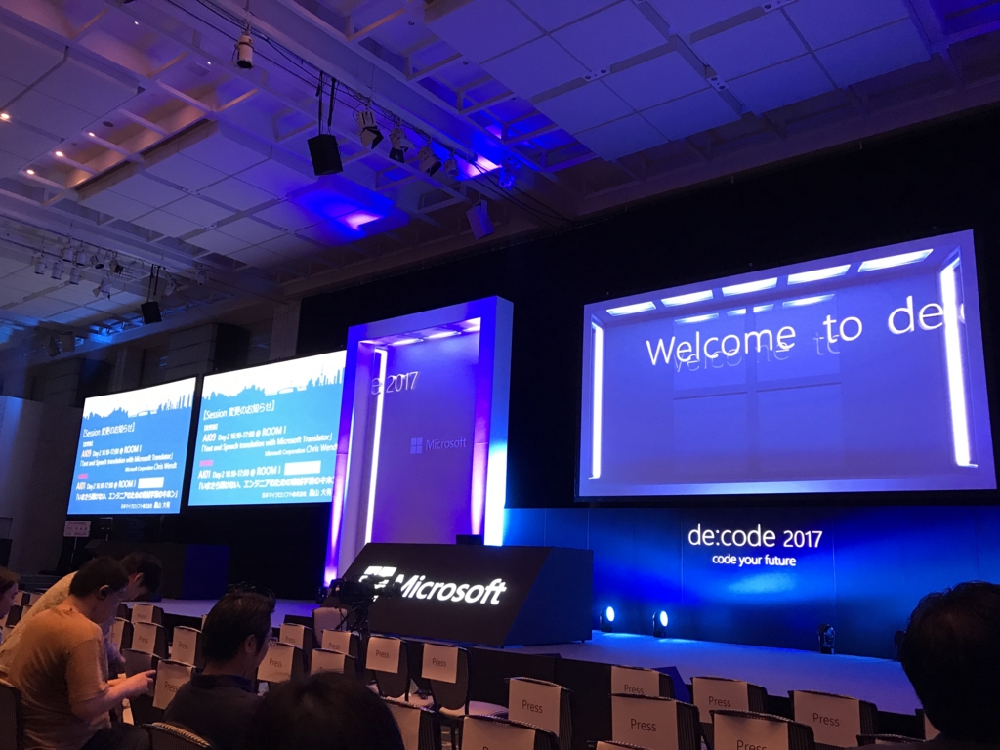
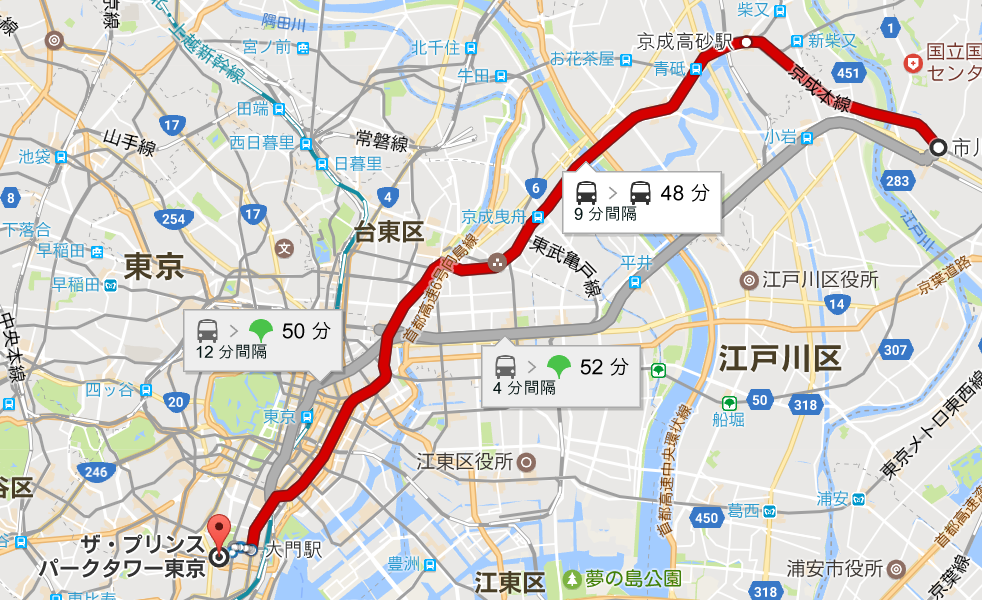
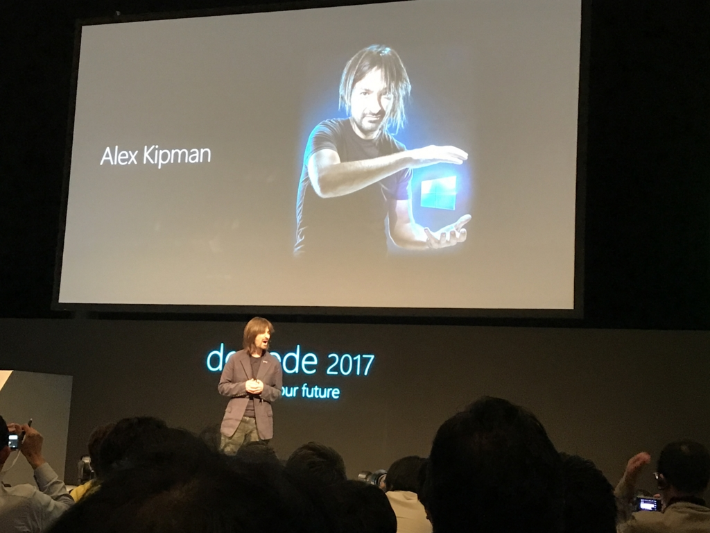
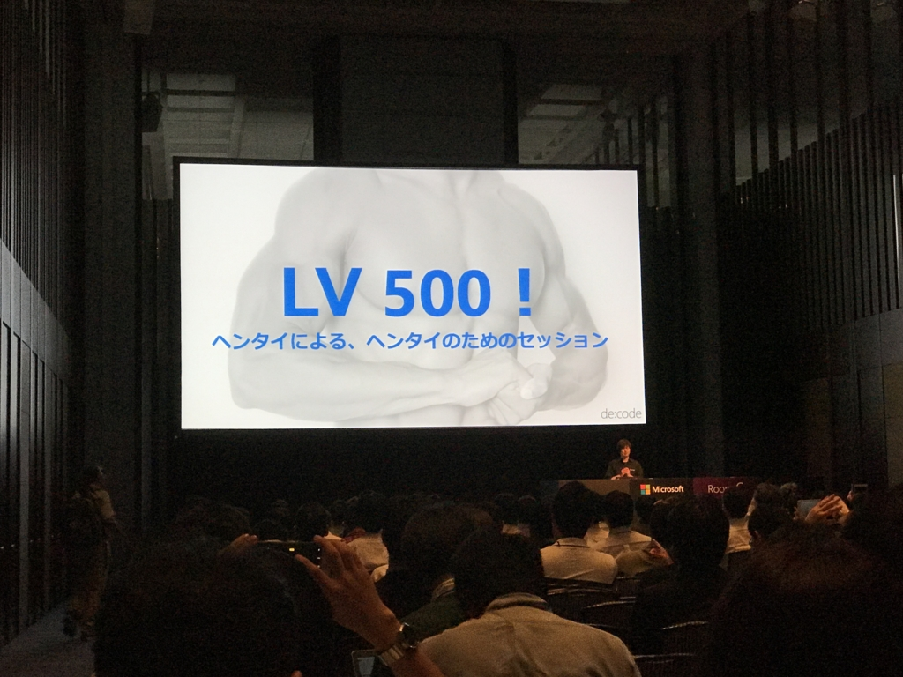
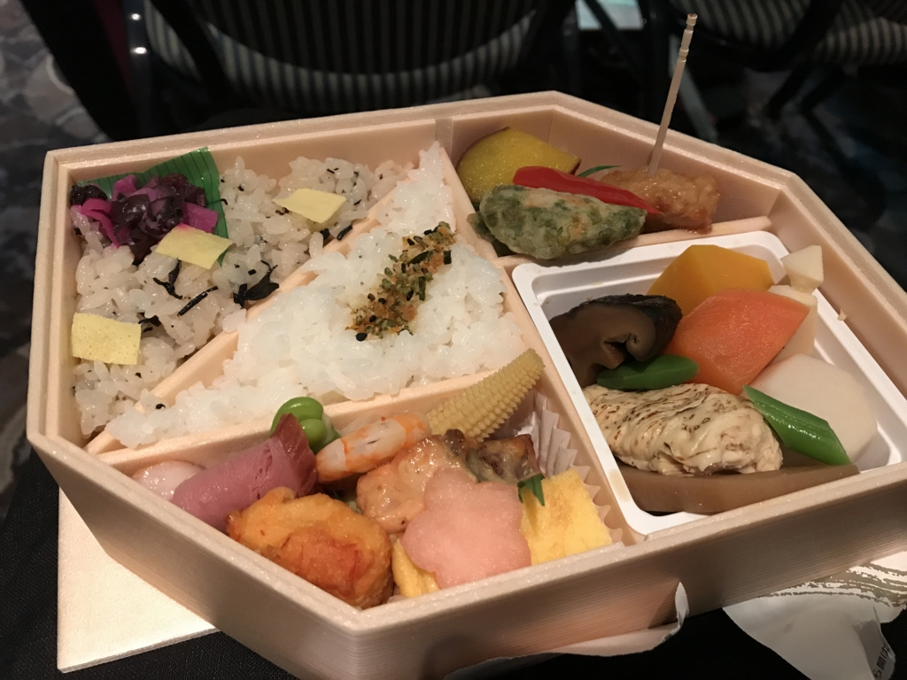
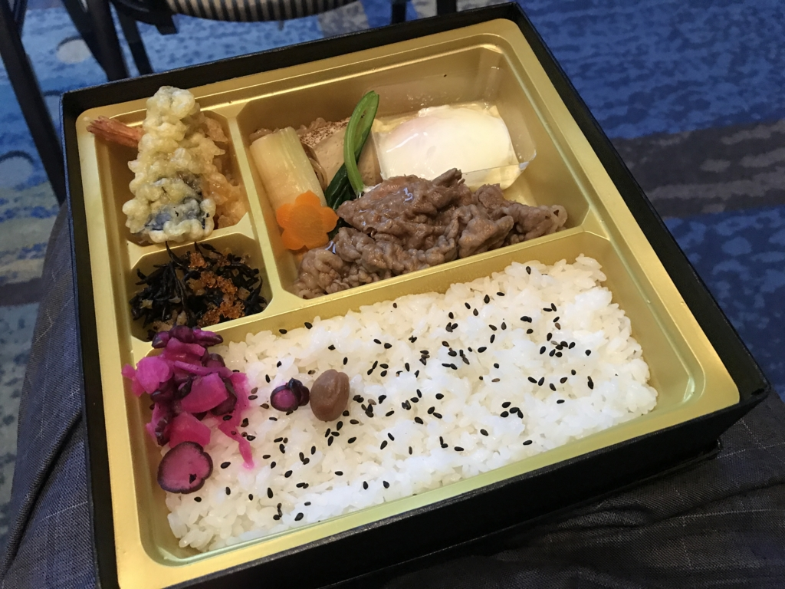
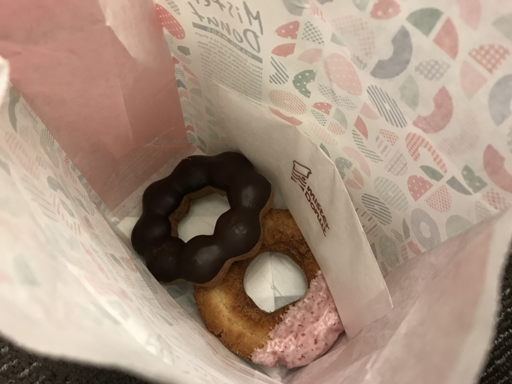
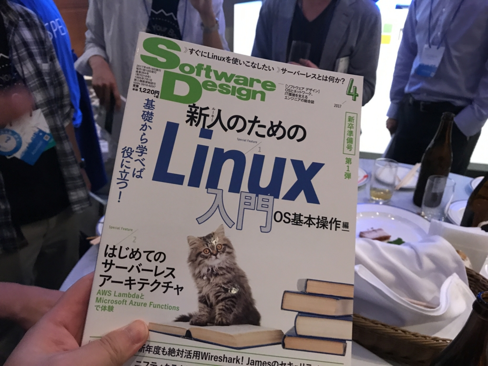

今週は四国をでて東京へ進出、<a href="https://www.microsoft.com/ja-jp/events/decode/2017/">de:code 2017</a> に参加してきました。3年前に参加して以来ですね。

<iframe src="http://blog.daruyanagi.jp/embed/2014/06/05/010551" title="de:code 参加してきたった - だるろぐ" class="embed-card embed-blogcard" scrolling="no" frameborder="0" style="display: block; width: 100%; height: 190px; max-width: 500px; margin: 10px 0px;"></iframe><cite class="hatena-citation"><a href="http://blog.daruyanagi.jp/entry/2014/06/05/010551">blog.daruyanagi.jp</a></cite>

毎年参加したいのだけど、10万円近い参加費やら、飛行機代やら、お仕事休むための根回しとか、休んだ分収入が減るだとか、休んでる間に仕事がなくなるんじゃないかとか（その点、正社員の人はいいよねぇ……）、まぁ、いろいろあって、なかなかしんどいですよね。でも、最近は勉強不足が目立ってきたのと、最新の技術に触れてモチベーションを取り戻したいなという気持ちが強かったので、頑張ってお小遣いをためました。

ちなみに、技術的な話はないです。今回はフワッとした感想だけ。

<h3>会場</h3>

3年前と同じく、ザ・プリンス パークタワー東京でした。芝公園・大門のあたりなのですが、根拠地にしているうちの実家（市川）から京成線＝浅草線でほぼ一本で行けるので楽でした。最近の東京は痴漢冤罪が流行っていて怖かったのですが、このルートだったら割と座れるのもいいですね。おとなしく座ってさえいれば、痴漢に間違われることはない……はず。

ただ、人数のわりに会場のキャパが足りていなくて、セッション会場の移動やパーティーでの人混みには閉口しました。ちょっと人に酔って気持ちが悪い……。二日目の午後には、割とグロッキーになっていました（笑

<h3>キーノート</h3>

Build のキーノートを見ていたのもあるけれど、それほど目新しいことはなくて、正直3時間もあるのはだるかったです。でも、生キップマン（最近のキャッチコピーは「Hololens の生みの親」みたいですね）が見れたのは「おぉー」って感じでした。会場でも普通に歩いていて、サインほしいなーと思ったのですが、自重。両手に Hololens 持ってるレベルじゃないと、話しかけるのも烏滸がましい感じがしてしまって……ｗ

<h3>セッション</h3>

キーノートは盛りだくさんでしたが、一言でいえば「ぜんぶの製品に Intelligence を組み込んでいくぜ！」って感じですかね。自分にはこの Intelligence ってのがフワッとしか感じに思えてしまったのですが、Google I/O でも AI の話ばかりだったり、これは疎かにしてられんなぁ……と思いなおし、機械学習のセッションを増やしてみました。機械学習の今さら聞けない（笑）を概説した #AI01 なんかは個人的にかなり有用で、これからディープラーニングソリューションに挑戦するうえでの基礎になりそうでしたね。断片的に得ていた知識に筋が通った感じが気持ちいい。

そんな感じで、今回は直前での予定変更を何回か入れたのですが、Web/Mobile（Windows 版は UWP だから PC でもいけるよ！）でスケジュールビルダー（とその他もろもろ）が用意されていて、スムーズにタイムテーブルを組むことができました。

<iframe src="//hatenablog-parts.com/embed?url=https%3A%2F%2Fwww.microsoft.com%2Fja-jp%2Fstore%2Fp%2Fde-code-2017%2F9mz0x3t11jfr" title="de:code 2017 を購入 - Microsoft Store 日本" class="embed-card embed-webcard" scrolling="no" frameborder="0" style="display: block; width: 100%; height: 155px; max-width: 500px; margin: 10px 0px;"></iframe><cite class="hatena-citation"><a href="https://www.microsoft.com/ja-jp/store/p/de-code-2017/9mz0x3t11jfr">www.microsoft.com</a></cite>

おかげで立ち見を強いられたのは岩永さんのセッション1回だけｗ

アンケートもアプリで提出できるので楽ちんですよね（3年前は紙だった記憶ある）。いろいろ進化してるなー。たぶん Xamarin で作ってあって、それをネタにしたセッションもあったと思うのだけど、今回は Xamarin を全スルーしたので自分はよく知りません。後日セッション資料が公開されたら確認してみようかな。

とにかくどのセッションもよく練られて・準備されていてとても楽しかったです。それでも敢えて一つだけ印象的だったものを挙げるとすれば、デバッグのセッション #MR15 でしょうか。日頃別にダンプとか見ないし、WinDbg の使い方もろくに知らないのですが、「へぇ、こうやってやるんだー」「……この流れは……デ、デッドロックだあああ！」みたいな感じで、自分の中ではだいぶ盛り上がりました（途中で退席してる人もちらほらいましたが……）。最終日の最終セッションだったので、だいぶ疲れてテンションがおかしかったのもありますけど、こういうディープなのも増やしてくれると嬉しいですね。そういえば3年前の帝国兵の中の人のセッションも楽しかった記憶あります。

<h3>ごはん＆スイーツ</h3>

実は3年前は昼ごはんに一度当たらなかったという悲劇を体験したので、ランチ付きのセッションは内容よりもごはんに当たることを優先して選びました（ぉ

おかげで今回はちゃんとごはんにありつけたぞー。この時間のセッションでは、TIS さんの事例が興味深かったですね。AR だの MR だの言ってますけど、入力インターフェイスはコントローラーと、あとは音声コマンドじゃん？　自分があんまり AR/MR を手放しに歓迎する気になれないのは、とくに日本語の音声認識・合成がまだまだいまいちで、日本での AR/MR 普及の足かせになってるからなのですが、そこがクリアされたら本格的に AI ＋ AR/MR 時代が到来しそうだな……と感じられました。ってか、さっさと到来してくれろください。

あと、ミスド美味しかった。

人に酔って気分悪かったときも、ドーナツかじってると少し回復した気がして、だいぶ助けられた……。ちなみにスタンプラリーとかは面倒で一切やらなかったので、アイスクリームとかは食ってない。

<h3>参加者パーティー</h3>

だれか知り合いいないかなーと思って参加したのですが（1日目はずっと一人でしたね）、最初はボッチで寂しかったです。でも、幸い顔見知りに会えて、Azure だか ASP.NET の部屋に連れられてからは、旧知の人やオンラインでしか知らなかった人にも会えて楽しかったです。

でも、ご飯は食べ損ねたというか、メイン会場で寿司をゲットするには自分は平和主義すぎた……もう人混みが辛かったってのもある。ひたすらビール飲んでた。

あと、くじ引きにはもちろん当たりませんでしたが、Software Design をもらいました。おおきにですー。

<h3>ちょっと後悔したこと</h3>

セッションの参加を優先しすぎて、EXPO などをほとんど体験できずじまいでした。これはちょっともったいなかったかな……セッションの資料は後日公開されるだろうので、セッションをいくつか犠牲にしてでも、その時にしか体験できないことをやっておけばよかった気もします。まぁ、ただ、一つでも受けておきたいってのが当時の気持ちだったので……次はもう少し余裕をもっていろいろ楽しみたいな。

体力的にはかなり堪えましたが、楽しい2日間でした。中の人に感謝したいです。得たものの多くはとっかかりに過ぎないので、自分の中でちゃんと消化して、活かしていきたいですね。それで初めて de:code に参加しましたって感じなんでしょう。

とにかく久しぶりにいい刺激がもらえました。来年も頑張って参加したいですね。ぜいたくを言うならば、会場にもう少し余裕があればうれしいです。

