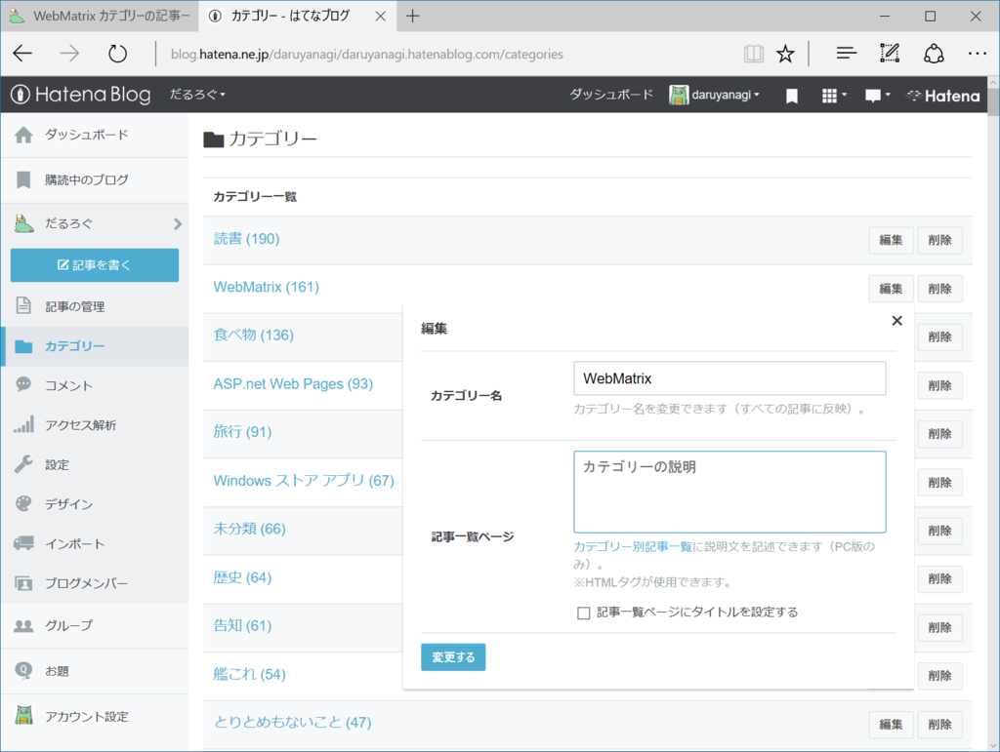
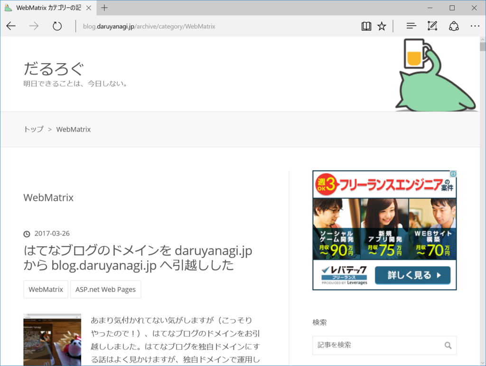
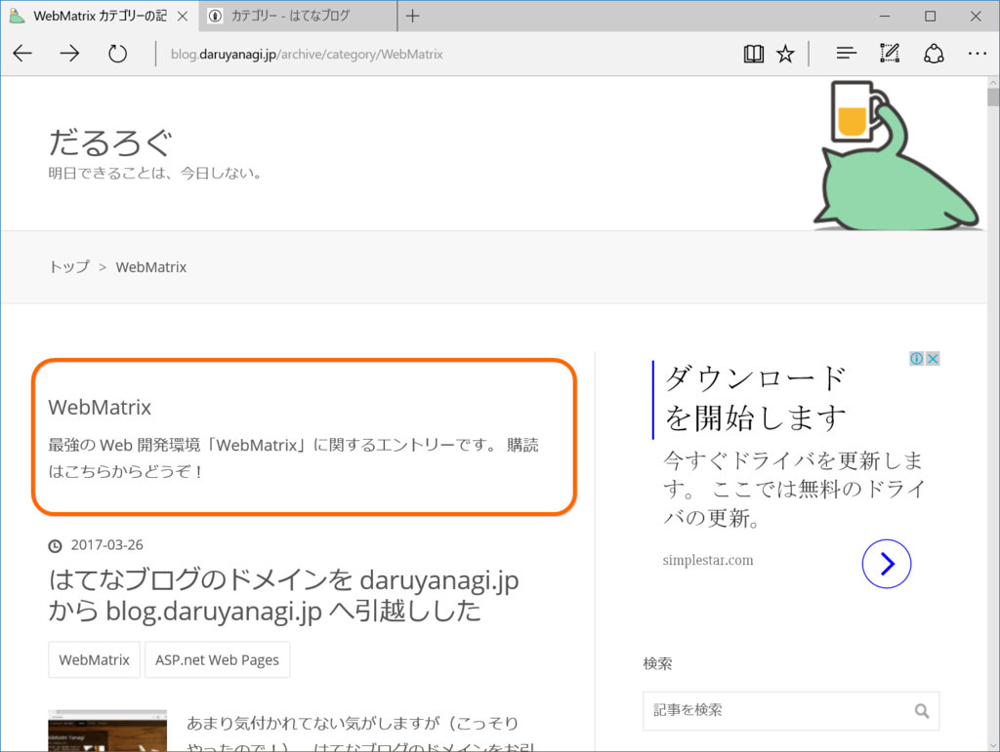

 

<blockquote cite="http://staff.hatenablog.com/entry/2017/05/24/115000">

はてなブログでは、カテゴリー別記事一覧（PC版）において、ページのタイトルや説明文を自由にカスタマイズできる機能を、有料プラン「はてなブログPro」利用者向けにリリースしました。特定のカテゴリーを目立たせたり、おすすめ記事を冒頭に表示したりといったリッチな表現が、カテゴリー別記事一覧ページで可能になります。どうぞご利用ください。

<cite><a href="http://staff.hatenablog.com/entry/2017/05/24/115000">&#x30AB;&#x30C6;&#x30B4;&#x30EA;&#x30FC;&#x5225;&#x8A18;&#x4E8B;&#x4E00;&#x89A7;&#x3067;&#x3001;&#x30DA;&#x30FC;&#x30B8;&#x306E;&#x30BF;&#x30A4;&#x30C8;&#x30EB;&#x3084;&#x8AAC;&#x660E;&#x6587;&#x3092;&#x30AB;&#x30B9;&#x30BF;&#x30DE;&#x30A4;&#x30BA;&#x3067;&#x304D;&#x308B;&#x3088;&#x3046;&#x306B;&#x3057;&#x307E;&#x3057;&#x305F;&#xFF08;&#x306F;&#x3066;&#x306A;&#x30D6;&#x30ED;&#x30B0;Pro&#xFF09; - &#x306F;&#x3066;&#x306A;&#x30D6;&#x30ED;&#x30B0;&#x958B;&#x767A;&#x30D6;&#x30ED;&#x30B0;</a></cite>
</blockquote>

リクエストしていた機能なのでとってもうれしいです。ありがとう！　中の人！

というわけで、さっそくウチでも使ってみましょう。例は……どうしようかな、軽いカテゴリーの説明と、フィードへのリンクを追加してみましょうか。ウチのような“雑記”だと、ノイズが多いですからね。特定のカテゴリーのみを購読したいという要望は3年に1回ぐらいもらいます。

カテゴリーの説明には HTML が使えるようなので、こんな感じでしょうでしょうか。

<pre class="code lang-html" data-lang="html" data-unlink>最強の Web 開発環境「WebMatrix」に関するエントリーです。

購読は&lt;a href=&quot;http://blog.daruyanagi.jp/feed/category/WebMatrix&quot;&gt;こちら&lt;/a&gt;からどうぞ！
</pre>
結果はこんな感じ。

割といい気がします。現在利用しているテーマがこの新しい機能を考慮していないのでスタイルシートを当てた方がよさそうですけど、このままでも十分使えそう。

できれば、すべてのカテゴリーにわざわざこんな説明を追加していくのは面倒なので、<b>“すべてのカテゴリーに共通の説明”</b>をつける機能がほしいかも。変数でカテゴリータイトル（エンコードあり・なし）や URL などを埋め込める感じにしてくれれば、カスタマイズの幅が広がりそうです。

気が向いたら今度フィードバックを送ってみよう。

