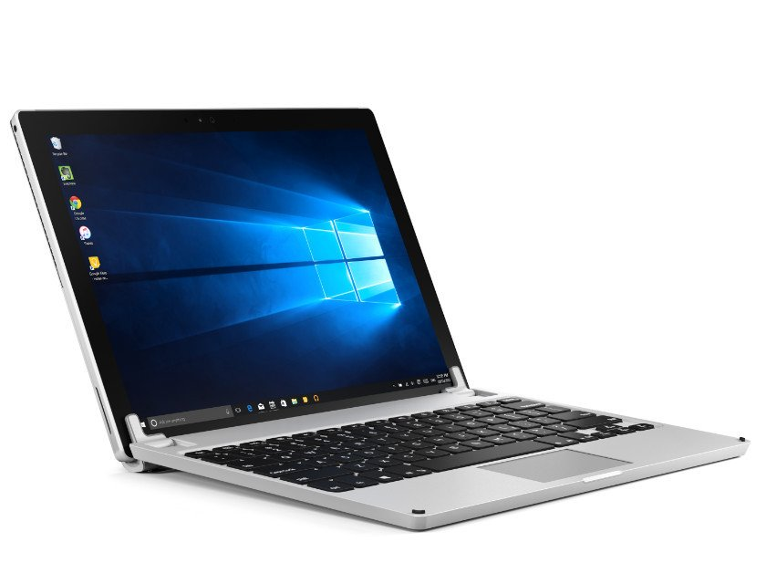

<b>めっちゃほしい（迫真</b>

Surface Studio は残念ながら完全に予算オーバーで買えない気がするのだけど、新しい Surface Pro は LTE 版（今秋でるらしい）を買う気満々で全裸待機中でござる。

というわけで、今持ってる Surface 3/Surface Pro 3 と現行版の Surface Pro 4、そしてこれからでる Surface Pro の違いを、個人的に気になる点を中心にまとめてみた。

<h3>外寸・重量</h3>

<table>
<tr>
<td></td>
<td>Surface Pro 3</td>
<td>Surface Pro 4</td>
<td>Surface Pro（2017）</td>
</tr>
<tr>
<td>横</td>
<td>292 mm</td>
<td>約292.1 mm</td>
<td>約 292 mm</td>
</tr>
<tr>
<td>縦</td>
<td>201.3 mm</td>
<td>201.4 mm</td>
<td>201 mm</td>
</tr>
<tr>
<td>厚み</td>
<td>9.1 mm</td>
<td>8.4 mm</td>
<td>8.5 mm</td>
</tr>
<tr>
<td>重量</td>
<td>800 g</td>
<td>786 g（i5/i7）</td>
<td>770 g（i5）</td>
</tr>
</table>
外寸と重量はほぼ変わらない……ってことは、<b>“BRYDGE 12.3”がそのまま使える可能性が高い</b>な。“BRYDGE 12.3”ってのは Surface 向けのサードパーティー製キーボードで、付けると Macbook っぽくなる。接続は Bluetooth で行う仕組みで、ストレージ内蔵モデルとストレージのないモデルがラインナップされている。

TypeCover は出たばかりの頃は感動してたけど、最近はもっとカッチリしたキーボードの方が好み（あと、英語配列を日本でも売ってほしい……）なので、“BRYDGE 12.3”を試してみたい――んなわけで、外寸の違いは割と重要な要素だったのだけど、ほぼ変わりがないっぽくて安心。

※まだ発注するとは言っていない

新しい Surface Pro はお値段が若干高めだけど、TypeCover が使いまわせれば多少出費を抑えることができるかな？　ペンも使いまわせるだろうけど、これは新しくした方がよさげ。

<blockquote cite="http://pc.watch.impress.co.jp/docs/news/1061865.html">

――Surface Penも筆圧レベルを従来の1,024段階から4,096段階に増やした新モデルを投入。新たに傾き検知をサポートするほか、21msの低遅延により、実際の紙に近い書き心地を実現。ペンの本体色も新たにタイプカバーに合わせて4種類の展開となった。

　なお、ペンは別売りで、8月に発売予定。税別参考価格は11,800円。従来のSurfaceシリーズでも利用可能だが、傾き検知には非対応となり、筆圧もSurface Pro 3までは256段階、Pro 4/Laptop/Studio/Bookでは1,024段階までの対応となる。

<cite><a href="http://pc.watch.impress.co.jp/docs/news/1061865.html">&#x30B9;&#x30BF;&#x30F3;&#x30C9;&#x304C;&#x6700;&#x5927;165&#x5EA6;&#x307E;&#x3067;&#x958B;&#x304F;&#x3088;&#x3046;&#x306B;&#x306A;&#x3063;&#x305F;&#x65B0;&#x3057;&#x3044;&#x300C;Surface Pro&#x300D; &#xFF5E;&#x8EFD;&#x91CF;&#x5316;&#x3068;&#x9759;&#x97F3;&#x5316;&#x3001;&#x9AD8;&#x6A5F;&#x80FD;&#x5316;&#x3092;&#x5B9F;&#x73FE;&#x3002;&#x5B9F;&#x6A5F;&#x5199;&#x771F;&#x3092;&#x591A;&#x6570;&#x63B2;&#x8F09; - PC Watch</a></cite>
</blockquote>

Surface ペン、高ぇ……！

<h3>CPU</h3>

Surface 3 と Surface Pro 3 の両方を持っている自分だけど、スペックは Surface Pro 3 の方が高いにもかかわらず、利用頻度は Surface 3 の方が高い。なぜなら、Surface Pro 3 は“五月蠅い”。冷却ファンの音が割と大きくて、静かなリビングでゴロゴロしながら使うにはちょっと……熱いのも困る。

新しい Surface Pro はここら辺も改善されていて、<b>i5 モデルまではファンレス</b>らしい。i7 はファン付きだけど、かなり静からしいので、こっちもありかもしれん（家電量販店でっファンの音をチェックするのはだいぶ厳しいが……）。

あと、CPU が新しいのも魅力やね。

<table>
<tr>
<td></td>
<td>Surface Pro 3</td>
<td>Surface Pro 4</td>
<td>Surface Pro（2017）</td>
</tr>
<tr>
<td>CPU の世代</td>
<td>第4世代（Haswell）</td>
<td>第6世代（Skylake）</td>
<td>第7世代（Kaby Lake）</td>
</tr>
<tr>
<td>CPU のモデル</td>
<td>i3/i5/i7</td>
<td>m3/i5/i7</td>
<td>m3/i5/i7</td>
</tr>
<tr>
<td>ファンレス</td>
<td>×</td>
<td>m3</td>
<td>m3/i5</td>
</tr>
<tr>
<td>バッテリー駆動時間</td>
<td>最大約 9 時間の Web 閲覧</td>
<td>動画再生最大約 9 時間</td>
<td>最大約 13.5 時間の動画再生</td>
</tr>
</table>
静粛性とバッテリー持続時間の改善が著しい。

あと、Windows 10 Insider Preview でテスト中の <b>Power Throttling</b> は Skylake 以降の対応（Intel SpeedShift Technology）なので、Pro 4 以降じゃないとダメなんだよねー。こういう技術も、静粛性とバッテリー持続時間にいい影響を与えてるのかもしれない。

 

<h3>グラフィックス</h3>

Surface Pro シリーズにはグラフィックスを期待していないが、あるに越したことはない。ゲームは Civilization しかやらんけど、ゲーム録画しながらサクサク遊べるようになったら、プレイ配信なんかにもチャレンジしてみたいなー（ちょっときついかなぁ？

<table>
<tr>
<td></td>
<td>Surface Pro 3</td>
<td>Surface Pro 4</td>
<td>Surface Pro（2017）</td>
</tr>
<tr>
<td>i3/m3</td>
<td>HD Graphics 4200</td>
<td>HD Graphics 515</td>
<td>HD Graphics 615</td>
</tr>
<tr>
<td>i5</td>
<td>HD Graphics 4400</td>
<td>HD Graphics 520</td>
<td>HD Graphics 620</td>
</tr>
<tr>
<td>i7</td>
<td>HD Graphics 5000</td>
<td>Iris Graphics 540</td>
<td>Iris Graphics 640</td>
</tr>
</table>

最近の CPU や GPU はよくわからんけど、まぁ、早くなってんねやろ（投げやり

<h3>その他の機能</h3>

<table>
<tr>
<td></td>
<td>Surface Pro 3</td>
<td>Surface Pro 4</td>
<td>Surface Pro（2017）</td>
</tr>
<tr>
<td>顔認証</td>
<td>×</td>
<td>○</td>
<td>○</td>
</tr>
<tr>
<td>Surface Dial 対応</td>
<td>×</td>
<td>○</td>
<td>○</td>
</tr>
<tr>
<td>LTE モデル</td>
<td>×</td>
<td>×</td>
<td>○</td>
</tr>
</table>
機能面では <b>Windows Hello の顔認証</b>対応がうれしいかも。パスワードの入力がいらなくなるぜー（ぃぇーぃ

あと、<b>LTE モデル</b>には期待。LTE は Surface 3 で経験済みだけど、あるとないのとでは割と違う。だいたい、初回セットアップでアクセスポイントのパスワードを入れなくていいのが大変よろしい。あとは Microsoft アカウントの確認さえやれば、無線 LAN のパスワードが同期される。ここでもパスワードの入力がいらなくなるぜー（ぃぇーぃ

最近はモバイル回線も大容量プランが出てきたし、いっそのこと WiMAX を解約して、大容量 LTE（＋複数台シェア）に乗り換えちゃうのもありだな。

スタンドの傾きが増えたとか、そういうのは、まぁ、個人的には割とどうでもいいや。あと Office 要らないんだけど（Office 365 買ってる）……その分安くしてくれないかなぁ。

