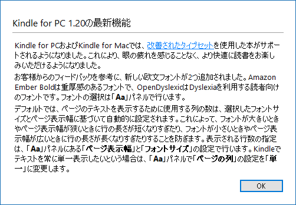
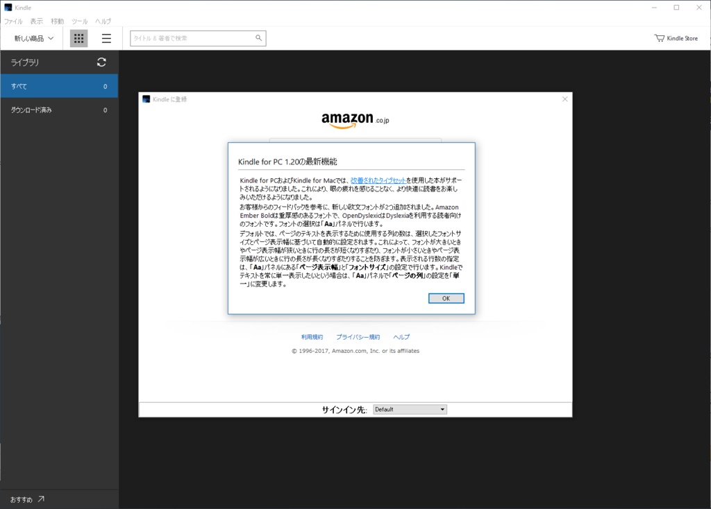

最近使ってなかったから、アップデートに気が付いていなかった。

<blockquote cite="https://www.amazon.co.jp/gp/help/customer/display.html?nodeId=201245960">

<h3>最新バージョンについて</h3>

Kindle for PCの最新バージョンは、Windows 7 / Windows 8または8.1 / Windows 10を搭載のPCに対応しています。

Kindle for PCの最新バージョン1.20.1には、以下の改善および新機能が含まれます。

<ul>
<li>日本語でのコンテンツ検索機能が向上しました。</li>
<li>JAWSスクリーンリーダーに対応するようになりました（対応している英語の本のみ）。</li>
<li>その他のパフォーマンスが改善されました。</li>
</ul>
お使いのKindle for PCが最新バージョンかは、Kindle for PCのヘルプタブをクリックし、バージョン情報から確認できます。

注: Kindle for PC 1.14.0 以下のバージョンはサポートされていません。Kindle for PCの最新バージョンは無料でダウンロードおよびインストールしていただけます。Windows XPをお使いのお客様は、Kindle for PC1.16.0をご利用ください。

<cite><a href="https://www.amazon.co.jp/gp/help/customer/display.html?nodeId=201245960">Amazon.co.jp &#x30D8;&#x30EB;&#x30D7;: Kindle for PC&#x306E;&#x6700;&#x65B0;&#x30D0;&#x30FC;&#x30B8;&#x30E7;&#x30F3;&#x3092;&#x30C0;&#x30A6;&#x30F3;&#x30ED;&#x30FC;&#x30C9;&#x3059;&#x308B;</a></cite>
</blockquote>

動作が早くなってる気もするけど、OS をクリーンアップした直後だからかもしれない。

