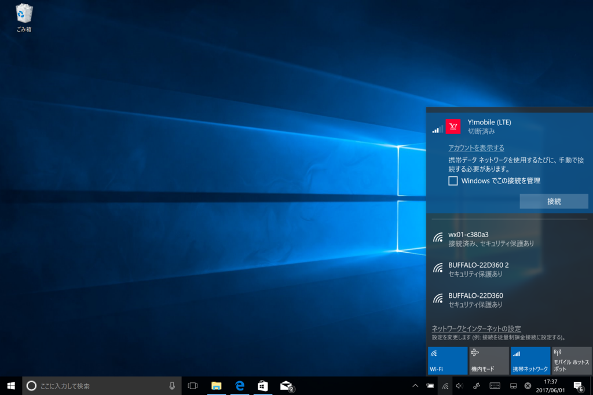
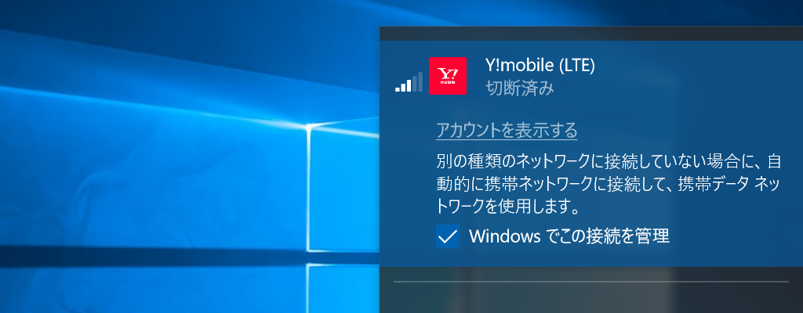

たぶん Windows 10 Creators Update からだと思うんだけど、携帯データネットワーク接続に［Windows でこの接続を管理］というオプションが追加されていた。

<blockquote cite="https://support.microsoft.com/ja-jp/help/10739/windows-10-cellular-settings">

携帯データネットワークを使用できるときに、PC がネットワークに自動的に接続するかどうかを指定します。携帯データネットワーク接続を使用するたびに手動で接続する場合には、チェック ボックスをオフにします。Windows によって自動的に接続を管理する場合は、このチェック ボックスをオンにしてください。オンにすると、別の種類のネットワークに接続していない場合に、自動的に携帯ネットワークに接続します。

<cite><a href="https://support.microsoft.com/ja-jp/help/10739/windows-10-cellular-settings">https://support.microsoft.com/ja-jp/help/10739/windows-10-cellular-settings</a></cite>
</blockquote>

要するに、こいつを有効化しておくと Wi-Fi が切れた時、勝手に LTE につないで接続を維持してくれるようなのだけど……

知らんうちに LTE 回線を使ってて、請求額がだいぶ上がった／(^o^)＼

基本的に便利でありがたい機能なのだけど、使うときはちょっと注意が必要かなと思った。ちなみに Y! モバイルは 7 月で解約（Surface 3 を買って 2 年経つんだね！）するので、低速でいい（転送速度に天井があってもいい）からずっと繋がる感じのサービスがないかなーって探してる。

