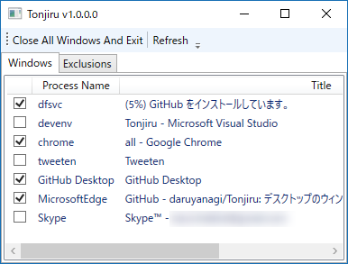

開いてるウィンドウを全部閉じてデスクトップをキレイにするアプリ「Tonjiru」を作った。似たようなアプリ「CloseAll」の仕様が少し変わっていて、あまり使い勝手がよくないなと思ったので、「これぐらい簡単に作れるだろう」と思ったのだが、作りこむといろいろ面倒だった（とくにストアアプリへの対応）。

<iframe src="//hatenablog-parts.com/embed?url=http%3A%2F%2Fforest.watch.impress.co.jp%2Fdocs%2Fnews%2F1063435.html" title="開いているウィンドウをまとめて閉じてデスクトップをスッキリさせる「CloseAll」v2.1／最新版ではWindows 10をサポート。UWPアプリのウィンドウ列挙も可能に" class="embed-card embed-webcard" scrolling="no" frameborder="0" style="display: block; width: 100%; height: 155px; max-width: 500px; margin: 10px 0px;"></iframe><cite class="hatena-citation"><a href="http://forest.watch.impress.co.jp/docs/news/1063435.html">forest.watch.impress.co.jp</a></cite>

名前は<b>「閉じる……閉じる……」</b>と悩みながら晩御飯を作っていたら、いつの間にか<b>豚汁</b>ができていたので、それにあやかってつけた。松山は麦味噌が多いのかな、結構適当に作ってもおいしいのができる。

<iframe src="//hatenablog-parts.com/embed?url=https%3A%2F%2Fgithub.com%2Fdaruyanagi%2FTonjiru%2Freleases%2Ftag%2Fv1.0.0" title="daruyanagi/Tonjiru" class="embed-card embed-webcard" scrolling="no" frameborder="0" style="display: block; width: 100%; height: 155px; max-width: 500px; margin: 10px 0px;"></iframe>

仕様的にはシンプルで。起動すると GUI なしに開いてるウィンドウを全部閉じて終了するだけ（これが欲しかったんだよ！）。［Shift］キーを押しながら起動すると GUI が現れ、終了するアプリをチェックで選べる。 

一応除外リストを作ったけど、プロセス名ベースなのがあまりイケてない気がする。

あと、終了メッセージを送ってもアプリによって挙動が異なるので、WM_CLOSE と SC_CLOSE の両方を送っている。なので、未保存のドキュメントがある場合に「保存しますか？」と確認ダイアログを出すアプリでは、キャンセルして終了をスキップしても、もう一回同じダイアログが表示される（計2回）。あまりイケてないから、将来バージョンではどっちのコマンドを送るかを選択できるようにするかなーと思っている。

<h3>与太話その一：ストアアプリへの対応</h3>

EnumWindows() でトップレベルウィンドウを列挙すると、ストアアプリは「<b>ApplicationFrameHost</b>」というのが引っ掛かるが、これは所謂ガワに過ぎない。これではストアアプリを一意に区別することができないので、その子ウィンドウをたぐって「<b>Windows.UI.Core.CoreWindow</b>」というのを探し、そのプロセス名（「ストア」アプリだと“WinStore.App”）をとった。

もう一つ面倒くさいのが「Microsft Edge」で、こいつはガワのほかにもコンテンツプロセス（MicrosoftEdgeCP）をいくつか余分にもっている。これをひっかけるのは余分だし、ほしいのは“トップレベル”ウィンドウなので、独自にフィルタリング処理を追加した。ただし、ここらへんで頭がこんがらがってきたので、ストアアプリの除外処理はいろいろバグバグだ。いずれ直そうかと思うけど、とりあえずはこのままにしておく。

<pre class="code lang-cs" data-lang="cs" data-unlink>private static bool EnumChildWindowProc(IntPtr handle, IntPtr lParam)
{
var builder = new StringBuilder(256);
GetClassName(handle, builder, builder.Capacity);

// ストアアプリのためのハック -&gt; &quot;Windows.UI.Core.CoreWindow&quot; を探す
if (builder.ToString() == &quot;Windows.UI.Core.CoreWindow&quot;)
{
int process_id;
GetWindowThreadProcessId(handle, out processId);

process = Process.GetProcessById(process_id); // プロセス情報を保管

if (process != null) return false;

// Microsoft Edge は null だった。とりあえず飛ばしておくことにしておこう
}

return true;
}
</pre>
久しぶりに P/Invoke 使ったので疲れた。最初は Process.GetProcesses() で済むと思ってたんだけど、全然そんなことはなくて、作り始めてから後悔した（とくにすごく必要なツールでもないので）。ただ、ストアアプリの構造をちょっと勉強できたのは面白かった。

<h3>与太話その二：GitHub for Windows</h3>

「GitHub」アプリの新版がベータ公開されているので試してみた。

<iframe src="//hatenablog-parts.com/embed?url=http%3A%2F%2Fforest.watch.impress.co.jp%2Fdocs%2Fnews%2F716583.html" title="GitHub、“GitHub Flow”に最適化した新しいクライアント「GitHub Desktop」を公開" class="embed-card embed-webcard" scrolling="no" frameborder="0" style="display: block; width: 100%; height: 155px; max-width: 500px; margin: 10px 0px;"></iframe><cite class="hatena-citation"><a href="http://forest.watch.impress.co.jp/docs/news/716583.html">forest.watch.impress.co.jp</a></cite>

個人的にはいろいろ使いにくいというか、プルリクエストが GUI から作れないのか？　それがちょっと面倒だった。――ので、古いの（現行版）を引っ張り出して使っている。こっちの方が今のところ便利かなぁ。

