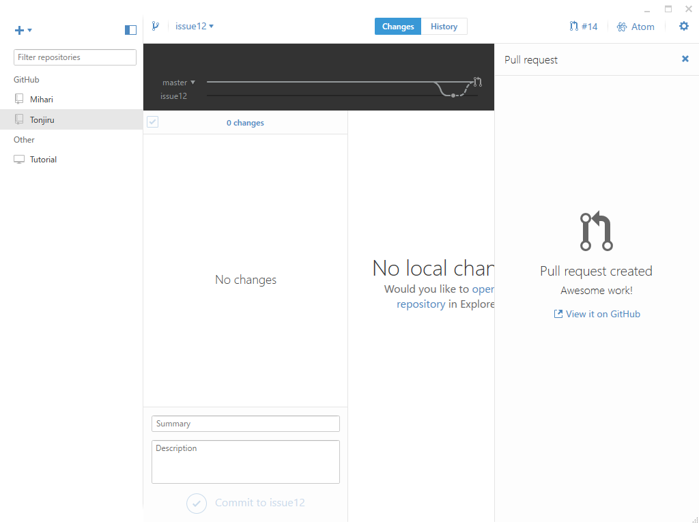

 

<ul>
<li>アイコンを付けた</li>
<li>SendMessage と PostMessage を選択できるように</li>
<li>不具合の修正</li>
</ul>
SendMessage だと相手がメッセージの処理を完了するまで制御が返ってこないので、PostMessage を使う方がいいかなって思った。

<iframe src="//hatenablog-parts.com/embed?url=https%3A%2F%2Fgithub.com%2Fdaruyanagi%2FTonjiru%2Freleases%2Ftag%2Fv1.1.0" title="daruyanagi/Tonjiru" class="embed-card embed-webcard" scrolling="no" frameborder="0" style="display: block; width: 100%; height: 155px; max-width: 500px; margin: 10px 0px;"></iframe><cite class="hatena-citation"><a href="https://github.com/daruyanagi/Tonjiru/releases/tag/v1.1.0">github.com</a></cite> 

<h3>関係のない話：GitHub Flow × GitHub for Windows</h3>

<blockquote cite="https://gist.github.com/Gab-km/3705015">

GitHub Flowとは何だろうか？

<ul>
<li>masterブランチのものは何であれデプロイ可能である</li>
<li>新しい何かに取り組む際は、説明的な名前のブランチをmasterから作成する（例: new-oauth2-scopes）</li>
<li>作成したブランチにローカルでコミットし、サーバー上の同じ名前のブランチにも定期的に作業内容をpushする</li>
<li>フィードバックや助言が欲しい時、ブランチをマージしてもよいと思ったときは、 プルリクエスト を作成する</li>
<li>他の誰かがレビューをして機能にOKを出してくれたら、あなたはコードをmasterへマージすることができる</li>
<li>マージをしてmasterへpushしたら、直ちにデプロイをする</li>
</ul>
これがフローのすべてだ。 

<cite><a href="https://gist.github.com/Gab-km/3705015">GitHub Flow (Japanese translation) &middot; GitHub</a></cite>
</blockquote>

去年ぐらいからこれを実践している（つもり）なのだけど、如何せん、一人でやっているのであまり自信がない。ので、自分のやり方をさらしておく。

<h4>1. 何か改善を思いついたら issue にメモする</h4>

この作業が一番面倒くさい……なにかいいアプリ（できればモバイル）があればいいんだけどな。

<h4>2. GitHub for Windows を起動して Sync</h4>

コマンドだと間違えるマンなので、GUI クライアントを使う。GitHub for Windows（現行安定版）を起動したらこまめに Sync しておく。

<h4>3. ブランチを切って Visual Studio で実装する</h4>

ローカルでブランチを切る。名前は……最近は解決する issue の名前を付けている。今回は issue #12 を直したいので、“issue12”と付けた。

Visual Studio でしばし開発――中断するときは Sync しておく。

<h4>4. コミット</h4>

終わったらコミットする。コメントを“resolve #”にすると、issue が保管されるのが GitHub for Windows のよいところ。

<h5>追記（2017/07/08）</h5>

書き忘れたけど、こうしておくと issue が自動でクローズされて便利。

<h4>5. プルリクエストを作成</h4>

画面左上の［Pull request］ボタンを押してプルリクエストを作成する。

送信したら［Visit it on GitHub］をクリック。ブラウザーでプルリクエストの画面を開く。

<h4>6. プルリクエストをマージ</h4>

あまり何も考えずにマージ。

マージが終わったら、ブランチを削除しておく。

<h4>7. ローカルを master に切り替えて Sync</h4>

GitHub for Windows に戻ってブランチを master に切り替えて、Sync ボタンを押す。プルリクエストがにょきっと表れて、master にむちょちょ～っと追加されるのを眺めて達成感に浸る。

→ 3 に戻る。

<h4>注意点</h4>

<ul>
<li>ブランチを切った後に master を更新してしまったら、［Update from master］する。</li>
<li>とりあえずミスしても落ち着く（master に戻すのを忘れて、サブブランチからブランチを切ったとか）。シンプルに保っていれば、復旧はそんなに難しくない。小幅な変更なら思い切って捨てて、master に戻れ</li>
<li>master で作業しないようにだけ気を付ける。バージョンのインクリメントとか、しょうもないのはそのまま作業していいことにしてるけど。</li>
<li>アレしてる間にコレしたくなっても我慢しろ。コレは issue に書いておけ。あとでブランチ切って コレ に取り組め。</li>
</ul>
いろいろ試してみたけどダメだった／(^o^)＼ ってときにブランチごと捨てられるので、昔みたいにプロジェクトをコピペしてサンプルコードを書く（！！）みたいなことはしなくなった。“test”なんちゃらというブランチを切って、試して捨てる。これだけでもだいぶ進歩したのかなって思うけれど、一人でやってるとこれでいいのかさっぱりわかんなくて不安になるネ。

