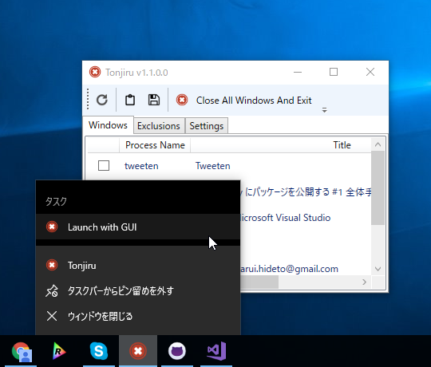

 

<ul>
<li>起動オプションの追加（/g で GUI 付きの起動）</li>
<li>ジャンプリストへの対応（GUI 付きの起動を追加）</li>
<li>ウィンドウ情報のクリップボードコピー（JSON 形式）</li>
<li>ウィンドウ情報のファイル保存（JSON 形式）</li>
<li>通知機能</li>
<li>安定性の向上</li>
</ul>
<iframe src="//hatenablog-parts.com/embed?url=https%3A%2F%2Fgithub.com%2Fdaruyanagi%2FTonjiru%2Freleases%2Ftag%2Fv1.2.0" title="daruyanagi/Tonjiru" class="embed-card embed-webcard" scrolling="no" frameborder="0" style="display: block; width: 100%; height: 155px; max-width: 500px; margin: 10px 0px;"></iframe><cite class="hatena-citation"><a href="https://github.com/daruyanagi/Tonjiru/releases/tag/v1.2.0">github.com</a></cite> 

<h3>WPF と起動オプション</h3>

起動時に［Shift］キーが押されていたら GUI を起動するという挙動は

<ul>
<li>App.xaml の StartupUri を削除</li>
<li>App.Startup でキーの押し下げ確認と MainWindow の自前生成</li>
</ul>
という感じで実現していたんだけど、起動オプションを付けたら破綻したので、

<ul>
<li>App.xaml の StartupUri を元に戻す</li>
<li>App.xaml のビルドアクションを Page にして、main 関数を自分で書く</li>
</ul>
という感じに変えた。

<pre class="code lang-cs" data-lang="cs" data-unlink>[System.STAThreadAttribute()]
public static void Main()
{
var args = Environment.GetCommandLineArgs();

if (args.Contains(&quot;/g&quot;) || (Control.ModifierKeys &amp; Keys.Shift) == Keys.Shift)
{
var app = new Tonjiru.App();
app.InitializeComponent();
app.Run();
}
else // UI less mode
{
CloseAllWindowsAndExit();
}
}
</pre>
/h スイッチで CUI ヘルプを出そうかなーと思ったけど、そっちはちょっと面倒くさいのでやめた。AttachConsole() などを使えば行けるのだけど、ちょっと挙動が変。ちゃんとやろうとすると CUI と GUI で EXE を分けないといけないみたいだが、そこまでやる気はないかな。

<h3>ジャンプリスト</h3>

起動オプションを付けた副産物として、ジャンプリストへの対応が簡単になった。App.xaml に以下のように記述。

<pre class="code lang-xml" data-lang="xml" data-unlink>&lt;Application x:Class=&quot;Tonjiru.App&quot;
             xmlns=&quot;http://schemas.microsoft.com/winfx/2006/xaml/presentation&quot;
             xmlns:x=&quot;http://schemas.microsoft.com/winfx/2006/xaml&quot;
             xmlns:local=&quot;clr-namespace:Tonjiru&quot;
             StartupUri=&quot;Views\MainWindow.xaml&quot;&gt;
&lt;Application.Resources&gt;

&lt;/Application.Resources&gt;

&lt;JumpList.JumpList&gt;
&lt;JumpList&gt;
&lt;JumpTask Title=&quot;Launch with GUI&quot;
                Description=&quot;Launch with GUI&quot; 
                Arguments=&quot;/g&quot; /&gt;
&lt;/JumpList&gt;
&lt;/JumpList.JumpList&gt;
&lt;/Application&gt;
</pre>
ジャンプリストは最近忘れられてる気がするけど、割かし便利だと思う。対応アプリが増えるといいな。

なお、ジャンプリストから起動するとワーキングディレクトリが System フォルダーになった気がする。設定ファイルなどをロードするとき、パス検索をいい加減にしていると痛い目にあう（あった）。

<h3>ValueTupple と DataContractJsonSerializer</h3>

ウィンドウ情報の保存は手抜きで DataContractJsonSerializer を使ったんだけど、Model をそのままシリアライズするとサイズがすごく大きくなってしまった。そこで情報を間引いたんだが、ここでタプルが使えるのではないかと気づいた。

<pre class="code lang-cs" data-lang="cs" data-unlink>list.Select(_ =&gt; (title: _.Title, process: _.ProcessName)); // これをシリアライズ
</pre>
試しにこれを

<pre class="code lang-cs" data-lang="cs" data-unlink>DataContractJsonSerializer(typeof(ValueTupple&lt;string, string&gt;));

DataContractJsonSerializer(typeof((string title, string process)));
</pre>
みたいに使ってみたところ――とりあえずコンパイルは通り、普通に使えた。けれど、出力される JSON がどっちも

<pre class="code" data-lang="" data-unlink>[{ &#34;Item1&#34;: &#34;hoge&#34;, &#34;Item2&#34;: &#34;fuga&#34; }]</pre>
みたいな感じになる（ほんとは Item1 のところが title や process になってほしいよね）ので、これを使うのはあきらめた。JSON.net のシリアライズだったら対応していた（or 対応してくれる）かもしれない？

<h3>通知</h3>

WPF でトーストを出そうと思うと WindowsRuntime を使わなくちゃーってなりがちだけど、ただ出したいだけであれば NotifyIcon で ShowBalloonTip() するのが楽でいい。Windows 7 だとバルーンだが、Windows 10 ではトーストになる。

<pre class="code lang-cs" data-lang="cs" data-unlink>using (var notify_icon = new System.Windows.Forms.NotifyIcon())
{
notify_icon.Icon = System.Drawing.Icon.ExtractAssociatedIcon(System.Reflection.Assembly.GetEntryAssembly().Location);
notify_icon.Visible = true;

notify_icon.BalloonTipTitle = System.Reflection.Assembly.GetExecutingAssembly().GetName().Name;
notify_icon.BalloonTipText = message;
notify_icon.ShowBalloonTip(3000);
}
</pre>
簡単だね！

ポイントは Visible を true にしておくこと（じゃないとトーストが出てこない）、最後に Visible を False にするか Dispose() すること（でないとトレイにアイコンがゾンビ）ぐらい。

