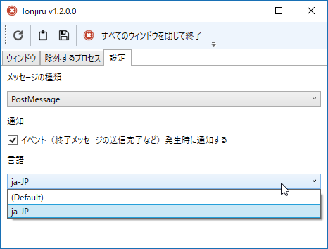
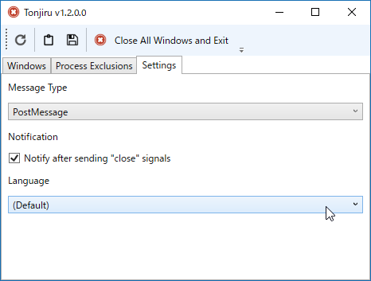

ここに日本語の UI があるじゃろ（＾ｖ＾）　これをこうして――

こうじゃ（＾ｖ＾）！

<iframe src="//hatenablog-parts.com/embed?url=https%3A%2F%2Fgithub.com%2Fdaruyanagi%2FTonjiru%2Freleases%2Ftag%2Fv1.3.0" title="daruyanagi/Tonjiru" class="embed-card embed-webcard" scrolling="no" frameborder="0" style="display: block; width: 100%; height: 155px; max-width: 500px; margin: 10px 0px;"></iframe><cite class="hatena-citation"><a href="https://github.com/daruyanagi/Tonjiru/releases/tag/v1.3.0">github.com</a></cite>

やり方は @Grabacr07 先生のをほぼパクった。

<iframe src="//hatenablog-parts.com/embed?url=http%3A%2F%2Fgrabacr.net%2Farchives%2F1647" title="WPF アプリの国際化 (多言語対応) と、実行中の動的な言語切り替え | grabacr.nét" class="embed-card embed-webcard" scrolling="no" frameborder="0" style="display: block; width: 100%; height: 155px; max-width: 500px; margin: 10px 0px;"></iframe><cite class="hatena-citation"><a href="http://grabacr.net/archives/1647">grabacr.net</a></cite>

しっかしこれ、リソース作るの面倒やな……みんなよくやると思うわ。

最近プログラミングしてなかったので練習で作り始めたしょうもないツールなのに、作ってるうちにちょっと楽しくなっちゃった、いろいろ手を加えすぎた気がするけど、それもこれでひと段落にしようと思う（できたら Chocolatey パッケージを作ってみたいってのはあるけど）。

