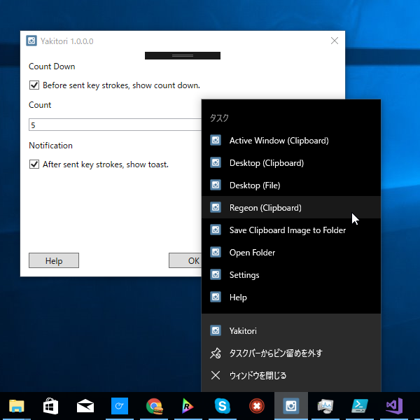

今週は身内に不幸があったりちょっと情緒不安定だったので、手慰みに Windows 10 のスクリーンショット機能をジャンプリストから利用できるようにするツールを作ってみました。「ネイティブ機能を利用する」という<s>手抜き</s>シンプルさがウリです。

<iframe src="https://hatenablog-parts.com/embed?url=https%3A%2F%2Fgithub.com%2Fdaruyanagi%2FYakitori" title="daruyanagi/Yakitori" class="embed-card embed-webcard" scrolling="no" frameborder="0" style="display: block; width: 100%; height: 155px; max-width: 500px; margin: 10px 0px;"></iframe><cite class="hatena-citation"><a href="https://github.com/daruyanagi/Yakitori">github.com</a></cite>

ツールの名前は、大阪へ向かうフェリーのレストランで「撮る……撮る……」と名前を考えながら晩飯を選んでいたら、いつの間にかお盆の上に焼き鳥があったという故事から採っています。

<h3>なぜ作ったのか</h3>

<iframe src="https://hatenablog-parts.com/embed?url=http%3A%2F%2Fforest.watch.impress.co.jp%2Fdocs%2Fserial%2Fyajiuma%2F1061300.html" title="ツールなしで“矩形キャプチャー”が可能！「Creators Update」に新搭載されたスクリーンショット機能が便利【やじうまの杜】" class="embed-card embed-webcard" scrolling="no" frameborder="0" style="display: block; width: 100%; height: 155px; max-width: 500px; margin: 10px 0px;"></iframe><cite class="hatena-citation"><a href="http://forest.watch.impress.co.jp/docs/serial/yajiuma/1061300.html">forest.watch.impress.co.jp</a></cite>

Windows 10 Creators Update 以降では OS ネイティブのスクリーンショット機能が拡充されていますが、

<ul>
<li>キーボードショートカットを覚えるのが面倒</li>
<li>クリップボードへコピーされた画像をファイル化するのが面倒</li>
<li>スクリーンショットフォルダーがどこにあるのか分からん＆開くのが面倒</li>
</ul>
なのではないかと思い作ってみました。あと、常駐しないのもよいところかな。逆にジャンプリストの利用が前提になっているのはマイナスかもね。

なお、作った本人は「WinSnap」という有償ツールを愛用しているので、この手のツールは要らない模様（ぉ

<h3>使い方</h3>

<ol>
<li>とりあえず実行する</li>
<li>設定ダイアログが表示されるのでタスクバーにピン留め</li>
<li>次回からはジャンプリストから Windows 10 ネイティブのスクリーンショット機能を呼び出せます</li>
</ol>

<h3>機能</h3>

<ul>
<li>Windows 10 ネイティブのスクリーンショット機能を呼び出します
<ul>
<li>アクティブウィンドウをクリップボードへコピー</li>
<li>デスクトップ全体をクリップボードへコピー</li>
<li>デスクトップ全体をスクリーンショットフォルダーへ保存（Windows 8以降？が必要）</li>
<li>デスクトップを矩形選択してクリップボードへコピー（Windows 10 Creators Update 以降が必要）</li>
</ul></li>
<li>クリップボードに格納されている画像をスクリーンショットフォルダーへ保存</li>
<li>スクリーンショットフォルダーを開く</li>
<li>カウントダウン実行</li>
<li>常駐しません</li>
</ul>
スペシャルサンクス：オレンジフェリーの無料 Wi-Fi

<h3>蛇足：メッセージポンプ</h3>

このアプリは Tonjiru と似たような方法で起動オプションを実装＆ジャンプリストから呼べるように作ってありますが、App クラスを生成せずにカウントダウンを行おうとするとうまくいきませんでした。DispatchTimer ってメッセージポンプがないとダメなのかな（よくわかってない）。ShowDialog() でもいけるやろ、と思ったのですがそっちもダメだったので、おとなしく App.Run() しています。ここを削ればもう少し高速化できるんじゃないかなーと思うのですが、まぁ、そこまでやらんでもいいかな。

