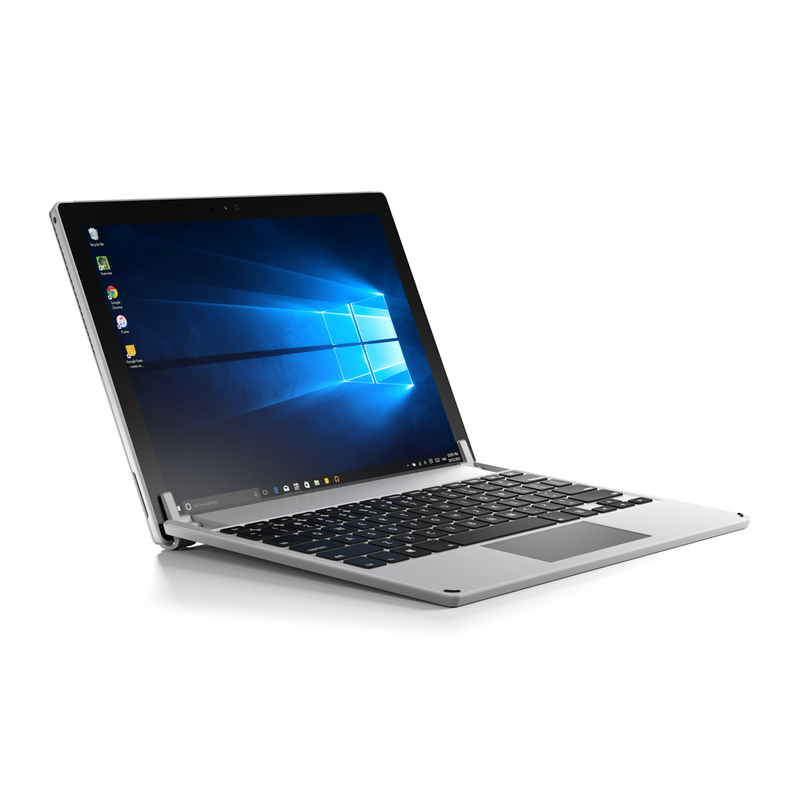
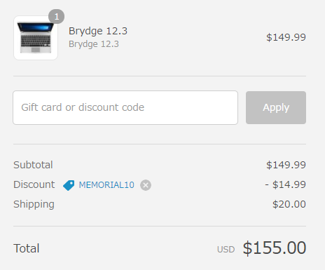
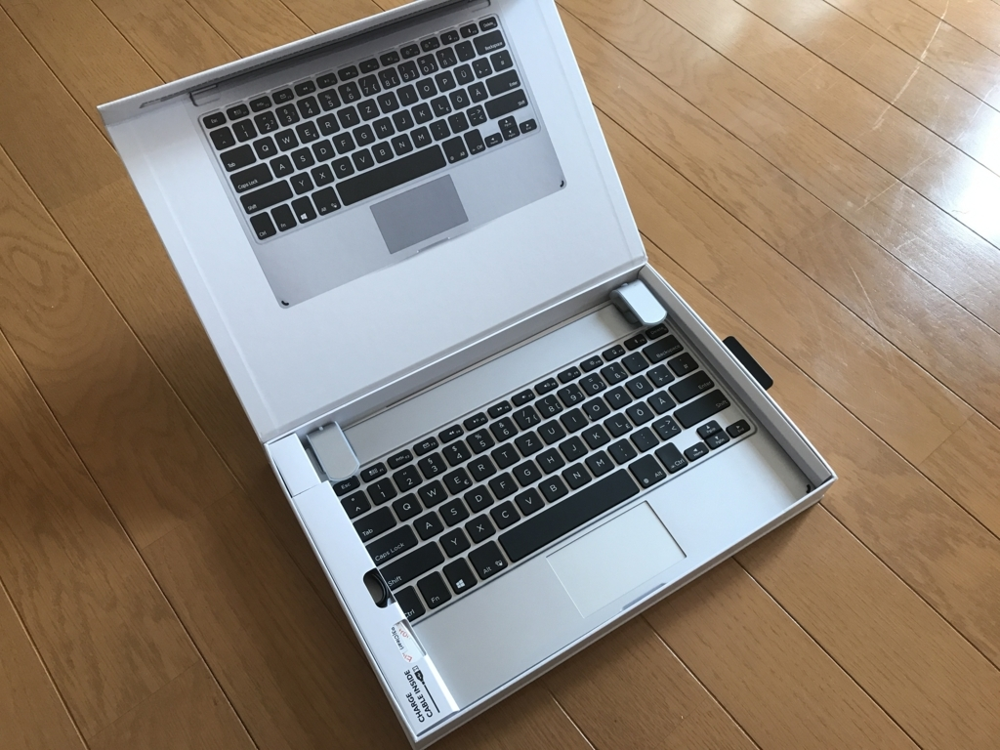
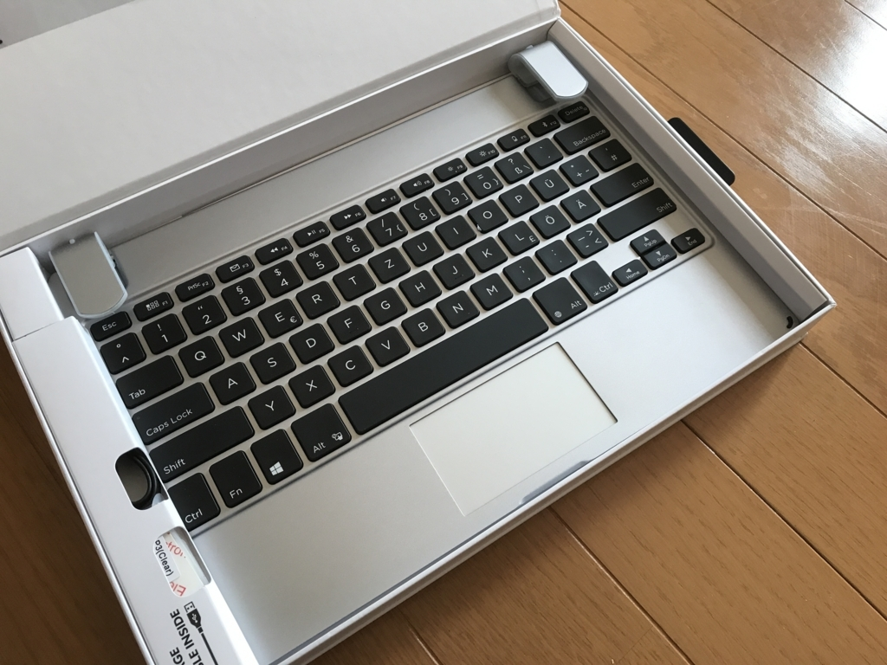
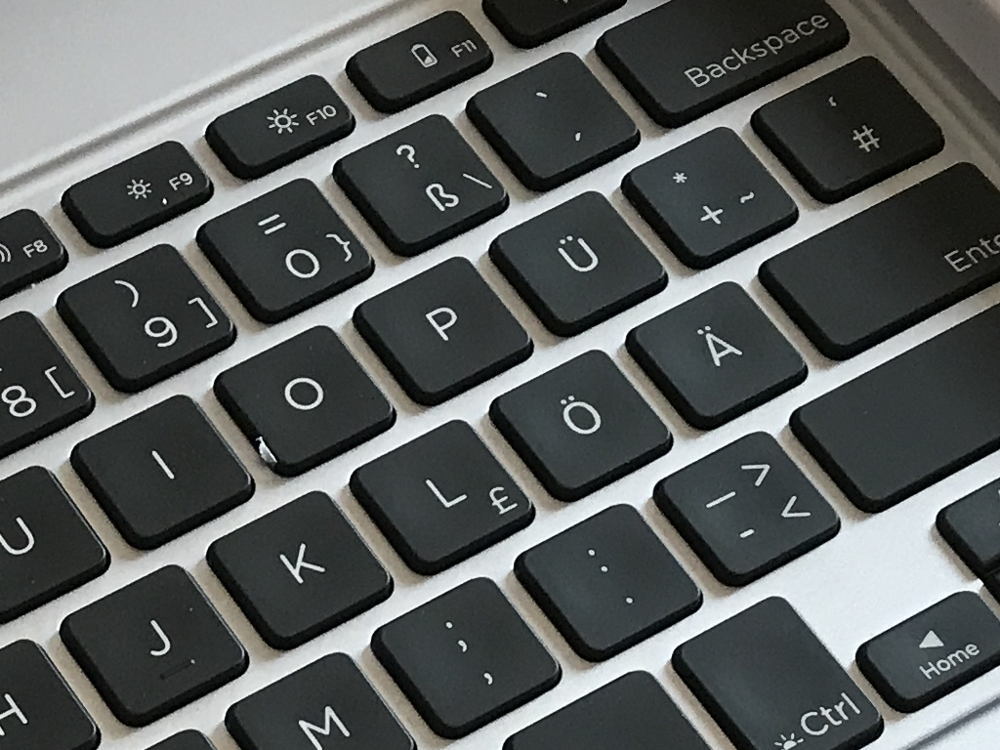

購入当初は Surface ＋ TypeCover の先進性に酔っていたのだけど、どうも自分にはもっとカッチリしたキーボードがいいみたい。がっつりテキストを書いたり、プログラミングをするときは、気が付くと Macbook（Bootcamp）の方を使ってしまっていた。とはいえ、Bootcamp もいろいろ面倒くさいし、Backspace がないのとか鬱陶しいし、何とかならんかなーと思っていたところ……

 

<blockquote cite="http://k-tai.watch.impress.co.jp/docs/news/1057753.html">

「BRYDGE」シリーズは高純度のアルミニウムから鍛造成形された筐体が特徴のBluetoothキーボード。BRYDGE社CEOのNicholas Smith氏いわく「Apple製品のこだわりを受け継いだBluetoothキーボードだ」とのことで、iPadシリーズやSurface Pro 3/4に装着すると、Macbookのような見た目と使い心地で使えるのが特徴とする。

<cite><a href="http://k-tai.watch.impress.co.jp/docs/news/1057753.html">iPad&#x3084;Surface&#x3092;&ldquo;&#x307E;&#x308B;&#x3067;Macbook&#x306E;&#x3088;&#x3046;&#x306B;&#x4F7F;&#x3048;&#x308B;&rdquo;Bluetooth&#x30AD;&#x30FC;&#x30DC;&#x30FC;&#x30C9;&#x300C;BRYDGE&#x300D;&#x3001;13&#x65E5;&#x767A;&#x58F2; - &#x30B1;&#x30FC;&#x30BF;&#x30A4; Watch</a></cite>
</blockquote>

BRYDGE っていうのがよさげだったので早速買ってみた。とはいえ、到着するまでにはいろいろ紆余曲折があったんだけど。

<ul>
<li>5月中旬ぐらい？：製品の存在を知り、公式サイトで注文</li>
<li>その翌日：代理店経由で日本でも発売されることを知る</li>
<li>その翌日：サポートに<b>「発送してないなら注文を取り消してちょ」</b>とお願い</li>
<li>その3営業日後ぐらい：<b>「わかったやで」</b>との連絡。お金が返ってくる</li>
<li>5月末：なかなか日本でも手に入らないのにしびれを切らして公式サイトを除いていたら、1割引だったので再び注文</li>
<li>その2週間後（6月半ば）：到着(/・ω・)/</li>
</ul>

我ながら面倒くさいことをしてしまった。さっそく開封！

でも、なんか違和感がある。

拡大してみよう。

<b>ドイツ語配列だー／(^o^)＼</b>

注文を見直してみたけど、ドイツ語（GR）配列とは書かれていなかったので、多分あっちの手違いだと思う。悲しみに包まれながら<b>「交換してちょ」</b>ってメールを書いたんだけど、まだ返事はもらえていない（今日で4営業日目かな？）。

そんな事情もあって、返品のことを考えたらあまり汚すわけにもいかず、それほどヘビーには使っていないのだけど、モノ自体はなかなかいいと思った。

<ul>
<li>装着すると Surface Pro 3 が重量・厚みともに2倍になる気がする（実際はそれほどでもないはず）</li>
<li>剛性とデザインは満足。開閉してみてもビクともしない</li>
<li>着脱は気軽じゃない。タブレットを押し込むとゴムが伸びて割けそう。改善の余地があると思う</li>
<li>キーボードは……最上質とは言えないけど、それなりの速度でタイピングできて不満はない（少しぺたぺたした感じ</li>
<li>タッチパッドは3本指ジェスチャーも認識。ただし、ウチの環境では横方向だけダメだった。あと、タッチパッドはもう少し広いと嬉しい（TypeCover にも言えることだけど</li>
</ul>
2万弱のお値段に見合うものかって言われると微妙だけど、TypeCover もそれなりに高いので、代替としては申し分ない気がした。とにかく、カッチリしたキーボードの使い心地っていうのは大変よろしい。この BRYDGE と LTE 版の Surface Pro（2017）を組み合わせられたらいいなって思ってたけど、自分が買うべきなのは Surface Book（＋スマホでテザリング）かもしれんな。でも、Surface Pro（2017）の TypeCover をエディオンで触らせてもらった感じでは、3/Pro 3 世代よりも進化してて、なかなかよかったんだよなぁ……悩む（相変わらずタッチパッドは狭かったけど）。

ちなみに、ドイツ語の BRYDGE は……交換してくれなかったらそのまま使おうかなと思ってる。ほんとは交換してくれたらうれしいけど、まぁ、あんまり期待はしてない。海外のモノに手を出したらこういうことはままあるので、みんなはおとなしく国内代理店から買うといいと思うよ！　お薦め度は……英語配列なら ★★★★☆（4つ星）ぐらいになるんじゃないかな？

<iframe src="https://hatenablog-parts.com/embed?url=http%3A%2F%2Fwww.links.co.jp%2Fitem%2Fbrydge-12-3%2F" title="BRYDGE 12.3" class="embed-card embed-webcard" scrolling="no" frameborder="0" style="display: block; width: 100%; height: 155px; max-width: 500px; margin: 10px 0px;"></iframe><cite class="hatena-citation"><a href="http://www.links.co.jp/item/brydge-12-3/">www.links.co.jp</a></cite>

