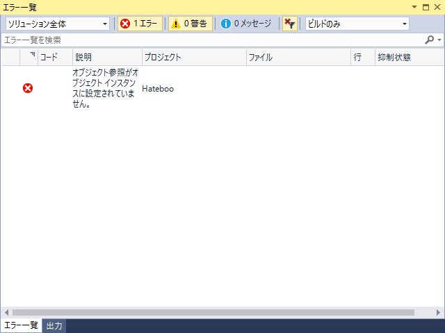
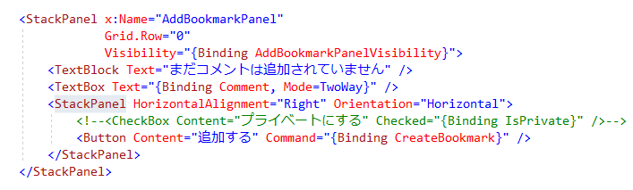
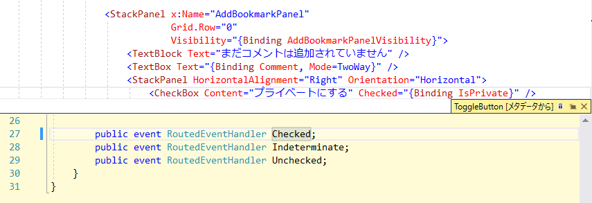

XAML をガリガリ書いてビルドすると、こんなエラーが出た。

<blockquote>

オブジェクト参照がオブジェクト インスタンスに設定されていません。

</blockquote>

エラーの説明がふんわりし過ぎていて、場所すら特定できない。ソースコードはコンパイルされているみたいなので、XAML の実行時エラーっぽいが……しょうがないのであちこちコメントアウトしながら、がんばって場所を特定した。

どうやら、このコメント部分が原因らしい。ぱっと見、問題はなさそうにも見えるが――

バインディングしていた Checked の定義を見て悟った。イベントにプロパティをバインドしている……orz

Checked イベントを IsChecked プロパティに書き換えることで問題は解消されました＼(＾o＾)／

