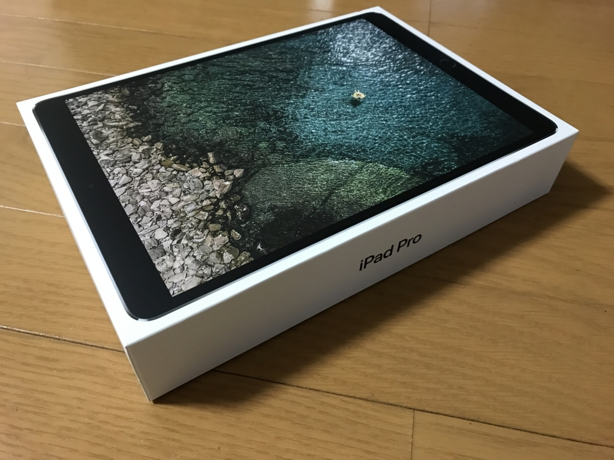
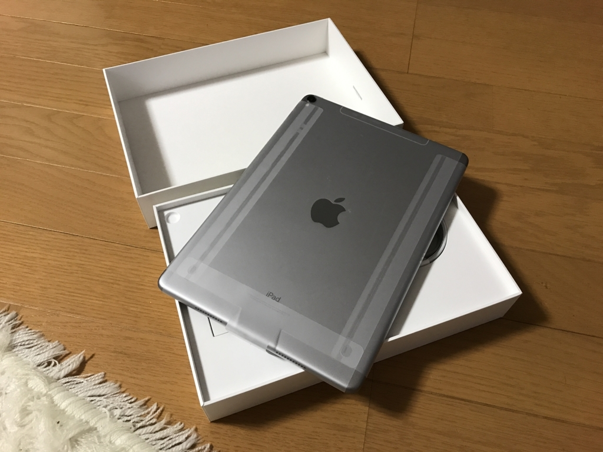
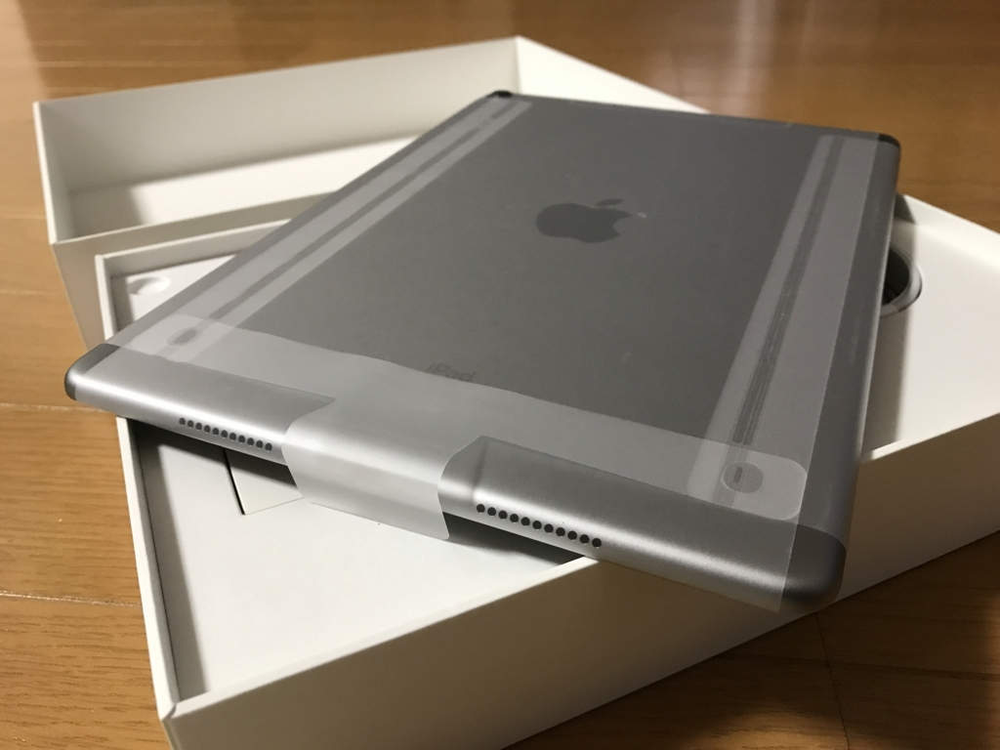
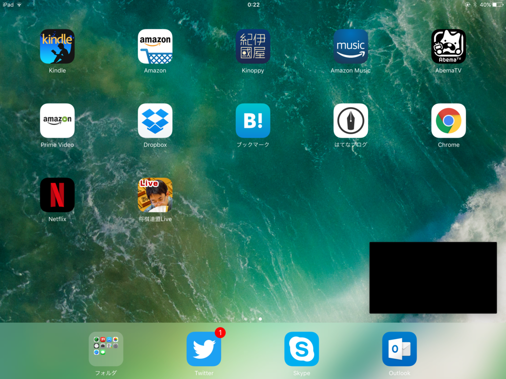

親父に 初代 iPad mini ＋ Surface Pro 3 を売りつけて得た資金に少しおカネを足し、iPad Pro 10.5 インチを買った。<b>タブレットの iOS 11 を試す環境が手元になくて困っていた</b>ので……さすがにもう初代 iPad mini では戦えませんでした。最近では動作が重すぎて、使う機会もなくなっていたし。長らくお世話になりました（＝人＝

金曜日に注文して、翌日に到着。四国・愛媛なのに、めっちゃはええ……まぁ、これはクロネコヤマトを褒めるべきだけど。ほかの業者だったら3日かかってた。

あと、SMS で配達状況をお知らせしてくれるのもいい。Apple はそういうのが至れり尽くせりですごい。

選んだモデルはスペースグレイの 64GB モデル（Wi-Fi＋Cellular）。容量は一番小さいけれど、どうせ本しか読まないので、これで問題はなさそう。動画を保存してみるヒトなんかは全然足りないだろうけど、ウチはストリーミングで観るしね。

メインの用途は雑誌を読むためなので、最初は 12.9 インチを買うつもり（ソフトバンクオンラインで予約までした）のだったけど、

<ul>
<li>レビューサイトを読む限り 10.5 インチでも大丈夫そう</li>
<li>さすがにそこまで大きいと雑誌閲覧以外の用途で使いづらくなる</li>
<li>Surface Pro（21017）の LTE 版を買い足すつもりなので、大きさが被る</li>
</ul>
などの理由で、アップルのオンラインショップで買うとき、土壇場で 10.5 インチに変更したのでした。別に10万円を超える金額をみて<s>ビビった</s>我に返ったわけではない。

iPad を買ったのは初代以来だが、最近のはすごく薄いな。リフレッシュレートが 120 Hzになっている点などが改良点だそうだが、そんなにスゴいとか、キレイとかいう印象は受けなかった。ただ、普通に、前に使ってた iPad mini なんかよりサクサク動くなーって感じ。iPad Pro を見た後に iPad mini の画面を見ると画面がツブツブに見えたのにはちょっと笑ったけど。

2、3 日使ってみたが、Netflix のピクチャーインピクチャー機能（右下の黒い部分。たぶん、著作権保護でスクリーンショットが撮れないようになっているのだろう）はなかなかよかった。アニメ見ながら他の作業ができるぜー＼(＾o＾)／

あと、右サイドからアプリを引き出せるのもいいな。アプリによっては 2 画面分割表示もできるみたい。<b>Windows 8 みたいでとても便利だと思う</b>。まぁ、実装は iOS の方がいいけどね。

昔の iPad は「一つのことしかできない」のが当たり前で、それがシンプルでもあり、不満でもあったのだけど、かなり様変わりしているんだなぁ。iOS 11 ではマルチタスクが強化されてるっぽいから、ちょっと楽しみ。

<blockquote class="twitter-tweet" data-lang="ja">
新しい iPad Pro、回転ロックボタン（老害）がなくなってて、ちょっと悲しかった
&mdash; エロやなぎ先生 (@daruyanagi) <a href="https://twitter.com/daruyanagi/status/879004859629936640">2017年6月25日</a></blockquote>

