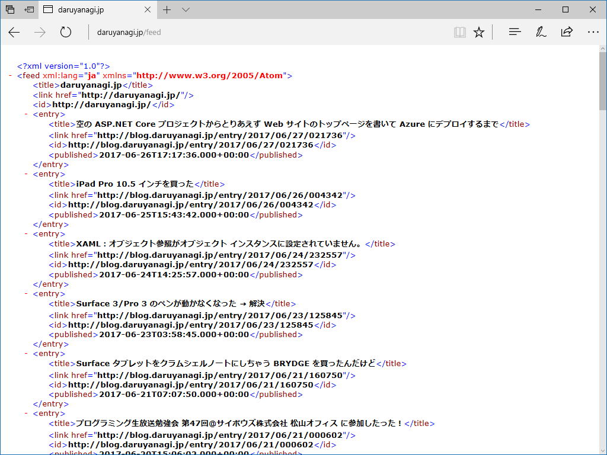

<iframe src="https://hatenablog-parts.com/embed?url=https%3A%2F%2Fblog.daruyanagi.jp%2Fentry%2F2017%2F06%2F27%2F021736" title="空の ASP.NET Core プロジェクトからとりあえず Web サイトのトップページを書いて Azure にデプロイするまで - だるろぐ" class="embed-card embed-blogcard" scrolling="no" frameborder="0" style="display: block; width: 100%; height: 190px; max-width: 500px; margin: 10px 0px;"></iframe><cite class="hatena-citation"><a href="http://blog.daruyanagi.jp/entry/2017/06/27/021736">blog.daruyanagi.jp</a></cite>

前回は ASP.NET Web Pages のサイトを、付け焼き刃で ASP.NET Core MVC に移植しました。でも、WebMatrix で作ったフィード配信機能が動作しない……。

<iframe src="https://hatenablog-parts.com/embed?url=https%3A%2F%2Fblog.daruyanagi.jp%2Fentry%2F2013%2F04%2F17%2F065153" title="WebMatrix 3: RSS フィードを出力する - だるろぐ" class="embed-card embed-blogcard" scrolling="no" frameborder="0" style="display: block; width: 100%; height: 190px; max-width: 500px; margin: 10px 0px;"></iframe><cite class="hatena-citation"><a href="http://blog.daruyanagi.jp/entry/2013/04/17/065153">blog.daruyanagi.jp</a></cite>

<iframe src="https://hatenablog-parts.com/embed?url=https%3A%2F%2Fblog.daruyanagi.jp%2Fentry%2F2013%2F04%2F18%2F031339" title="WebMatrix 3: RSS フィードを出力する（解決編） - だるろぐ" class="embed-card embed-blogcard" scrolling="no" frameborder="0" style="display: block; width: 100%; height: 190px; max-width: 500px; margin: 10px 0px;"></iframe><cite class="hatena-citation"><a href="http://blog.daruyanagi.jp/entry/2013/04/18/031339">blog.daruyanagi.jp</a></cite>

というわけで、こっちも簡易的な対策を行いました。

ちょっと調べた限りでは、

<ul>
<li>Response は使えない → Context.Response を代わりに使う</li>
<li>System.ServiceModel.Syndication は .NET Core 1.1 で実装されていない → 自分で XML を組み立てる</li>
</ul>
でイケそう。というわけで、まずはモデルっぽいもの（/Models/FeedItem.cs）を準備。

<pre class="code lang-cs" data-lang="cs" data-unlink>public class FeedItem
{
public string Link { get; set; }
public string Title { get; set; }
public HtmlString Content { get; set; }
public DateTime PublishDate { get; set; }
}
</pre>
次にコントローラー（/Controllers/FeedController.cs）を作成。

<pre class="code lang-cs" data-lang="cs" data-unlink>public class FeedController : Controller
{
public async Task&lt;IActionResult&gt; Index()
{
var feeds = new List&lt;FeedItem&gt;();
// FeedItem を適当に Add() してね！
return View(feeds);
}
}
</pre>
最後にビュー（/Views/Feed/Index.cshtml）を作成。今回は Atom で出力してみました。

<pre class="code lang-cs" data-lang="cs" data-unlink>@model IList&lt;FeedItem&gt;

@{
Context.Response.ContentType = &quot;application/xml&quot;;

var title = &quot;daruyanagi.jp&quot;;
var link = &quot;https://blog.daruyanagi.jp/&quot;;
}

&lt;feed xmlns=&quot;http://www.w3.org/2005/Atom&quot; xml:lang=&quot;ja&quot;&gt;
&lt;title&gt;@title&lt;/title&gt;
&lt;link href=&quot;@link&quot; /&gt;
&lt;id&gt;@link&lt;/id&gt;
@foreach (var item in Model)
{
&lt;entry&gt;
&lt;title&gt;@item.Title&lt;/title&gt;
&lt;link href=&quot;@item.Link&quot; /&gt;
&lt;id&gt;@item.Link&lt;/id&gt;
&lt;published&gt;@item.PublishDate.ToString(&quot;yyyy-MM-dd'T'HH:mm:ss.fffK&quot;)&lt;/published&gt;
&lt;/entry&gt;
}
&lt;/feed&gt;
</pre>
簡易的な対策ですけど、まぁ、ちゃんと動いているので当面はこれでよし。

正しい作法ではない気がしますが（ちゃんとフレームワークでやり方が用意されているかも？）、自己流なりに要領をつかめてきた感じで嬉しいです。ほんとは ASP.NET Web Pages で気軽にやりたいんだけど……調べてみたらそろそろ準備が整いつつあるみたいなので楽しみ。

<blockquote class="twitter-tweet" data-lang="ja">
<a href="https://t.co/8bABHDpik7">https://t.co/8bABHDpik7</a> Web Pages の後継っぽいものに Razer Pages（？）っていうのがあって、次期 VS の Update でツールサポートが付くということを理解したところで、この件に関しては休眠 Zzz……
&mdash; だるやなぎ に天使が舞い降りた！ (@daruyanagi) <a href="https://twitter.com/daruyanagi/status/880084125624918016?ref_src=twsrc%5Etfw">2017年6月28日</a></blockquote>

