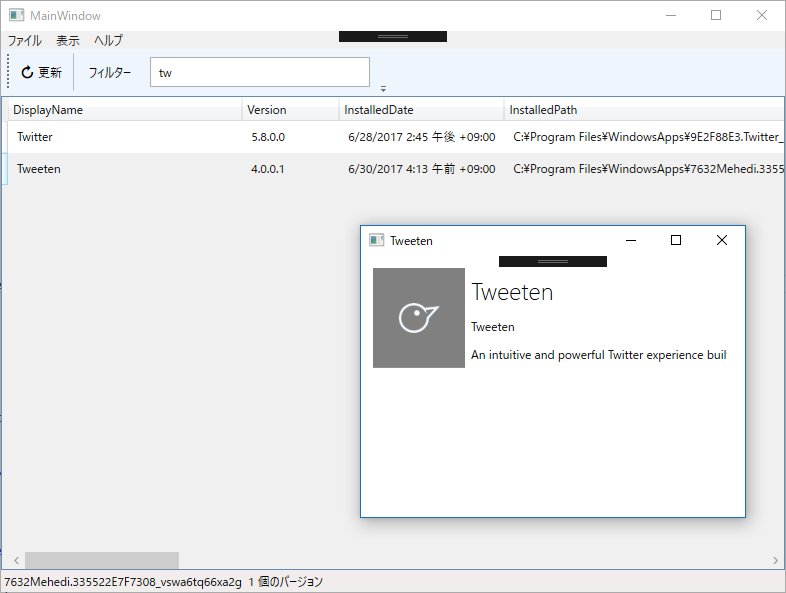

<iframe src="https://hatenablog-parts.com/embed?url=http%3A%2F%2Fblog.daruyanagi.jp%2Fentry%2F2014%2F09%2F11%2F025615" title="WinRT：システムにインストールされた Windows ストア アプリを列挙する（2） - だるろぐ" class="embed-card embed-blogcard" scrolling="no" frameborder="0" style="display: block; width: 100%; height: 190px; max-width: 500px; margin: 10px 0px;"></iframe><cite class="hatena-citation"><a href="http://blog.daruyanagi.jp/entry/2014/09/11/025615">blog.daruyanagi.jp</a></cite>

3年前のブログ記事のソースコードを（ググったらでてきた……）そのままコピーしても動かなかったので。

復習しておくと、システムにインストールされた Windows ストア アプリを列挙するフローはこんな感じ。

<ul>
<li>Windows.Management.Deployment.PackageManager の FindPackages() などでパッケージ package を取得</li>
<li>package.DisplayName は残念ながら空
<ul>
<li>package.InstalledLocation.Path にある AppxManifest.xml を解析して取得する</li>
<li>Description や Logo なども同様の手段で取得</li>
</ul></li>
<li>AppxManifest.xml から DisplayName を取得すると ms-resource:// で記述されている場合がある
<ul>
<li>SHLoadIndirectString() API で文字列を取得する</li>
</ul></li>
</ul>
まず、AppxManifest.xml を解析。前回との違いは、ネームスペースが変わっていても大丈夫なよう LocalName で要素を探すようにしたところぐらい。

<pre class="code lang-cs" data-lang="cs" data-unlink>private string GetDisplayNameFromManifest(string installedPath)
{
var xml = File.ReadAllText(Path.Combine(installedPath, &quot;AppxManifest.xml&quot;));
var doc = XDocument.Parse(xml);
var value = doc.Descendants().First(_ =&gt; _.Name.LocalName == &quot;DisplayName&quot;).Value;

return value;
}
</pre>
次に ms-resource:// で記述されている場合の処理。ms-resource:// の書き方は数パターンあるようで、それに応じて処理を変えないといけない。

<ul>
<li>ms-resource://Microsoft.SkypeApp/Resources/SkypeVideo_ProductName</li>
<li>ms-resource:///Resources/AppStoreName</li>
<li>ms-resource:PackageDisplayName</li>
</ul>
最初のパターンに寄せてから、SHLoadIndirectString() を使うことにした。

<pre class="code lang-cs" data-lang="cs" data-unlink>
[DllImport(&quot;shlwapi.dll&quot;, BestFitMapping = false, CharSet = CharSet.Unicode, ExactSpelling = true, SetLastError = false, ThrowOnUnmappableChar = true)]
public static extern int SHLoadIndirectString(string pszSource, StringBuilder pszOutBuf, int cchOutBuf, IntPtr ppvReserved);

private string GetTextFromResource(string installedPath, string name, string key)
{
var pri = Path.Combine(installedPath, &quot;resources.pri&quot;);
var resourceKey = string.Empty;

if (key.Contains(name))
{
// キーにアプリ名が含まれているパターン → そのままリソースキーとして扱う
// ms-resource://Microsoft.SkypeApp/Resources/SkypeVideo_ProductName
resourceKey = key;
}
else
{
// リソースキーの解析が必要なパターン
// → とりあえずプロトコルを省く
// ms-resource:///Resources/AppStoreName
// ms-resource:/manifest/DisplayName
// ms-resource:PackageDisplayName
resourceKey = key.Split(':').Last();

if (resourceKey.StartsWith(&quot;/&quot;))
{
// パスになっているパターン → アプリ名入りのパスに
// :///Resources/AppStoreName
// :/manifest/DisplayName
resourceKey = resourceKey.TrimStart('/');
resourceKey = $&quot;ms-resource://{name}/{resourceKey}&quot;;
}
else
{
// リソース名になっているパターン → リソースへのパスに
// :PackageDisplayName
resourceKey = $&quot;ms-resource://{name}/resources/{resourceKey}&quot;;
}
}

var buffer = new StringBuilder(1024); // ← 適当

var result = SHLoadIndirectString(
$&quot;@{{{pri}? {resourceKey}}}&quot;,
buffer, buffer.Capacity,
IntPtr.Zero
);

// 失敗したときはパスをそのまま返しておく
return result == 0 ? buffer.ToString() : key;
}
</pre>

うまくいっているみたい。「ストア」アプリと表記の違うパッケージもあるけど、今のところは気にしないことにする。

