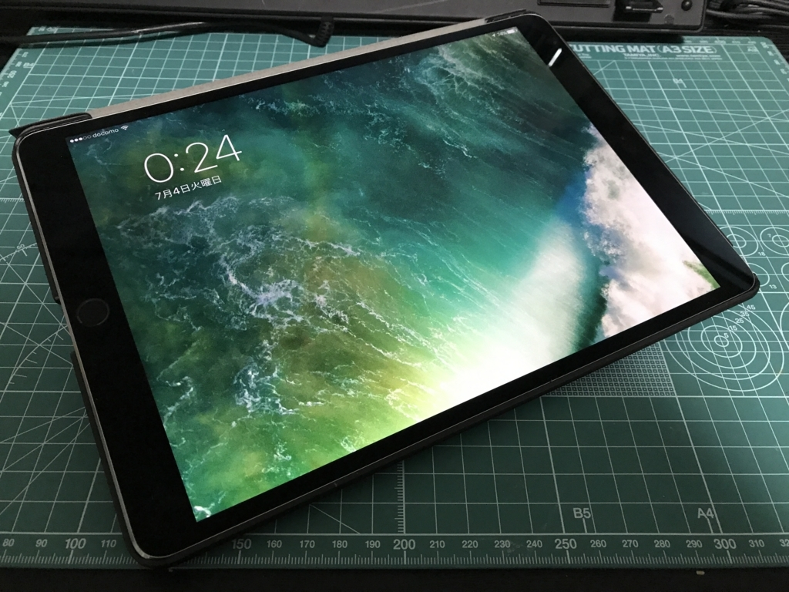
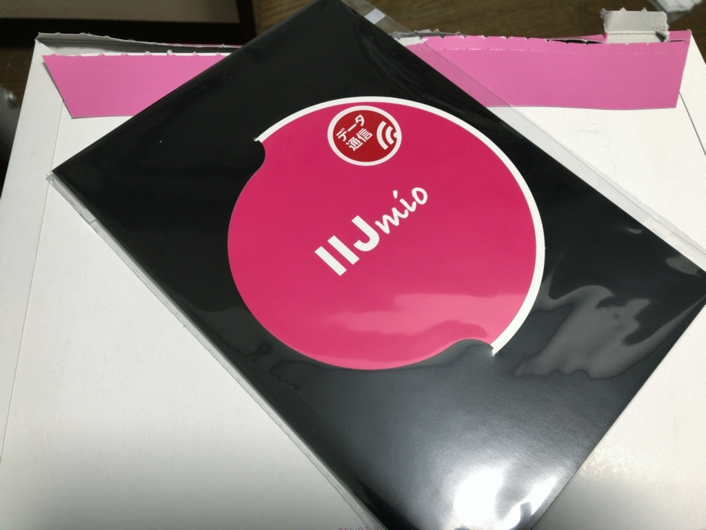

この前買った iPad Pro 10.5 インチだけど――

<iframe src="https://hatenablog-parts.com/embed?url=http%3A%2F%2Fblog.daruyanagi.jp%2Fentry%2F2017%2F06%2F26%2F004342" title="iPad Pro 10.5 インチを買った - だるろぐ" class="embed-card embed-blogcard" scrolling="no" frameborder="0" style="display: block; width: 100%; height: 190px; max-width: 500px; margin: 10px 0px;"></iframe><cite class="hatena-citation"><a href="http://blog.daruyanagi.jp/entry/2017/06/26/004342">blog.daruyanagi.jp</a></cite>

ハダカで使い続けるのも何なので（Apple Care も入ってないしな！）、適当にカバーを買ってつけてみた。

<a href="http://www.amazon.co.jp/exec/obidos/ASIN/B07175N8XP/bestylesnet-22/">iPad Pro 10.5 ケース, JEDirect 薄型軽量 スリムフィット 本革調PUレザー 傷つけ防止 三つ折スタンド オートスリープ機能 スマートカバー 新しいApple iPad Pro 10.5インチ 2017最新版専用 (ブラック) - 3052</a>
<ul><li>出版社/メーカー: JEDirect</li><li>メディア: エレクトロニクス</li><li><a href="http://d.hatena.ne.jp/asin/B07175N8XP/bestylesnet-22" target="_blank">この商品を含むブログを見る</a></li></ul>

純正<s>お風呂のフタ</s> Smart Cover のパチモノで、1,500円ぐらい。純正と同様、フタを閉じればスリープするし（動画を再生しながらフタを閉じて試した）、三角に折ればスタンドにもなる。違いは、背面と側面も守ってくれる点。防御力は少しアップするが、スマートさは若干低下する。

良し悪しはあるけど、個人的には純正よりも気に入ってる。何より、安い。特別優れたポイントはないけど、とくに大きな不満も感じなかったし、「なんでもいいや」と思ってる人にはお勧めできるかも。

あと、親父に買い与えていた IIJmio（ミニマムスタートプラン）をファミリーシェアプランにアップグレードした。移行時に SIM を2枚発行してもらえるので、Docomo のデータ SIM を注文。これを iPad Pro に挿した。

SIM の大きさはよくわからなかったが、家にゲタが何枚かあったので、テキトーに nano SIM を頼んだら、ゲタなしでそのまま挿さった。これで10GB をシェアできる。残った SIM は、今月 Surface 3（Y! モバイル）を解約するので、そっちに転用するつもり。iPhone 7 Plus（ソフトバンク）も年季が明けたら IIJmio に一本化したいですなー。とりあえずテザリングのために契約していたギガモンスターをやめて月額支払いを1,000円だけ抑え、あと16カ月使う。

注意点になるかどうかは知らんが、IIJmio のプラン切り替えは月末限定みたい。SIM が到着するまで少し待たされた（とはいえ、20日過ぎに申し込んだので1週間程度で済んだ）。急いでいる場合はちょっと不便かもね。

