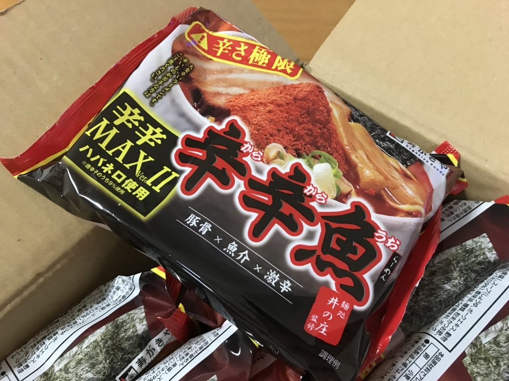
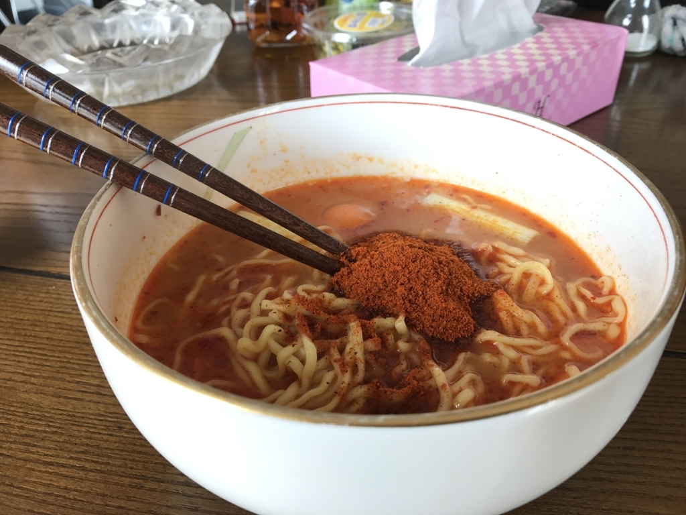

なんか知らんけど、送られてきたので食べるしかない。

<a href="http://www.amazon.co.jp/exec/obidos/ASIN/B01IQJPE3E/bestylesnet-22/">寿がきや 井の庄監修 辛辛魚ラーメン 辛辛MAXバージョン 135g×10袋</a>
<ul><li>出版社/メーカー: 寿がきや食品</li><li>メディア: 食品&飲料</li><li><a href="http://d.hatena.ne.jp/asin/B01IQJPE3E/bestylesnet-22" target="_blank">この商品を含むブログを見る</a></li></ul>

<blockquote cite="http://www.sugakiya.co.jp/special/karakaramax/index.html">

「麺処井の庄監修 辛辛魚らーめん」は、2009年1月に発売以来熱狂的なファンの方々に支えられ、大人気商品となっております。

そして、2016年8月に打倒カップめんをコンセプトに袋めんでさらなる旨辛さを追求した「辛辛MAXバージョン」も発売し、こちらも人気商品となっております。

今回は、この「辛辛MAXバージョン」をさらに辛く、極限レベルでパワーアップさせ、「辛辛MAXバージョンⅡ」としてリニューアル発売いたします。

<cite><a href="http://www.sugakiya.co.jp/special/karakaramax/index.html">&#x8F9B;&#x8F9B;&#x9B5A;&#x3089;&#x30FC;&#x3081;&#x3093;&#x8F9B;&#x8F9B;MAX&#x30D0;&#x30FC;&#x30B8;&#x30E7;&#x30F3;2&#x306E;&#x3054;&#x6848;&#x5185;&#xFF1A;&#x30B9;&#x30DA;&#x30B7;&#x30E3;&#x30EB;&#x60C5;&#x5831;&#xFF1A;&#x5BFF;&#x304C;&#x304D;&#x3084;&#x98DF;&#x54C1;&#x682A;&#x5F0F;&#x4F1A;&#x793E;</a></cite>
</blockquote>

そういう斜め上な開発力が、俺のような可哀そうな人間を窮地に追い込むのだ。新商品が開発されるたびに、それを食わされる俺の身にもなれ。

今回は、父ちゃんに作ってもらった。なるべく『辛辛魚』そのものの味を味わうため、トッピングはあえてネギと生卵のみにしている。

正直なところ、辛さは以前のものと違いを感じなかった。というか、ある一定以上辛いもんは、“辛い”としか知覚できない。無限は数えられるそうだが、実生活で数える機会などない。無限は無限だし、それと同じで、辛いものは辛い。少なくとも、俺の舌は辛さの違いを味わえるほど繊細にはできていない。

しかし、今回は食べるときに湯気が鼻に入り、むせて咳き込んだ。前回はそんなことはなかったので、辛さがアップしているという触れ込みに偽りはないのかも。

製品自体は大変おいしく、スープまで全部飲んでしまった。5分半も茹でるのに時間がかかる麺は、インスタントにしてはかなりおいしい。この麺が無駄に辛いスープをまとわせてくれるおかげで、口に入れるとき無駄に辛いのだが、そのあとに豚骨と魚粉の旨味が染みわたってきて、懲りずに二口目を運んでしまう。まさに悪魔のハーモニーだ。

――というわけで、美味しくいただいたのだけど……

6時間後に、悲劇が襲ってきた。あまりの辛さに、おなかを下したのである。『辛辛魚』を食べるときは毎回腹を下しているのだが、これまでは12時間のインターバルがあったのに対し、今回は6時間ほどしか猶予がなかった。

トイレにこもり、便座に腰を下ろすと、熱い塊が肛門を潜り抜けようとするのを感じる。やがてそれは肛門を通過し、穴を焼いた。一瞬の痛みを残し、その灼けた砲は、煙を吐きながら駐退機で押し戻され、次弾を装填する。そして、また発射。僕は、ただ目を瞑りながら、砲弾が打ち尽くされるまで耐えるしかなかった。砲口をぬぐい、パンツをあげ、立ち上がった時、少し立ち眩みがした。

でも、たぶん、またこれを食べると思う。それぐらい美味しいぞ！（錯乱

<h3>追伸</h3>

父ちゃんにも一杯薦めてみたけど、全力で拒否られた。いつか鼻から流し込んでやろうと思う。

<iframe src="https://hatenablog-parts.com/embed?url=http%3A%2F%2Fblog.daruyanagi.jp%2Fentry%2F2015%2F02%2F04%2F204808" title="「辛辛魚」が送られてきたので食べてみた。 - だるろぐ" class="embed-card embed-blogcard" scrolling="no" frameborder="0" style="display: block; width: 100%; height: 190px; max-width: 500px; margin: 10px 0px;"></iframe><cite class="hatena-citation"><a href="http://blog.daruyanagi.jp/entry/2015/02/04/204808">blog.daruyanagi.jp</a></cite>

<iframe src="https://hatenablog-parts.com/embed?url=http%3A%2F%2Fblog.daruyanagi.jp%2Fentry%2F2015%2F02%2F10%2F003213" title="「辛辛魚」で死にかけた → リベンジ - だるろぐ" class="embed-card embed-blogcard" scrolling="no" frameborder="0" style="display: block; width: 100%; height: 190px; max-width: 500px; margin: 10px 0px;"></iframe><cite class="hatena-citation"><a href="http://blog.daruyanagi.jp/entry/2015/02/10/003213">blog.daruyanagi.jp</a></cite>

