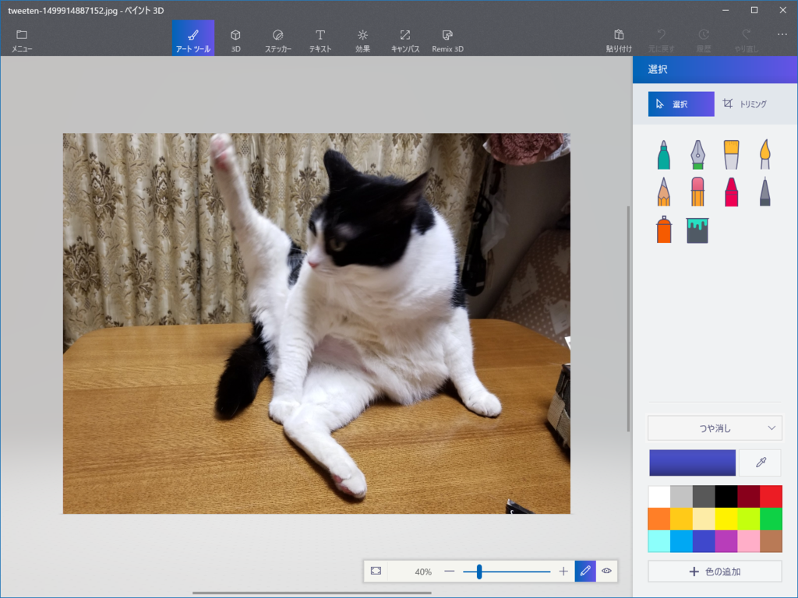
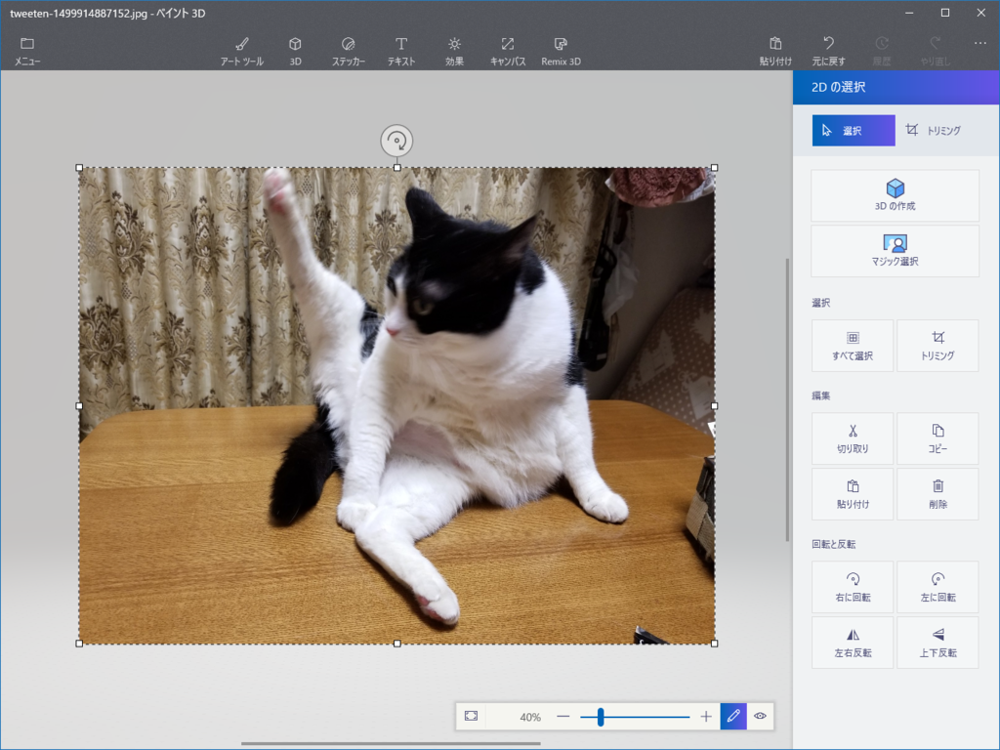
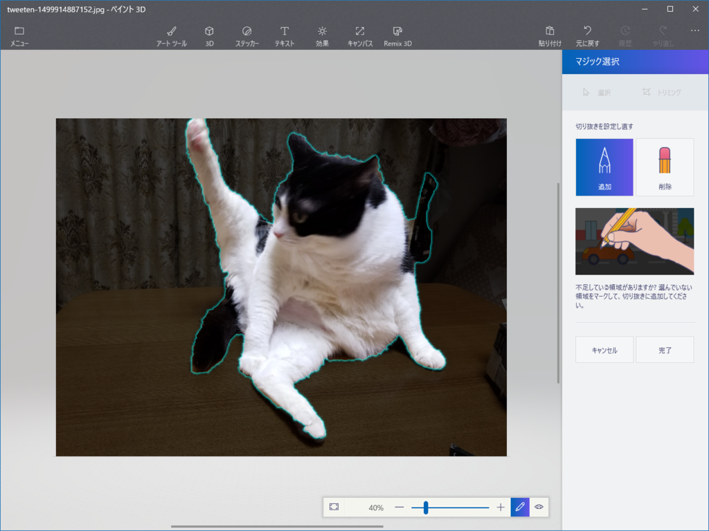
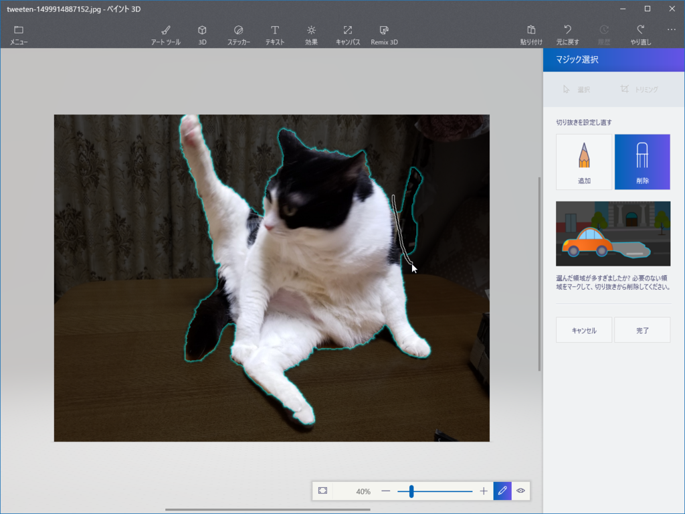
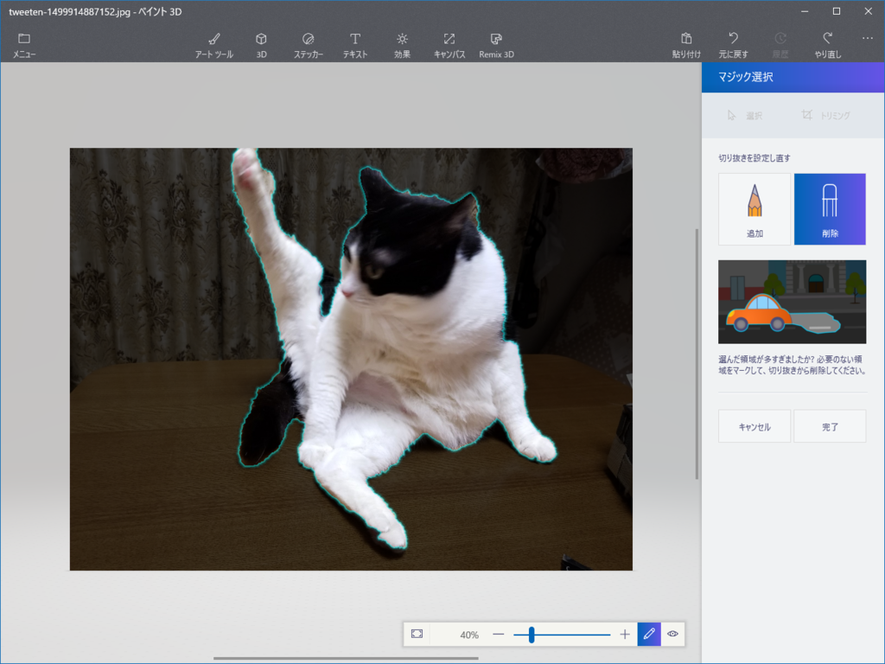
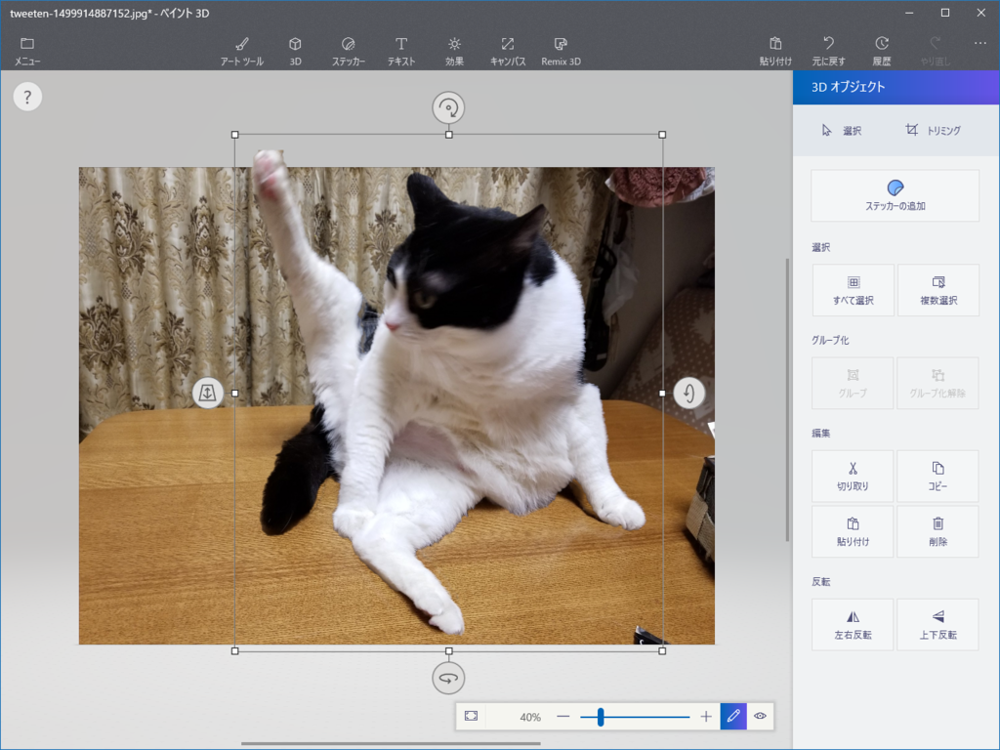
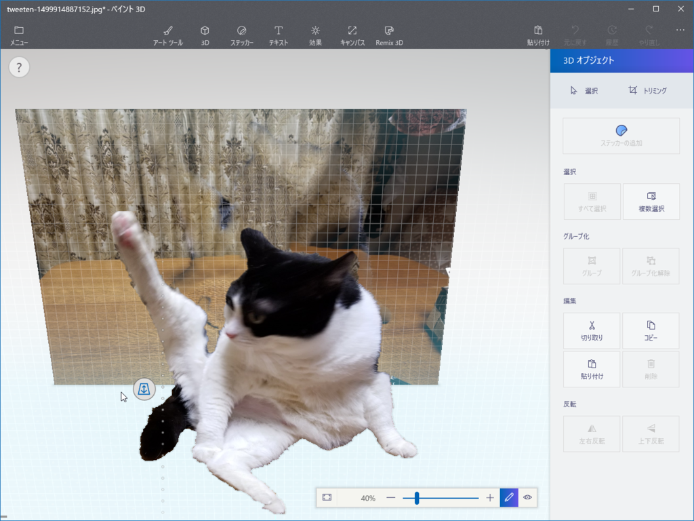
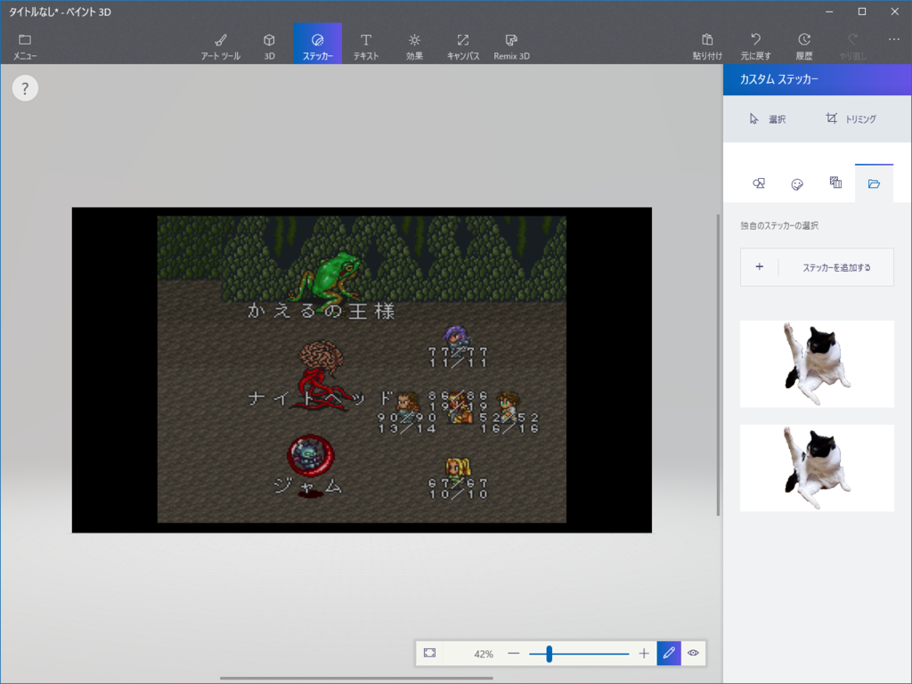
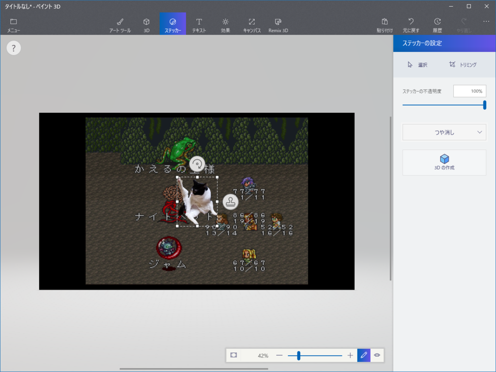
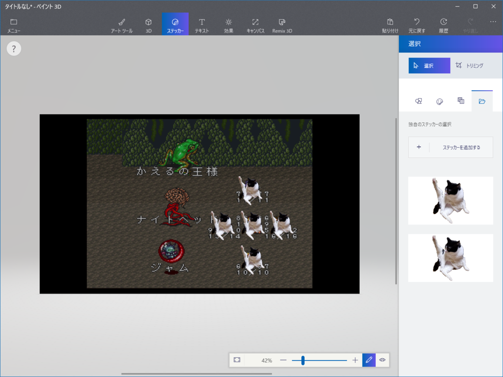

<h3>きっかけ</h3>

<blockquote class="twitter-tweet" data-lang="ja">
ロマサガのコマンド入力待ち <a href="https://t.co/47zYBMNqMS">pic.twitter.com/47zYBMNqMS</a>
&mdash; バッタ (@honey_burst) <a href="https://twitter.com/honey_burst/status/885144879512272896">2017年7月12日</a></blockquote>

<blockquote class="twitter-tweet" data-lang="ja">
誰かこれをインペリアルクロスに並べてよ
&mdash; エロやなぎ先生 (@daruyanagi) <a href="https://twitter.com/daruyanagi/status/885333138670370816">2017年7月13日</a></blockquote> 

<h4>参考：インペリアルクロス</h4>

“インペリアルクロス”はロマサガの陣形やね。最初に使えるヤツ。

<h3>「ペイント 3D」でやってみた</h3>

<b>「誰かにやってもらうのを口開けて待っている」</b>のはよくないと思い、「ペイント 3D」でクソコラしてみることにした。

まずネコの画像を「ペイント 3D」で開いて、［Ctrl］＋［A］キーで全選択。ほんとは部分選択した方がいいのかもしれないけれど、これぐらい被写体とそれ以外がクッキリ区別のつく画像だったら、全選択で問題ないと思う。画像を選択すると［マジック選択］というコマンドが現れるので、続けてこれをクリック。

すると、ネコが選択される。右上の部分がちょっと誤選択されてるので、［削除］ボタンを押してペンかマウスでさっとなでる。

割と適当で大丈夫。

いい感じになったら［完了］ボタンを押す。

するとモリッというエフェクトとともに、選択範囲が抜き取られる。

まさに背景から“抜き出した”感じで、こんな風に上下・左右・前後を自由に移動させられるようになる。今回は［ステッカーの追加］コマンドで“ステッカー”（後述）に変換して、この画像は捨てる。

次に適当なインペリアルクロスの画像を拾ってきて（ごめんね、借りるね）、「ペイント 3D」で開く。ツールバーだからタブだかの［ステッカー］を開くと、“カスタム ステッカー”が選べるようになってるはずなので、それをクリック。“ステッカー”っていうのは 3D モデルなんかに張り付けられるシールのようなもんかな。“ステッカー” から 3D モデルも作れるみたいだけど、そこらへんはイマイチわかっていない。

そしたらこんな感じになるはず。あとは大きさを調整して、適当に配置。［スタンプ］アイコンをクリックすると“ステッカー”を量産できる。

これでだいたい完成。クソコラなので、完成度は追及しない。

<h3>ツイート</h3>

<blockquote class="twitter-tweet" data-lang="ja">
Windows 10 のペイント 3D めっちゃ便利だな <a href="https://t.co/ffiucMIscb">pic.twitter.com/ffiucMIscb</a>
&mdash; エロやなぎ先生 (@daruyanagi) <a href="https://twitter.com/daruyanagi/status/885334015468687360">2017年7月13日</a></blockquote>

ツイートの間隔をみてもらえばわかるけど、画像を探す時間も含めて、加工時間は正味3分ぐらい。誰でもお手軽なクソコラが作れて、大変便利な時代になったと思う。

<b>Windows 10 はいいぞ！</b>

