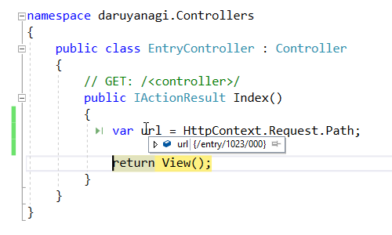

6月末、事情があって急遽 daruyanagi.jp を ASP.NET Core MVC で書き直した。

<iframe src="https://hatenablog-parts.com/embed?url=http%3A%2F%2Fblog.daruyanagi.jp%2Fentry%2F2017%2F06%2F27%2F021736" title="空の ASP.NET Core プロジェクトからとりあえず Web サイトのトップページを書いて Azure にデプロイするまで - だるろぐ" class="embed-card embed-blogcard" scrolling="no" frameborder="0" style="display: block; width: 100%; height: 190px; max-width: 500px; margin: 10px 0px;"></iframe><cite class="hatena-citation"><a href="http://blog.daruyanagi.jp/entry/2017/06/27/021736">blog.daruyanagi.jp</a></cite>

しかし、このとき daruyanagi.jp → blog.daruyanagi.jp へのリダイレクト機能を実装していなかった。

<iframe src="https://hatenablog-parts.com/embed?url=http%3A%2F%2Fblog.daruyanagi.jp%2Fentry%2F2017%2F03%2F26%2F234347" title="はてなブログのドメインを daruyanagi.jp から blog.daruyanagi.jp へ引越しした - だるろぐ" class="embed-card embed-blogcard" scrolling="no" frameborder="0" style="display: block; width: 100%; height: 190px; max-width: 500px; margin: 10px 0px;"></iframe><cite class="hatena-citation"><a href="http://blog.daruyanagi.jp/entry/2017/03/26/234347">blog.daruyanagi.jp</a></cite>

<iframe src="https://hatenablog-parts.com/embed?url=http%3A%2F%2Fblog.daruyanagi.jp%2Fentry%2F2017%2F04%2F02%2F013553" title="Google Search Console から“「404」ページの増加”というメールが来た - だるろぐ" class="embed-card embed-blogcard" scrolling="no" frameborder="0" style="display: block; width: 100%; height: 190px; max-width: 500px; margin: 10px 0px;"></iframe><cite class="hatena-citation"><a href="http://blog.daruyanagi.jp/entry/2017/04/02/013553">blog.daruyanagi.jp</a></cite>

リンク先を読むのがめんどくさい人のために、事情をかいつまんでいうと、

<ul>
<li>むかし、はてなブログを daruyanagi.jp で運営していた</li>
<li>はてなブログをサブドメインなしで運用するのは非推奨だったので、blog.daruyanagi.jp へ移した</li>
<li>当然ながら大量のリンク切れが発生</li>
<li>これを解消するため、daruyanagi.jp にリダイレクト機能を組み込んでいた（ASP.NET Web Pages 製）</li>
<li>ASP.NET Web Pages 製 daruyanagi.jp を ASP.NET Core MVC 製にする過程で、リダイレクト機能を省略した</li>
</ul>
Visual Studio 2017 Update 3 が正式版になれば、ASP.NET Web Pages のような機能が IDE 側でサポートされるという話を聞いたので、それを待ってから実装してもいいかなと思っていたのだけど、なかなかこない＆ブログにリンク切れが多くて使いにくかったので、とりあえずやっつけの対策を施した。

まず、ルーティングの書き換え。今回は /entry だけを対策しておく（ほんとは他の URL にも対策を施さないといけないけれど、今回は一番困るやつだけ対策）。

<pre class="code lang-cs" data-lang="cs" data-unlink>// {Root}/startup.cs

app.UseMvc(routes =&gt;
{
routes.MapRoute(
        name: &quot;entry&quot;,
        template: &quot;entry/{*id}&quot;,
        defaults: new { controller = &quot;Entry&quot;, action = &quot;Index&quot; });

routes.MapRoute(
        name: &quot;default&quot;,
        template: &quot;{controller=Home}/{action=Index}/{id?}&quot;);
});
</pre>
ちゃんとコントローラーに処理が移っているみたい。“*（アスタリスク）”を付ければ、“/（スラッシュ）”も含めてマッチするみたいだね。

あとは EntryController をちょちょいのちょいと書き換え。

<pre class="code lang-cs" data-lang="cs" data-unlink>// {Root}/Controllers/EntryController.cs

using System;
using System.Collections.Generic;
using System.Linq;
using System.Threading.Tasks;
using Microsoft.AspNetCore.Mvc;

// For more information on enabling MVC for empty projects, visit https://go.microsoft.com/fwlink/?LinkID=397860

namespace daruyanagi.Controllers
{
public class EntryController : Controller
{
// GET: /&lt;controller&gt;/
public IActionResult Index()
{
var url = HttpContext.Request.Path;

return Redirect($&quot;http://blog.daruyanagi.jp{url}&quot;);
}
}
}
</pre>
これでだいたいイケてるような気がする。

